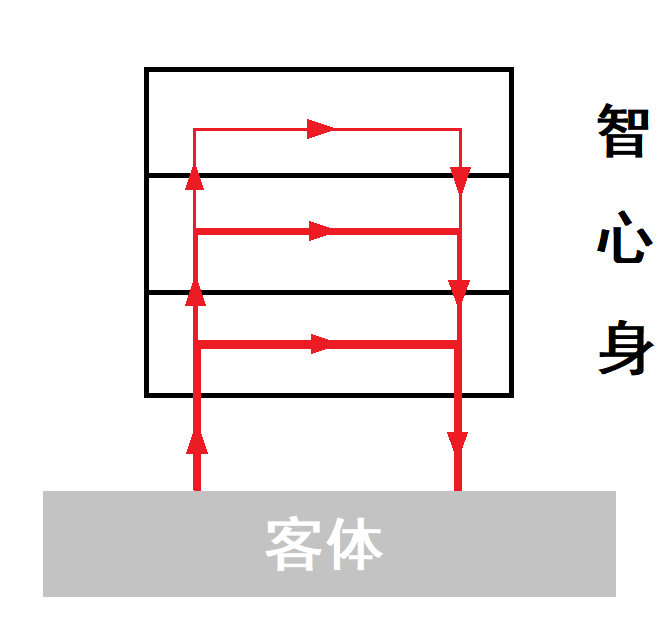
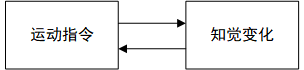
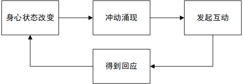
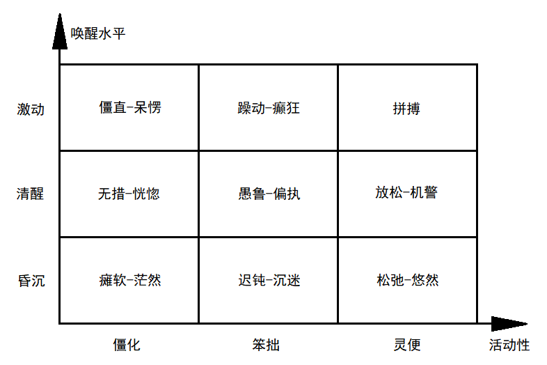
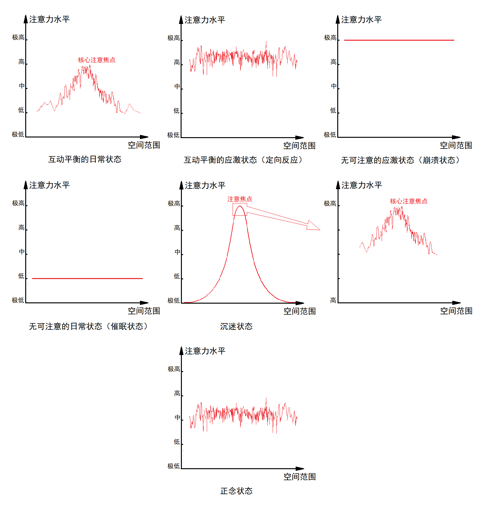

**复杂性创伤后压力综合征和阿斯伯格综合征的自助治疗**

——基于躯体体验的视角

Self-Help Healing for Asperger's Syndrome & Complex PTSD: From the Perspective of Somatic Experience

# 目录

## [前言](#_Toc168574589)

## [前言](#_toc174009631)

### [自助的可行性](#_toc174009632)

### [自助的必要性](#_toc174009633)

### [基本思路](#_toc174009634)

### [阅读提示](#_toc174009635)

## [1	自助的基本认识](#_toc174009636)

### [1.1	人性观](#_toc174009637)

### [1.2	责任观](#_toc174009638)

#### [1.2.1	自我负责精神](#_toc174009639)

#### [1.2.2	全力斗争精神](#_toc174009640)

#### [1.2.3	忘我精神](#_toc174009641)

### [1.3	先天与后天观](#_toc174009642)

### [1.4	积极心理学的差异观](#_toc174009643)

#### [1.4.1	大同小异观](#_toc174009644)

#### [1.4.2	谱系观](#_toc174009645)

#### [1.4.3	谱系观视角下的诊断标签](#_toc174009646)

#### [1.4.4	谱系观视角下的自助](#_toc174009647)

### [1.5	体感疗法的身心观](#_toc174009648)

#### [1.5.1	整合的身脑观](#_toc174009649)

#### [1.5.2	整合的身心观](#_toc174009650)

#### [1.5.3	协同性](#_toc174009651)

## [2	概念解析](#_toc174009652)

### [2.1	交流圈](#_toc174009653)

#### [2.1.1	主体-环境交流圈](#_toc174009654)

#### [2.1.2	主体间交流圈](#_toc174009655)

#### [2.1.3	同步性](#_toc174009656)

### [2.2	感觉与知觉](#_toc174009657)

#### [2.2.1	感觉与知觉的关系](#_toc174009658)

#### [2.2.2	想象知觉与现实知觉](#_toc174009659)

#### [2.2.3	感知觉与活动](#_toc174009660)

### [2.3	活动](#_toc174009661)

#### [2.3.1	活动与活动性](#_toc174009662)

#### [2.3.2	微活动与显著活动](#_toc174009663)

#### [2.3.3	微活动与感知觉品质](#_toc174009664)

#### [2.3.4	活动性与肌张力](#_toc174009665)

#### [2.3.5	活动性与注意力品质](#_toc174009666)

#### [2.3.6	强迫性](#_toc174009667)

### [2.4	唤醒水平](#_toc174009668)

### [2.5	意识与意识对象](#_toc174009669)

#### [2.5.1	意识对象的切分](#_toc174009670)

#### [2.5.2	意识对象的残迹与身心状态的滞留](#_toc174009671)

### [2.6	注意](#_toc174009672)

#### [2.6.1	注意的概念](#_toc174009673)

#### [2.6.2	注意的能动性](#_toc174009674)

#### [2.6.3	注意力的品质](#_toc174009675)

#### [2.6.4	互动平衡](#_toc174009676)

#### [2.6.5	专注](#_toc174009677)

#### [2.6.6	正念](#_toc174009678)

### [2.7	情绪](#_toc174009679)

#### [2.7.1	积极情绪与消极情绪](#_toc174009680)

#### [2.7.2	初级情绪与次生情绪](#_toc174009681)

#### [2.7.3	愤怒](#_toc174009682)

#### [2.7.4	恐惧](#_toc174009683)

#### [2.7.5	羞耻](#_toc174009684)

#### [2.7.6	抑郁](#_toc174009685)

#### [2.7.7	孤独](#_toc174009686)

#### [2.7.8	述情障碍](#_toc174009687)

### [2.8	体觉与体会](#_toc174009688)

#### [2.8.1	体觉](#_toc174009689)

#### [2.8.2	体会](#_toc174009690)

### [2.9	解离](#_toc174009691)

### [2.10	序列化行为](#_toc174009692)

#### [2.10.1	序列化行为的概念](#_toc174009693)

#### [2.10.2	序列化行为的建立与瓦解](#_toc174009694)

### [2.11	条件反射](#_toc174009695)

#### [2.11.1	条件反射的序列化解释](#_toc174009696)

#### [2.11.2	情绪闪回](#_toc174009697)

#### [2.11.3	广场焦虑反射](#_toc174009698)

#### [2.11.4	叙事还原](#_toc174009699)

### [2.12	驱力与能量](#_toc174009700)

#### [2.12.1	基本驱力](#_toc174009701)

#### [2.12.2	能量](#_toc174009702)

### [2.13	身心状态](#_toc174009703)

#### [2.13.1	习惯状态与最佳状态](#_toc174009704)

#### [2.13.2	中立状态](#_toc174009705)

#### [2.13.3	中立状态的养成](#_toc174009706)

#### [2.13.4	情感底色](#_toc174009707)

#### [2.13.5	中立状态的意义](#_toc174009708)

## [3	病理论述](#_toc174009709)

### [3.1	应激](#_toc174009710)

#### [3.1.1	应激与应对](#_toc174009711)

#### [3.1.2	僵直](#_toc174009712)

#### [3.1.3	应激能力的发展](#_toc174009713)

#### [3.1.4	心理韧性](#_toc174009714)

### [3.2	定向反应](#_toc174009715)

#### [3.2.1	定向反应的概念](#_toc174009716)

#### [3.2.2	创伤化的过程](#_toc174009717)

#### [3.2.3	寄生性紧张的补偿效应与省减效应](#_toc174009718)

#### [3.2.4	危机信号的泛化与闪回的发生](#_toc174009719)

#### [3.2.5	僵直的发展与解除](#_toc174009720)

#### [3.2.6	定向反应与情绪](#_toc174009721)

### [3.3	自我对抗与微观管理](#_toc174009722)

#### [3.3.1	行为抑制](#_toc174009723)

#### [3.3.2	反应抑制](#_toc174009724)

#### [3.3.3	微观管理](#_toc174009725)

#### [3.3.4	自我催眠](#_toc174009726)

### [3.4	定向反应的重启](#_toc174009727)

### [3.5	神秘主义与情绪推理](#_toc174009728)

#### [3.5.1	神秘主义](#_toc174009729)

#### [3.5.2	情绪推理](#_toc174009730)

### [3.6	活动视角下的创伤](#_toc174009731)

#### [3.6.1	活动性的退化和日常唤醒水平的下降](#_toc174009732)

#### [3.6.2	磨损性创伤](#_toc174009733)

#### [3.6.3	破碎的自我认知](#_toc174009734)

### [3.7	注意力品质视角下的创伤](#_toc174009735)

#### [3.7.1	无可注意](#_toc174009736)

#### [3.7.2	自我沉迷](#_toc174009737)

#### [3.7.3	外部沉迷](#_toc174009738)

#### [3.7.4	沉迷状态与ADHD](#_toc174009739)

#### [3.7.5	瞬间定位能力](#_toc174009740)

#### [3.7.6	异常注意力品质的常态化](#_toc174009741)

#### [3.7.7	神游](#_toc174009742)

#### [3.7.8	思维反刍](#_toc174009743)

### [3.8	身心状态视角下的创伤](#_toc174009744)

#### [3.8.1	中立状态的变形与瓦解](#_toc174009745)

#### [3.8.2	摇摆不定的性情](#_toc174009746)

#### [3.8.3	社会性退化](#_toc174009747)

#### [3.8.4	中立状态与述情障碍](#_toc174009748)

### [3.9	PTSD与CPTSD的形成](#_toc174009749)

#### [3.9.1	PTSD病理的躯体体验表述](#_toc174009750)

#### [3.9.2	创伤的代际传承与CPTSD的形成](#_toc174009751)

#### [3.9.3	消沉的代际传递](#_toc174009752)

#### [3.9.4	二次创伤与脆弱性](#_toc174009753)

#### [3.9.5	推拉效应与CPTSD](#_toc174009754)

#### [3.9.6	情绪稳定性的丧失](#_toc174009755)

### [3.10	AS的形成](#_toc174009756)

#### [3.10.1	自挫与早期创伤](#_toc174009757)

#### [3.10.2	神经多样性与标签化](#_toc174009758)

#### [3.10.3	阿斯伯格综合征患者的创伤故事](#_toc174009759)

### [3.11	AS、CPTSD和PTSD的共病](#_toc174009760)

## [4	自助的基本工具](#_toc174009761)

### [4.1	生物性节律](#_toc174009762)

#### [4.1.1	深呼吸](#_toc174009763)

#### [4.1.2	情绪节律](#_toc174009764)

### [4.2	体感疗法与费登奎斯方法](#_toc174009765)

#### [4.2.1	获取“觉醒”体验](#_toc174009766)

#### [4.2.2	注意自身驱力](#_toc174009767)

#### [4.2.3	身体与心智的对话](#_toc174009768)

#### [4.2.4	突破自我抑制](#_toc174009769)

#### [4.2.5	正念的误区](#_toc174009770)

### [4.3	链网释法与互释法](#_toc174009771)

### [4.4	双极觉察](#_toc174009772)

### [4.5	认知矫正与公序良俗](#_toc174009773)

### [4.6	图像式思考](#_toc174009774)

### [4.7	哀悼](#_toc174009775)

#### [4.7.1	哀悼的概念](#_toc174009776)

#### [4.7.2	哀悼与羁绊](#_toc174009777)

### [4.8	体会与表达](#_toc174009778)

#### [4.8.1	体会与表达的关系](#_toc174009779)

#### [4.8.2	情感动力](#_toc174009780)

#### [4.8.3	书面表达](#_toc174009781)

### [4.9	梦](#_toc174009782)

### [4.10	半睡半醒时间](#_toc174009783)

### [4.11	肢体对抗能力训练](#_toc174009784)

### [4.12	幽默感训练](#_toc174009785)

### [4.13	外部投注](#_toc174009786)

### [4.14	眼动脱敏与再加工技术的启示](#_toc174009787)

### [4.15	关系映射](#_toc174009788)

### [4.16	同行者](#_toc174009789)

## [5	自我概念化](#_toc174009790)

### [5.1	迷路者的小故事](#_toc174009791)

#### [5.1.1	自我认知类](#_toc174009792)

#### [5.1.2	人际关系类](#_toc174009793)

### [5.2	觉醒时刻的小故事](#_toc174009794)

## [6	后记](#_toc174009795)

## [7	推荐书目](#_toc174009796)

### [7.1	心理学基础必读](#_toc174009797)

### [7.2	阿斯伯格综合征必读](#_toc174009798)

### [7.3	认知行为疗法必读](#_toc174009799)

### [7.4	心理动力学必读](#_toc174009800)

### [7.5	体感疗法必读](#_toc174009801)

### [7.6	选读](#_toc174009802)

# 前言

## 自助的可行性

首先我们想象一种理想情况：每个人都可以借助功能性磁共振成像（fMRI）等技术实时监测自己在进行某种心理活动时相应的大脑活动，将其与一般人在相似情形下的大脑活动相对比，我们就可以评估出自己的心理健康状况并指导自己作出调整。

虽然上述情形并不现实，但是在主观上，不同的脑活动对应于不同的现象学体验和认知图式。出于各种因素的影响，即使身处相似情境，同一主体在不同时机产生的体验也可能存在各种品质差异，因此脑活动模式的差异可以通过现象学体验的品质差异得到自主评估。阿斯伯格综合征患者和复杂性创伤后压力综合征幸存者（在不造成歧义的前提下可简称为“幸存者”）虽然自身存在各种局限，但仍然有相当程度的社会功能，他们有能力通过观察与学习，尤其是在社会活动中的学习，作出相对客观的自我评估。

与创伤后应激障碍（post-traumatic stress disorder，简称PTSD）相比，复杂性创伤后压力综合征（Complex PTSD，简称CPTSD）虽然病理更加复杂，但与之关联的创伤性事件往往相对温和，主体更容易承受在处理创伤过程中被激起的各种痛苦情绪。

上述条件使自助治疗成为可能。

## 自助的必要性

阿斯伯格综合征（Asperger's Syndrome，简称AS）与复杂性创伤后压力综合征拥有相当程度的共性。本文重点在于帮助主体实现转变，无意于对二者作出明确区分。实际上，二者的区分具有很大的主观性：如果针对幸存者的治疗手段对阿斯伯格综合征患者管用，人们就会认为之前的诊断错了；如果所有的治疗手段对幸存者都不管用，人们就会怀疑该幸存者是阿斯伯格综合征患者。二者内涵的丰富性和表现的多样性与复杂性使现代医学手段对其如隔靴搔痒，难以发挥作用，而相关心理咨询手段普遍周期长、成本高、效果差。即使有效果，由于幸存者心智发展水平普遍落后，基于咨询关系获得的治疗效果向生活情境的迁移也是一个问题。对于业已成年的阿斯伯格综合征患者和幸存者，自助几乎是唯一可靠的手段。

心理障碍的消解需要依托良好的社会关系，但幸存者与阿斯伯格综合征患者往往极度缺乏与他人发展有意义的关系的能力。如果强行将他们推入各种复杂的社会环境（类似于“暴露疗法”的做法），不但无益于成长，而且可能造成二次伤害。实际上，自我疗愈的早期阶段完全可以在相对简单的社交情境甚至安宁的独处中进行。只有在处理了一些顽固的基础问题以后，社会层面上的支持才能充分发挥作用。本文重点关注的就是处理这些基础问题的方法。

## 基本思路

对于严重创伤化的主体，治疗方法的选择可遵循认知行为疗法与体感疗法交替进行的思路。二者分别代表了心理治疗的“自上而下”路径和“自下而上”路径。

体感疗法（the Somatic Experiencing approach，简称SE，又译“身体体验疗法”或“躯体体验疗法”）是着眼于躯体体验的创伤治疗技术，具有效果直接、泛用性强、对社交情境要求不高的优点。在国内，认知行为疗法（Cognitive Behavior Therapy）和心理动力学（psychodynamics）技术的发展程度相对较高，而体感疗法进入中国并不久，群众基础相对薄弱。因此本文将以体感疗法为核心，用大量篇幅介绍与体感疗法有关的基本概念和重要思想，对认知行为疗法和心理动力学不再赘述，有关资料可通过文末推荐书目获得。

比起在心理咨询中使用的体感疗法，自助情境下的体感疗法无论是常用概念还是操作方法都有其特殊性，有必要专门进行论述。科学的理论都是相通的，体感疗法与认知行为疗法和心理动力学相辅相成，三者之间的对比与互释有助于促进大众对心理自救技术的现状形成全面的认识。

本文基于积极心理学的差异观（详见1.2节）和体感疗法的身心观（详见1.4节），将ADHD和阿斯伯格综合征的本质理解为一种“脆弱性”。由于早期发育进程遭受的剧烈扰动，主体在人生的起点上就处在一种“脆弱状态”。这种状态使他在人生早期的探索中极易遭受各种伤害，甚至他的身体本身就是创伤源（详见“自挫与早期创伤”一节）。阿斯伯格综合征患者的创伤化（traumatisation）进程在幼儿期甚至更早的人生阶段就已经开始，经过长期的迁延发展和自我代偿，形成了如乱麻般复杂混乱的表现。AS的自助治疗应当以CPTSD的自助治疗为基础。较之“病理学范式”和“神经多样性范式”，本文所代表的思路可概括为“脆弱性范式”。

在中文语境下，“综合征”意味着一系列使主体深受困扰并亟待被处理的问题，而“患者”意味着这些主体深受困扰，急需帮助。因此，当阿斯伯格综合征患者实现创伤免疫以后，不宜继续使用AS的标签。如果主体欣赏自身的独特性并期待它得到他人的理解与认可，那么首先自己应当理解“人的多样性”。

在不致造成歧义的前提下，本文将“心理创伤”称为“创伤”。但我们将很快看到，心理创伤与身体创伤有很大的同源性。脆弱的心理与脆弱的身体是一对孪生兄弟。

本文既非保姆式的教程，也非字典式的手册。本文仅是作者基于自身知识储备和切身经验所作的分享。希望能为有需要的人带来一些帮助，也希望普通人能够借此一窥创伤幸存者的现象学世界（有时也称“主观现实”），从而能够多一些理解与包容。我期待本文能够为心理障碍的“当事者研究（第一人称研究）”正名。

## 阅读提示

正文部分约九万字，分为七章。为使行文简洁，对于在文末必读书目中已经详尽解释的概念或案例，本文不再多做说明。这可能给缺少心理学基础的读者或者因为严重创伤化而导致注意力缺陷的读者带来一定阅读难度。这种难度在某种意义上是必要的，可以理解成作者有意安排的一项挑战。

CPTSD的自救是一项严肃、漫长、极具挑战性的工作，知识储备、生活阅历、学习能力、耐心、决心、悟性都不可或缺，只有坚信自己拥有这些能力的人才能实现自救。超越创伤的旅程宛如一次重生，许多人会因此而收获更高的思想境界，正所谓功不唐捐。本文不适合追求速成之人或者仅仅只是为日常琐事困扰之人。

本文与AS/ADHD相关的讨论可能会吸引两类读者。一类是受困于ADHD/AS的当事者，一类是某些“业内人士”。本文的目的在于告诉前者不必执念于现有的ASD/ADHD诊断，而非与某些自以为是的业内人士搞字面之争。当事者当中有很多人的问题都可以在CPTSD的框架下得到更好的解释和处理。只有当某些所谓的研究者带着居高临下的态度，忽视真实的个体，追求所谓抽象本质时，才会大量出现无法解释的问题。等他们解释明白了，当事者的一生也过去了。

文章内容存在假说成分，假说成分较大的章节会特别注明。检验真理的最终标准是实践而非权威，何况精神病学的权威早已摇摇欲坠。不能给出解决方案的诊断对于当事者意义有限。对于心理治疗理论的科学性，当事者和研究者拥有同等发言权。

除引文段落外，本文属于原创作品，转载与引用请遵守相关规范。

# 1	自助的基本认识

## 1.1	人性观

本文不讨论反社会性人格。

亲社会性是人类的本能。治疗的目标是充分舒展主体自身的天性，而非追求什么“理想人格”。如果主体表达爱意的能力受限，那只是因为他遭受过很深的伤害。

## 1.2	责任观

### 1.2.1	自我负责精神

创伤与缺陷并非自己的过错，但自己必须为自己的解救负起最终的责任。“为自己负责”绝非“受害者有罪”。虽然很多幸存者的不幸都和生理缺陷、原生家庭或成长环境相关，但是这些因素都属于人生的“初始设定”。走出创伤阴影的第一步，就是和自己的初始设定和解。和解不是原谅，更不是清算，而是真正看见了成长的全貌。只有能领悟这一点的人才有可能实现自救。

### 1.2.2	全力斗争精神
如果将创伤比作树木的伤口，CPTSD就是遍体鳞伤的树木倒下后散落的枯枝败叶。CPTSD的治疗过程既不是简单的处理创伤的过程，也不是简单的清理垃圾的过程，而是在残躯上再度长出一棵大树的过程。幸存者必须丢掉“缝缝补补又三年”的幻想，做好脱胎换骨的准备。

CPTSD的自救是一个螺旋上升的过程，而非一蹴而就的过程。过程中每一轮新的循环都比上一轮需要承受更大的压力，同时也有更多的资源可以利用，循环结束后主体也会收获更多的活力和更深刻的平静。在循环的过程中，主体的身心从一地碎屑开始，逐渐形成较大的碎片，最后融合成一个统一的整体。

每一轮循环都是一个“开窍”“觉醒”或者“升维”的过程。它是在主体最本真的生命力得到释放后自然完成的。心理治疗是为了使我们舒展天性，而不是把我们变得小心翼翼。

### 1.2.3	忘我精神

问题的解决方案从来不会出现在问题形成的地方。如果我们一直盯紧自己的创伤和缺陷，就只会在其中越陷越深。

人格发展的过程是主体走出自我，走向他人的过程。走向他人的过程又是完善自我，学会独处的过程。

这听起来有些矛盾，但正如钱钟书所言，矛盾是智慧的代价，这是人生对人生观开的玩笑。

有关忘我精神的更多内容，参见4.13节“外部投注”。

## 1.3	先天与后天观

作为生物体的人和作为社会个体的人并不在一个层面上。这一观点可以借助计算机科学中“软件系统”与“硬件系统”的关系来理解：早期的计算机系统并不刻意区分“软件”与“硬件”。随着计算机系统日趋复杂，人们开始从“硬件系统”和“软件系统”两个维度描述计算机系统。虽然软件系统以硬件系统为基础，但两者的概念系统和话语体系相互独立，软件系统并不能简单还原为硬件系统。计算机的一次作业过程可以从硬件过程和软件过程两个角度进行表述，两种表述都是自洽的。二者在结构上无法简单对应，在逻辑上不能强加因果。同样，描述人的活动能力（尤其是社会活动能力）所使用的概念并不能与人体（包括人脑）的解剖结构或物质成分简单对应。

例如人们曾经以为大脑的枕叶负责视觉功能，但随着技术的进步，人们发现盲人的枕叶同样高度活跃，于是人们对枕叶的认识上升到了负责空间辨识功能。后来，人们发现单凭枕叶无法形成完整的空间感知能力，枕叶也不仅仅在辨识空间的过程中发挥作用。如今，科学家对大脑的认识已经发展到了非常抽象的程度，一系列独特的、脱离生活语言的概念系统正在形成。

但我们无须为此感到压力，正如计算机软件工程师并不需要了解硬件工作过程的无穷细节，也不会因为自身能力的不足就轻率要求变更硬件系统。我们无须为了理解和处理自己的创伤而学习无穷无尽的神经生物学或神经化学知识，这对于自助意义不大，而且药物干预或物理介入常常意味着风险。人们区分“先天因素”和“后天因素”，区分“内生因素”和“外界因素”，主要是为了完成责任切割，限定“不可干预”与“可干预”、 “物理干预”与“认知干预”的分野。

假如我们将心理障碍的生理基础比作母鸡，将异常的认知习惯和行为模式比作鸡蛋（这样类比是考虑到鸡生蛋比蛋生鸡更容易），那么心理障碍形成的过程就是鸡生蛋蛋生鸡直到鸡圈被挤爆的过程。干预的首要目标在于打破这一循环，而非关心最初到底是蛋多还是鸡多。从主体自身角度来说，任何心理障碍的形成都是先天因素与后天因素共同作用的结果。情绪智力如同肌肉，它既是天生的，又是练出来的；既是在各种活动中下意识地发展的，也可以通过有意识的锻炼得到发展。幸存者不应该以“天赋不可改变”为借口逃避责任，先天与后天的讨论在自助治疗中意义有限。

## 1.4	积极心理学的差异观

本文基于积极心理学（Positive Psychology）的差异观看待心理障碍者与常人之间的差异。这种差异观可概括为“大同小异观”和“谱系观”，前者是后者的基础。

### 1.4.1	大同小异观

人类既有一致性，又有多样性，而一致性在其中占据主导地位，因此，人类才可以既拥有丰富的可能性，又能作为一个整体存在。显著的一致中往往蕴含了微妙的差异，显著的差异中又存在广泛的一致。无论我们如何关注心理障碍者与常人之间的不同，这些差别与区隔都是次要的，细微的。人们之间的共同点和联系才是普遍的，主要的，只不过人们出于猎奇心理更愿意关注那一点不同罢了。

### 1.4.2	谱系观

谱系观拒绝标签化，认为所谓的“正常”与“异常”只是人们为了偷懒，强行给程度不同的同一表现贴上的对立标签罢了。例如社会达尔文主义者简单粗暴地将人类划分为“强者”与“弱者”，将社会关系定义为“竞争”，从此就再也不必关心人类的多样性与社会活动的复杂性了。谱系观只承认典型与非典型、温和与强烈、快与慢、大与小的分别。谱系观要求一个合理的表述必须能够涵盖同一谱系内从典型到非典型或者从一般到特殊的所有现象，而不是将它们分开表述，再额外说明彼此的关联性。

例如，本文将幸存者异乎常人的身心状态解释成个体的“习惯位”显著偏离了公认的“最优位”。常人也会有各种偏离，只是这种偏离并不显著，可以无意识地完成调整或代偿而无需额外耗费认知资源，也不会产生明显的不适。又如许多CPTSD幸存者习惯于将意识对象分为内心对象与外界对象，这显示了他们某种程度上的分裂感。但即便如此，他们对世界的主要体验仍然和常人相同，甚至常人有时也会认同这种划分，因为常人也会经历这些意识状态，只不过没有造成显著的适应不良罢了。本文为了表述方便，有时也会用“内”和“外”来区分事物，但是要用谱系观的立场来看待。

强迫行为和反射行为也可以看作处于同一谱系，两者的区别仅在于前者所依托的激发条件相对苛刻因而更容易得到觉察与调节。条件反射、非条件反射和操作性条件反射也可看作处于同一谱系。条件反射是以非条件反射为核心构件形成的序列化行为与契合要素一起构成的，包含了显著的操作行为的条件反射是操作性条件反射，在漫长演化中发展成硬连接的操作性条件反射是非条件反射。

### 1.4.3	谱系观视角下的诊断标签

一个恰当的标签可以使原本无法名状的痛苦形成可分享的意义，主体可以以此出发，寻找有关资源，争取改变自身处境，这才是标签的意义。标签应该被理解为一种“索引”，而非一种“身份”。

可现实是标签往往会使人“标签化”。有的人因标签而被边缘化，受到了各种“特殊对待”，许多父母仅仅因为孩子被打上了“阿斯伯格”的标签就对孩子彻底丧失了信心。有的人因标签而偏执地寻找所谓“同类”以谋求心理安慰。人被异化成了标签的附属品，也就失去了改变的可能性。

如果一个人某方面的特质过于突出，就很容易把拥有相似特质的人看做同类，全然不顾其他更基本也更重要的品质。儿童往往热衷于寻找身份认同，他们一旦被贴上“阿斯伯格”的标签，就更容易跟其他带有特殊标签的人走到一起，这无疑会给成长引入新的风险。

### 1.4.4	谱系观视角下的自助

心理自助并非自己充当自己的咨询师，这完全不现实。

社会环境充满了各种潜在的创伤源，我们的免疫力和自愈力决定了我们所受到的影响。从这一角度来说，幸存者似乎应该向免疫力和自愈力强大的人学习。然而遗憾的是，这些“强者”的现象学世界与幸存者的现象学世界差异过大，以至于很难在常规语境下被纳入同一表述中。常人无法理解幸存者为何如此脆弱，幸存者也无法理解常人何以利用创伤实现成长。自助理论的价值在于构建起一套科学的表述，能够同时涵盖幸存者和常人的现象学世界，一方面使幸存者能够体会常人的现象学世界，理解他们的免疫力与自愈力，因而明确自身努力的方向和方法，另一方面使常人能够体会幸存者的现象学世界，理解他们的脆弱性，因而更容易与之相处。

与生理缺陷相比，心理障碍具有很强的异质性。与其说人们难以找到心理障碍的生理基础，不如说心理障碍根本就没有共同的生理基础。每位当事者的“病理”可能都是独特的。这也是“病理学范式”饱受争议的原因之一。心理障碍需要个体化的干预方案，而制定个体化的干预方案，离不开一套能够沟通不同现象学世界的话语体系。好比我们学开车必须首先认识刹车、油门等等。不清楚这些基本配置就强行上路只会造成交通事故。

人生充满了黑色幽默。有时简简单单一个问题就可能困住一个人一辈子。很多心理困境看似无解，只是因为它们难以在现有的话语体系下得到恰当表述。既然根本说不清楚，当事人就只能听天由命。一套恰当的、能够沟通常人与心理障碍者的现象学世界的话语体系可以帮助我们在一张足够广阔而详尽的地图上定位自己的坐标，从而找到回家的路。作为一套有价值的自助理论，它的语言必须能够发挥“路标”“桥梁”和“翻译官”的作用。无法为受困者指明方向的理论无论多么精妙都只是花瓶。

这项工作的最佳人选是那些曾在两种（或多种）截然不同的现象学世界中生活过并且具有一定学术素养和表达能力的人。在人类历史上，往来于不同社群的“边民”往往会成为最早的“翻译官”，他们为文明的传播与发展作出了重要贡献。

本文作者曾有幸在CPTSD幸存者与常人的现象学世界之间穿梭过。愿本文能够抛砖引玉，唤起更多人对“当事者-观察者双视角研究”的重视。

## 1.5	体感疗法的身心观

### 1.5.1	整合的身脑观

体感疗法不会刻意区分大脑活动和身体活动。任何一个具体的活动都会同时涉及到包括大脑在内的身体各部分的活动，本文所述“身体”全部包括大脑。

从肢体到大脑，从大脑的低级功能到高级功能，并非前者从属于后者，低级服务于高级。相反，前者是后者的前提、基础、来源和归宿，后者是对前者的增强、扩展和整合。后者从前者中来，到前者中去，使前者在更高层面得到整合。让前者的能量流动变得更加高效而顺畅，从而发挥出更高的创造性才是后者存在的意义。这种身脑关系观可称为“整合的身脑观”，它将物种的演化历程和个体的发展过程相统一，使我们可以通过观察动物的活动认识人类活动的底层逻辑，通过身体活动所展示的外显信息了解大脑中发生的事情。

“本能”“情感”和“认知”都是身脑整合的产物，整合程度依次提升。在日常语境下，人们常用“身体”指代本能。“整合”是一个略显尴尬的词汇，由于生活语言中缺乏具体的相关概念而不得不频繁使用。情感与认知并不能简单还原为生理活动，于是只能用“整合”一词来笼统地表达身心关系。

### 1.5.2	整合的身心观

行为是本能、情感和认知相整合的结果。

本能（“身”）、情感（“心”）和认知（“智”）三者之间的关系可与上文所述身脑关系相类比，这种身心观可称为“整合的身心观”。它将物种的演化历程、个体的发展过程和具体的行为过程相统一，具有极强的承载力和指导意义。它让我们可以用身体和生活的语言（身体和生活所展示的外显信息）讲心理（现象学世界）的故事。 “身”既是真实的身体，也是所谓的“潜意识”，它和外部环境直接统一。身与心构成了“儿童自我”，身、心、智一起构成了“成人自我”。

儿童自我是成人自我的基础，因此我们也可以用儿童的活动理解成人活动的底层逻辑。我们在儿童时期的各种表现并没有随年龄的增长而轻易消失或改变，相反，它们成为了更复杂的行为和认知过程的基础。当我们遭遇了极端情形，这些复杂的行为和认知过程全部失效，我们被迫重新从非常基础的层面上开始处理问题时，我们儿童时期的行为风格就会清晰表现出来，此时脑海中甚至还会闪过儿时的一些画面，这种现象在一些心理动力学理论中被称为“退行（regression）”。成长既是不断地重塑基本的序列化行为和认知图式（可称为“第一类成长”）的过程，也是发展出更复杂的习惯和认知图式（可称为“第二类成长”）的过程。常人的第一类成长在青春期后期已经基本完成，其适应意义在于使主体能够以相对独立的姿态面对社会现实中的各种冲击，从而使第二类成长达到非常高的水平。幸存者的第一类成长从未完成，这既使他们的人格在成年期也能表现出良好的可塑性，也使他们的第二类成长极不稳定，很容易在各种冲突中陷入恍惚而缺少应对能力。

### 1.5.3	协同性

与精神分析不同，基于“整合观”的心理动力学没有玄学色彩，有助于主体了解和分析自身认知和行为的动态过程。类比工程力学中的“应变”与“应力”，本文使用“应激”与“应力”。“应力”在一些心理动力学理论中也称作“张力”。“社会动力学决定个体动力学”，“生理动力学决定心理动力学”是本文的动力学表述中的两大基本观点，两者也可表述为“个体-社会协同性”和“身心协同性”。

身-心-智模型与交流圈示意图：

上图可与排便运动中的神经反射相类比。身、心、智可顺次类比为低级中枢与高级中枢。

# 2	概念解析

## 2.1	交流圈

互动形成交流圈（loops）。一方发起一个邀请，另一方作出回应，回应又驱使发起方改变状态，双方的状态在互为因果地快速变化。在交流圈不断地循环中，冲动（本文中的“冲动”特指行为冲动）、情绪和概念不断地涌现、发展、分化和消解，主体对刺激的适应和改造也在同步进行。

在劳恩·考夫曼（Raun K. Kaufman）的自闭症家庭内部治疗技术中，交流圈是一个重要的原始概念。本文以此概念为逻辑起点，全篇所有内容都应该放在交流圈中理解。

正如“症状”与“体征”是不同的概念（前者是主体能感知的不适，后者指观察者检查发现的异常），交流圈也可以从两个不同的视角进行表述。

### 2.1.1	主体-环境交流圈

从主体自身的角度来看，一切活动都发生在主体-环境交流圈中，其他的交流圈都是此交流圈的特例。主体自身发展的过程就是主体与环境的交流越来越丰富，交融越来越深刻的过程。在主观体验上，交流圈是感觉和行为的无限循环。主体-环境交流圈也可借助“自传入知觉（reafference）”的概念来理解。

主体-环境交流圈示意图：

### 2.1.2	主体间交流圈

从主体间关系的角度来看，一切的活动都发生在主体间交流圈中。所谓主体-环境交流圈不过是主体间交流圈的一个瞬时切片或者说是主体的“自我交流”罢了，而自我交流只是对主体间交流的内化，内化意味着经验的积累和习惯的养成。

本文不接受所谓“上帝视角”，即使是主体间关系，也应当选定一个主体作为讨论中心，否则讲述者就成为了主体-环境交流圈中的主体。他讲的就不再是观察对象的故事而是自己的故事了。

主体间交流圈示意图：

### 2.1.3	同步性

主体-环境交流圈是随着行为和知觉的分化而形成的，体现了动作指令和感知觉反馈之间的同步性。初生婴儿的行为过程与知觉过程、感觉过程与知觉过程具有同一性，而后逐渐分化开来，成为观测者眼中相互关联而又有所区别的过程，同一性就成为了同步性。同步意味着相互确认、相互适应与相互交融。

同理，主体间交流圈是随着自我与他人（或“属我”与“非我”）的分化而形成的，体现了互动双方的同步性。

在主体活着的任一时刻，他的一切活动都在交流圈中进行着。无论这些活动是受注意的（有意识的）还是不受注意的（无意识的），是情节性的（可回忆的）还是非情节性的（不可回忆的）。所有的，同时也是无限的交流圈汇集成了一个人的体验流。

## 2.2	感觉与知觉

### 2.2.1	感觉与知觉的关系

感觉是知觉的基础，知觉是感觉的综合与经验的统合，并且与感觉同时进行。由于涉及到经验，因此知觉必然包含一定的想象成分。事实上，感觉神经系统能够给主体提供的信息极为有限，经验和想象在知觉的形成中具有惊人的作用。有时即使完全不存在感官刺激也可以形成相应的知觉（比如“幻肢”现象），由此形成了“想象知觉”与“现实知觉”的分野。

### 2.2.2	想象知觉与现实知觉

“想象知觉”即主体基于经验自发地对知觉进行补全（或扩展）而形成的知觉。可以是基于彼通道知觉补充此通道知觉，例如通过不同岩石的视觉形象的差别想象它们在触感上的差别；也可以是通过此处知觉补全他处知觉，例如通过面前的一段铁轨补全它在视野外继续延伸的部分；也可以是通过前置知觉预期继起知觉或通过后置知觉回溯前置知觉，例如通过“打”的动作预期“疼”的感觉或者反过来。想象知觉被证实后就是现实知觉，被证伪后就是错觉或幻觉。在缺少现实检验（reality testing）手段（或者说缺少与之相拮抗的知觉）时，想象知觉具有和现实知觉相同的主观真实感。

这一机制的适应意义在于使主体可以无需关注感官刺激的无穷细节就能形成完整而连续的体验流（例如人类由于进化过程中的缺陷，导致在视觉中心外侧约15°左右的位置存在一个圆形的视觉盲区，但我们在生活中很难注意到它的存在，我们用想象把缺失的信息补全了），但它有时候也会成为适应不良（maladaptation）的根源。例如疼痛的胳膊被截肢后，胳膊的运动神经、感觉神经和视觉形象同时缺失。胳膊的运动-感觉交流圈没有受到扰动，而是直接消失了。胳膊的状态无法得到主体的确认，主体的身体意象无法得到更新，于是就形成了“幻肢痛”。这一现象可类比成囚犯被关押后，他们对社会的认知会长期停留在被拘禁前的水平。并不是让他们看看外部世界的照片就能使他们感受到世界的变化。对“幻肢痛”的理解可参考维莱亚努尔·拉马钱德兰（Vilayanur Ramachandran）的“镜盒实验”。

想象知觉与现实知觉共同构成了具有现象学意义的知觉，参与主观现实的构建和更新。在自助治疗中，知觉以现象学体验和行为反应为测量尺度。一种知觉激起的现象学体验越生动，激发的行为越显著，该知觉就越强烈。当不同的知觉之间发生冲突时，我们就说交流圈受到了“扰动（perturbation）”。

### 2.2.3	感知觉与活动

活动产生感知，静止造成麻痹。本文所称“静止”特指现象学意义上的静止，日常口语所称“静止”在下文被称作“平静”或“安宁”。“平静”是观察者基于感官信息作出的一种认知判断，它是一种虽不显著却内涵丰富的活动状态。所谓平静时产生的感觉就是一些不显著的活动产生的感觉，它们作为难以言表的意识对象进入知觉，成为了认知活动的“底噪”或“基调”，被一些理论称作“潜意识”。在本文的语境下，身体即潜意识。如果用投影等方式放大我们的身体，就会发现即使在平静状态下，全身也如清风拂过的树梢般在活动着。我们稍微移动一下身体的某个部位，身体其他部位也会立即改变状态，我们不可能单独移动身体某一部分而不影响身体其他部分。

我们的感官允许我们觉察身体发生的任何细微变化，但只有显著的变化能够用语言表达出来并在公共的话语空间中得到认知加工。在主体极度疲劳或严重抑郁的状态下，身体的活动性可能会异常下降。比如我们有时在半夜苏醒时会感觉到身体的某一部分仿佛消失了一样，但我们只要稍微活动一下对应部位，感觉立刻就回来了。又比如我们在早上刚刚睁开眼的恍惚状态下，如果长时间呆呆地盯住某个角落，就有机会看到视野内的物体像融化一般逐渐消失了边界，然后视野开始出现残缺。残缺迅速扩大，像洪水泛滥一样要淹没整个视野，此时我们会因为应激而迅速转动眼球，从而恢复视觉（这个实验有一定危险性，如果因为某些原因无法唤起应激，可能导致灾难性后果。因此仅供参考，不要刻意尝试）。在这两种情况下，我们都体会到了现象学意义上的静止。

每个个体都有独特的活动偏好，这些偏好既使主体在某些方面更加敏感，也使主体在另一些方面更加迟钝甚至完全麻痹，不同的活动偏好使每个人对世界的体验都独一无二。抑郁者的微活动普遍脆弱而单调，很难与外界活动相契合，参与感的缺失导致他们情感淡漠。

## 2.3	活动

### 2.3.1	活动与活动性

存在（existence）即活动（movement）。活动的发起和完成意味着交流圈的建立与消解。在我们活着的每时每刻，我们的身体无不在进行着丰富的活动。

本文所述“活动”绝非机械运动。现实中的所有活动，尤其是人类的社会活动，都既有节律性，又有丰富的随机性与混沌性。想象正在摔跤的两个人，彼此通过双方的推、拉、拧、绊中的坚定、勉强、犹豫、飘忽等等动作品质感受到对方是一个和自己一样鲜活的人而非一台机器。双方既彼此相似，又各自拥有独特而值得体会的个性。活动的契合或共鸣是形成亲和感的前提。活动性体现在主体能够建设性地维持与改变动作的品质和活动的状态，使自己免于被“固定”或“套牢”。活动性可以看作是自然事物所普遍具有的使自身免于“被定义”的能力。

活动性使主体能够对外界刺激作出合目的的反应。健康的主体不仅能够对刺激作出反应，而且拥有充分的自由选择如何反应，这样的身体才会灵便之感。拳击手（尤其是还不够老练的拳击手）在对战中常常要保持一种不断跳动的状态，其意义就是为了保证身体能够达到竞技情境所要求的活动性水平。活跃的身体可以提供足够的反应倾向，随时可被触发各种反应。如同倒立的椎体，处在一种不稳定平衡（unstable equilibrium）状态，只需要被施加一点点作用就可以倒向任意方向。

活动性也可理解为灵活性（flexibility），“灵活”与“涩滞”相对。活动性等同于认知行为表述下的“应激性”，在动力学表述下可称作“机动性”。

### 2.3.2	微活动与显著活动

一个活动可以在微活动和显著活动两个层面上得到观察。微活动层面体现了活动的细腻性与微妙性，显著活动层面体现了活动的具体性与情节性。具体、显著、强烈的行为越多，活动就越具体，越显著，越强烈。个体在他显著活动最少而微活动最丰富时的状态就是他的平静状态（或称“中立状态”、“日常状态”）。

一般地，能够被主体自身或者互动对象的感官感知为活动的身体活动被称为显著活动。虽然不能被直接感知为活动，但可以通过感知觉品质的变化、注意力品质的变化、情绪的波动、“气场”的变化等得到间接感知的活动称为微活动。微活动的“微”强调的是程度的微妙（subtle）而非范围的微小（micro）。活动越微妙就越不可切分，在极微妙的层面上，所有的活动共为一体，构成感知觉的背景，奠定感知觉的基调。

冲动产生自微活动。不能被感官感知为活动，意味着冲动的产生不受意志控制。只有在冲动发展为行动，具体的行为开始涌现时，主体才能有所觉察并对它们进行有意识地引导或抑制，因此可以说“冲动先于想法”。在人们形成确切的想法前，身体就已经产生了冲动。想法是对冲动的确认，并使之发展成完整的行为。我们在生活经验的积累中建立了大量具体而微妙的条件反射，也就是所谓的“肌肉记忆”。肌肉记忆是习惯性的冲动，它可以引导行为，唤起回忆，提示想法。

冲动开始作为行动被主体所觉察（或者说在情节记忆中作为行为被记录）的那一刻所发展到的程度就是冲动与行动（或微活动与显著活动）的临界水平。由于活动性较低， CPTSD幸存者所能感知的临界水平通常比常人低得多。他们一方面对注意力焦点之外的活动异常迟钝，另一方面对注意力焦点之内的活动表现出惊人的洞察力。当他们的活动性得到改善后，这种洞察力往往也会退化甚至消失。

冲动先于想法，因此主体想要对自身正在发展为行动的冲动“抓现行”很困难。只有在极偶然的情况下（例如身体极度疲惫而大脑相对清醒之时，或者主体处在“半睡半醒时间”时），我们才有机会直接观察到它们。在大部分情况下，主体对自身冲动和无意识行为的觉察是通过交流圈中互动对象的回应间接实现的。CPTSD幸存者的生活以孤独为基调，缺少可信对象，他们的自我洞察能力可看作是对孤独的代偿。然而很可惜的是，很少有幸存者能够用好这种能力。在羞耻感的作用下，这种洞察力往往被导向了苛刻的自我抑制和微观管理。

如果说冲动是行为的萌芽的话，微活动就是行为的种子。无限的微活动之间持续不断的冲突（对抗）与妥协（交融）构成了微活动的基本内容（一般地说，行为构成活动，但是在微活动层面上，区分行为与活动没有意义）。行为都是由微活动在相互协调之中发展而成的，神经系统是专用于协调身体活动的结构，大脑是负责协调的核心。行为的涨落反过来又会“搅动”微活动，因此丰富的显著活动也会使微活动变得更加丰富而细腻。微活动与显著活动的关系有些类似“整合的身心观”之下的低层结构与高层结构的关系。从微活动的角度看，微活动相当于舞台和演职员班子，显著活动只是演员在舞台上表演的节目，任何一个显著活动中的行为都被包含在微活动中。从显著活动的角度看，显著活动相当于演员的“台上一分钟”，而微活动相当于演员的“台下十年功”，任何一个行为都需要微活动的支撑，任何一个显著活动都包含了无数的微活动，微活动的价值最终需要依靠显著活动来实现。

当冲动形成，行为开始涌现时，微活动水平会短暂下降。这相当于身体在特定的一个或几个方向上“绷紧”时，其他所有方向多少也会受到些影响。当行为完成，冲动平息时，微活动水平又会恢复，身体恢复了平静。在一次完整的活动中，身体会经历无数次这样的“紧张-放松”循环。当我们认真尝试某种陌生的活动时，身体可能在多个方向上同时“绷紧”，我们会感觉身体变得僵硬而笨拙，这种状态就是“僵直（freezing）”。

不同社会或不同时代的人们对意识对象的切分方式、关注重点和观察工具往往不同，因此人们对显著活动的识别能力不仅存在个体差异，而且存在时代差异与社会差异。如果语言中缺少与某个活动相关联的概念或表达方式，那么个体对它的观察就很难在公共的话语空间中得到有意义的认知加工，此时个体把它看作从属于更大的显著活动的微活动往往更经济。例如对于“假笑”表情，中国古人常常爱用“皮笑肉不笑（外笑里不笑）”的说法。如今我们已经知道所谓假笑就是“嘴笑眼不笑”，但你如果要跟古人沟通，“皮笑肉不笑”这种玄学表达往往效率更高。

在微活动层面上，活动性既代表一种“状态可变”的能力，又代表一种“变动不居”的状态。正如拳击手的跳动，它使主体能够保持足够的敏捷，同时本身也是一种不安定的状态。

显著活动与微活动的品质在长期水平上相统一，流畅的举止只能来自灵便的体态。主体的微活动能力与显著活动能力在长期水平上保持一致。

### 2.3.3	微活动与感知觉品质

微活动决定感知觉品质，所谓感知觉品质，就是感知觉的背景和基调。良好的活动性水平使大脑时刻能够接受足够丰富的感觉刺激，从而维持唤醒并为知觉的形成提供丰富的素材。活动性越强，感知觉的品质就越好，犹如充分校准的提琴，可以表现出最完美的音色。

焦虑和消沉都能破坏身体的微活动，使感觉输入变得匮乏而单调，缺失了各种细节。主体即使找到了貌似有意义的意识对象，也会因为无法激起相应的感觉而不敢笃定。主体会感觉到世界好像不那么生动了。CPTSD幸存者严重缺失各种感知觉细节，他们与常人仿佛生活在不同的世界中。

### 2.3.4	活动性与肌张力

在一个人活着的每时每刻，他的肌肉系统都在进行着一种不随意的、微妙的牵张反射（stretch reflex；myotatic reflex），使身体即使在平静的状态下也在像清风拂过的树梢般在活动着。这些牵张反射是微活动的重要组成部分。它们维持着人体各种姿势和行为的稳定、连续和平滑，持续创造着体觉，形成了人体的肌张力（muscle tone）。肌张力与活动性密切相关，长期活动性低下的人往往存在肌张力异常，他们的肢体呈现出整体过度松弛而局部过度紧张（代偿）的特点，给人以虚弱而不灵便的印象。长期活动性较高的人普遍具备较为平衡的肌张力水平。

幸存者的肌张力水平在大部分时间低于典型发展的同龄个体（neurotypical，下文简称为“常人”），而在急性压力事件中却经常超过常人。他们在婴儿期往往就已经表现出肌肉无力、走路不稳、进食困难、关节活动范围过大、性格过于安静、易受惊吓等特点。

肌张力不同于肌力（muscle strength），但肌张力的调节同样需要借助各种体育锻炼活动。肌张力长期异常（增高或减低）也会导致肌力退化。肌肉无力使主体在从事很多活动时都需要通过提高肌张力实现代偿，而肌张力的整体改变总是伴随着情绪的波动，情绪的波动又会干扰认知过程，这使他们显得脾气差而脑子笨。

常年抑郁消沉之人往往会过早出现各种关节退化现象。肌肉对身体的支撑不足，关节必然加速磨损。

注意：在论及体征时，心理治疗对异常的判定方法和判别标准与临床医学有很大不同。临床医学的判定必须要有普适性，不会考虑太多个体因素，而体感疗法对异常体征的识别是为识别个体的身心状态服务的，因此必须充分考虑个体间差异及个体不同状态之间的差异。对于心理治疗来说，临床意义的肌张力分级标准过于粗糙，无法使用。本文所述“肌张力低下”在肌张力的临床分级标准中几乎都不会超出正常范围。

### 2.3.5	活动性与注意力品质

注意力的转移包括视线的调整和姿势的变化等丰富的活动。活动性差的人，调节注意力的难度也更大，他们相比于常人更容易表现出对具体事物的沉迷和执念。

### 2.3.5	强迫性

强迫性与活动性相对，主体感到自身行为的备选范围变窄，体验到了强烈的身不由己的感受。强迫性总是与异常下降的活动性相伴，主体通常会体验到某种僵直或笨拙之感。强迫性的形成需要同时满足两大条件：一是受限的活动性，二是反活动性的正反馈循环。比如森田疗法（Morita therapy）中的“精神交互作用”：由于注意具有能动性，主体越是注意某个想法或感觉，此想法或感觉就越强烈，这反过来又使注意更加固着于此想法或感觉，从而形成强迫性。又比如活动性的下降造成了感知觉品质的变异，相同的行为不能再产生相同的完成感。主体感到好像自己一直没有做到位，总是“差点意思”，于是只能不断重复。不断重复的结果可能是终于找到了完成感，也可能是身体越来越僵直，感觉品质变得更差了，从而形成强迫性。

## 2.4	唤醒水平

体感疗法所用“唤醒（arousal）”皆指生理唤醒（physiological activation，或称“运动唤醒”），心理唤醒用其他更具体的措辞表述。唤醒是指机体总的生理性激活的不同状态或不同程度，是由感觉兴奋性水平、腺体和激素水平以及肌肉的准备性所决定的一种生理和心理活动的准备状态。基于躯体体验的视角，仿照情绪的定义，唤醒水平是主体对自身肌张力水平的总体评估。情绪的识别以唤醒水平的评估为基础，在一些心理学理论中，情绪依据唤醒水平的不同进行分类。

高唤醒可能使人兴奋激动或焦虑不安，低唤醒可能使人感到放松愉快或厌倦冷漠。高水平的唤醒可促进粗糙或简单的活动，但会干扰精细或复杂的活动；较低水平的唤醒有助于精细或复杂任务的完成，却会阻碍粗糙的或简单的活动取得更好的成绩。决断的数量少、备选范围狭窄、速度要求快的技能，其适宜的唤醒水平比较高。刺激的数量多、持续时间短、强度小的技能，在相对低的唤醒水平下容易获得最佳表现。参与活动的肌肉越多、对肌肉协调性、动作精确性和稳定性的要求越高的技能，越需要在较低的唤醒水平下才能够取得理想表现。一些复杂的活动往往会对唤醒水平提出看似矛盾实则微妙的要求。例如篮球运动既要求足够高的兴奋度，又要求足够的精确度与协调性（协调性可以从身心协调与主体间协调两个视角理解），甚至要求唤醒水平能够动态调整。这些微妙的要求与不怀好意之徒为了“打压”他人而提出的自相矛盾的要求完全不同。这些要求在一个信息足够全面，主体足够自由，反馈足够及时，不含人格评价和隐匿动机的过程中可以达到。这类要求主体在唤醒水平发生剧烈波动的同时保持良好活动性的运动对发展情绪智力（Emotional Intelligence）通常大有帮助。

幸存者在生活中的一般唤醒水平通常远低于保持身心的最佳激活状态所需要的唤醒水平，以致他人身上的活力几乎总是令他们恐惧而很少能带动他们一起活跃。幸存者一方面显得沉闷而内向，一方面又表现出对社交的强烈渴望，这种矛盾性使他们给人以“拧巴”的印象。

如果说活动性代表了活动的能力，唤醒水平就代表了活动的强度。唤醒水平直接决定肌张力，活动性与唤醒水平的关系就是活动性与肌张力的关系。过高或过低的唤醒水平都会限制活动性。如果主体达到最佳活动性所需的唤醒水平较低，主体就会表现出相对安静内敛的性格，反之就可能表现出相对活跃张扬的性格。唤醒水平的波动对活动性的影响程度可以体现主体的创伤免疫能力。创伤易感者的活动性极易受到唤醒水平波动的影响，而创伤免疫者即使遭遇唤醒水平的剧烈波动也可以保持良好的活动性。幸存者通常只有在极低的唤醒水平下才能表现出良好的活动性。一般而言，唤醒水平越高的状态越不可持续，活动性越高的状态越不容易达到。

人们通常所说的“活力”一般包括唤醒水平和活动性两个维度。

基于唤醒水平与活动性划分的身心状态示意图：

## 2.5	意识与意识对象

意识总是指向一系列的意识对象，意识活动通过意识对象得到定义。就本文而言，只有能够通过某种方式被意识到的对象才是有意义的。因此可以说，没有无对象的意识，也没有无意识的对象。

意识在主体的活动中形成，主体形成认知能力的过程就是意识对象分化的过程。意识既是活动，也是活动的积淀。主体的意识活动能力与行为活动能力在长期水平上保持一致。

### 2.5.1	意识对象的切分

人类的认知加工过程（或“思维过程”）围绕着意识对象的切分（也作“分化”）展开。个体意识对象的切分并不以一般意义上的物理边界或概念边界为界，而是与主体和对象的关系有关。对于初生婴儿来说，整个世界连同他自身一起构成自己的意识对象。不过既然此时一切皆为一体，所以也可以认为根本没有意识，也没有意识对象。随着儿童活动能力的扩大和经验的积累，各种意识对象的分野才逐渐形成。

假如主体刚刚进入一个陌生的环境，尚未发起显著的互动，此时整个环境对于他就是一个完整的意识对象。如果他清晰感受到了环境内不同子对象之间的同步性，就更会坚定此态度。如果他在此时受到了来自环境内某个对象的伤害，他会理解为是整个环境在伤害他。如果他能在环境中进行足够的探索，逐渐认识到环境内部的同步性与多样性，他对意识对象的切分就会发展到更加深刻的水平。又比如母亲在寻子过程中看到两个孩子，她看见自己的孩子时的生理反应（包括微活动的变化）和看到陌生孩子时的生理反应是不同的，她自身的一部分微活动与孩子身上的某些独特活动相契合，孩子的活动驱动了她身上的相应活动，她通过这些生理过程感受到了某种亲和感，从而确认这真的是自己的孩子，因此她自己身上的这部分生理属性可以和孩子一起构成一个完整的意识对象。如果某些因素（比如中风或严重的交通事故）致使大脑中从杏仁核到边缘系统的神经通路出现损伤，导致母亲无法在看到自己的孩子时产生亲和感，她将断定这个孩子是骗子伪装的。

意识对象可根据其对探索的接受程度简单切分为可信任的（无需探索的），待探索的和敌对的（抗拒探索的）。与之对应，冲动也可分为交融的，探索的和对抗的。

当可信对象与主体实现交融后，主体就得到了扩展，他对世界的体验也会随之发生变化。就好比我们戴着手套触摸物体的感受和我们直接触摸物体的感受会有差异一样。交融意味着信任，主体会和交融的对象分享与交融程度相匹配的控制权，就好像彼此在一定程度上成为了一体。交融对于主体的发展具有极为重要的意义，高等哺乳动物甚至进化出了专门的神经元以调节交融，这就是镜像神经元（Mirror Neuron）。

意识对象的切分也是一种活动，和其他一切活动一样具有活动性。例如某些情绪成熟度（emotional maturity）极低的人在情绪稳定时可以被列入可信对象，可他们一旦陷入情绪化就必须被列入敌对对象以维护主体自身安全。

### 2.5.2	意识对象的残迹与身心状态的滞留

所有的过往都会在我们的身心状态中留下不同性质、不同程度的残迹。

想象一位街头摊主，面对迎面走来的地头蛇，一面起身点头哈腰，笑脸相迎，一面仔细观察对方，琢磨其意图，然后按照事先准备，巧妙作出反应。待地头蛇走后，他迅速站定，收敛笑容，放下紧张情绪，恢复到之前的状态。在这个过程中，摊主表现出了良好的心理韧性。

再看另一位摊主，他无依无靠，懵懵懂懂地开始了他的生意，从未了解过行情。面对地头蛇，他惊慌失措，好不容易打发走了，仍然心有余悸。他没有恢复到之前的状态，而是变得畏畏缩缩，之前应对地头蛇的痛苦体验在他的身心状态中留下了显著的残迹。他看起来好像恢复了平静，但他的身心在不易观察的层面上仍然有一部分停留在惊慌无措的状态。这种不舒展的状态使他做什么都不舒服，而他自己却很快忘了原因是什么，于是这种状态就成了他自身气质乃至性情的一部分。他只能在当下的环境中不断尝试为自己挥之不去的别扭感受寻找各种貌似合理的解释。他起初觉得自己是被孩子不听话气的，于是他就把孩子打出了心理阴影，孩子再也不敢不听话了。但他发现自己的焦虑并没有消失，于是又转向别处。身边的一切变得越来越不顺眼，这种“情绪推理（emotional reasoning）”习惯使身边的人成为了他的出气筒。他的人际关系逐渐恶化，而他自己也开始为自己不明缘由的坏脾气苦恼。健康的社会支持系统是身心状态最重要的调节器，而他本来就薄弱的调节器被自己亲手破坏了。在无止境的反思中，他逐渐建立起一套过度精细而不切实际的认知图式，给自己造成了巨大的精神负担。

这种使自身困于“不舒展状态”的事件就是“创伤性事件”。这些在创伤性事件中被卡住的能量可能在自我抑制（可分为“反应抑制”和“行为抑制”）减弱时重新进入意识，此时主体可能会表现出一些令自己惊讶甚至羞耻的行为表现。比如他正在认真地和一位新朋友互动，互动中偶然出现的小问题可能就会重新激活这些积压的能量，使他突然表现得仿佛对方就是曾经那位地头蛇一般，这既可能使他惊慌失措，轻易地将自己置于“下位者”的地位，也可能使他陷入暴怒，这些反应将摧毁他们之间发展健康关系的可能性。如果主体由于孤独等原因长期找不到处理创伤性事件的办法，无法完成对创伤性事件的认知加工，他就可能作出以下三种选择中的一种或几种：

1.过度发展行为抑制，完全抗拒放松身心。这会让他的身心始终处于绷紧的状态，认知图式变得越来越复杂、越来越不切实际，天长日久必然发展出各种身心障碍。

2.过度发展反应抑制，陷入神游和无助以回避身体的不适体验。这将导致恍惚、闪回和过度频繁的噩梦。

3.陷入没完没了的思维反刍，反复琢磨各种细节却受限于身心状态和认知资源而得不到结果。

在摩谢·费登奎斯（Moshe Feldenkrais）的身心学（Somatics）理论中，残迹被表述为“寄生性紧张（parasitic forces，parasitic strain）”。费登奎斯借用“寄生”一词来表示有些不必要的力量会像寄生虫一样依附在主体身上消耗主体，干扰主体的活动。寄生性紧张的存在意味着在观察者眼中主体明显处于一种高度紧张的状态，但是当他们建议主体放松自己时，主体却完全不知道有什么好放松的。在彼得·莱文（Peter Levine）的身心学理论中，残迹被表述为“被卡住的冲动”或“不自觉的自我对抗”。在心理动力学理论中，残迹被表述为“无法流转的能量”。认知与行为主义理论更关注残迹在个体发展进程中对认知图式造成的渐进性的破坏，而非残迹本身。

## 2.6	注意

### 2.6.1	注意的概念

主体使自身状态与意识对象保持同步，以维持特定交流圈的行为就是“注意”。假如我们在自行车车头上固定一个老式摄像头，用它录制一段骑行影像，我们会发现影像一片混乱，画面抖动剧烈，根本注意不到任何有意义的内容，但我们自己作为骑行者显然很清楚路上的一切。我们的身体在活动中高效地保持着与环境的同步，使我们能看清楚环境中的事物。幸存者由于活动性低下，保持与环境同步的能力往往弱于常人，因此他们在乘坐交通工具时更容易感到眩晕。当他们成为司机而不得不对环境分配更多注意力时，眩晕感就消失了。

### 2.6.2	注意的能动性

注意并不是完全被动地接受意识对象的刺激，它是主体与意识对象之间的相互作用，会在一定程度上影响到意识对象的状态。注意是一种有能动性的微行为，是一种试探性的交融，是特殊的“倚靠”、“照亮”或“敲击”。 意识对象与主体的关系越密切，注意的能动性就越直接，否则就可能不那么直观。

比如当我们集中注意于自己身上的某种感觉时，身体会在某种程度上变得僵直，这种感觉就可能变得更加强烈，这种强烈的能动性就是森田疗法中的“精神交互作用”。

又如我们盯住墙上的一颗斑点，假如我们不打算对它采取行动，斑点似乎不会发生任何变化。但简单地“盯”并不能叫注意，否则雕塑才有最好的注意力。一个普通的斑点能够吸引我们的注意，一定是我们身上正在经历某些事件。盯住这个斑点可能有助于主体保持特定的身心状态，激发或者平息某些体验。主体看似盯的是斑点，其实注意力在这些心理活动上。如果主体真的只是在无意义地盯着它，那么他很可能已经创伤化了。如果我们是在别人家作客时盯住了这个斑点，此时周围的环境是主人自我的扩展，主人与环境（包括这个斑点）一起构成了一个完整的意识对象。我们盯住斑点，类似于盯住主人身上的某些部位，这将迫使主人有所反应，尽管他的反应未必直接针对这个斑点。

注意具有能动性是“聚焦（focusing）”能够发挥作用的前提。

### 2.6.3	注意力的品质

注意力品质直接定义意识状态。常人的注意力品质以互动平衡的注意力品质为中心，随情境而轻微波动。

活动性弱的人在注意力的调节上常常出现各种问题。视线的转移和聚焦、身体姿态的调整都比常人更吃力。这些微活动水平上的吃力体验一般不会被直接觉察，而是以“容易产生执念”的性格特点表现出来。

### 2.6.4	互动平衡

互动平衡的注意力品质就是注意能够随着刺激的变化在意识对象之间自由切换，在交流圈的无限循环中使互动最有效地进行。主体既能保持一定的注意焦点，又能有效响应来自焦点之外的刺激的“邀请”。主体的警醒程度与环境压力相协调，主体在注意力集中的同时有良好的应激能力。此状态下的主体可以直面现实，能够边体会边思考。

互动平衡是人类的本能，体现了个体与环境之间天然的默契，是最自然的注意力品质。它使主体在任何一个清醒的时刻都能形成一个注意力的焦点，同时又能保持对环境的完整感知。比如我们在和别人通电话时，可以同时接受身边其他人的提醒，调整自己的行为。而许多幸存者在通话时会陷入一种轻微的“僵直”状态，很难对外界信息作出反应，即使通话内容和外界信息都十分简单。如果受到质疑，他们就会说自己根本没接收到外界信息。如果被证明他们其实接收到了信息，只是在刻意抗拒处理，他们就会反驳说自己需要保持专注，甚至恼羞成怒，仿佛他们的“不反应”会使自己显得更出色，而别人是在破坏他的“专注”一般。但是他们这种强迫性的专注是给谁看的呢？电话那头是什么特别的人吗？不专注又能怎样呢？为什么宁可忽视电话外的人也要取悦电话里的人呢？他们不敢回答，甚至不敢思考这种问题。他们已经合理化了自己的创伤化表现，很难再作出改变了。他们所谓的专注，其实只是反映了一种自我关注的注意力品质。

### 2.6.5	专注

信任，意味着分享控制权。幸存者往往丢掉了与他人建立信任关系的能力。

专注就是“集中注意”。真正的专注，只有在互动平衡的状态下才会产生。

一个真实情境中时刻存在着各种事物，发生着各种活动。这些活动既相互关联，又相对独立；既相互支持，又有一定的互斥性。这些活动之间的互容互斥形成了情境的活动性。当主体专注于其中某项活动时，就是选择了对环境中其它活动的信任，让它们作为所专注活动的舞台和背景。主体将直接用自己的本能面对它们，而不再为之分配认知资源，这也是对自身本能的信任。主体带着信任关系赋予自己的能量在交流圈的流畅循环中与待探索对象发生激烈的相互作用，成为了所参与活动的一部分。主体既是在注意互动对象，也是在注意自身的体验，自身的体验与互动对象的表现逐渐契合，彼此实现了统一。新的交融产生了，意识对象的切分开始向更深层次发展。在这种状态下，主体会给所有当下的活动打上所专注活动的烙印，比如身边狂风的呼啸声可能被主体作为一种鼓励而接受，墙上的光线、花纹和图案可能成为某种思路的提示，即使这些东西几乎不可能在情节记忆中被记录。如果信任关系继续发展，意识对象切分的显著水平逐渐低于日常表达能力的范围，那么主体就会进入“心流（flow）”状态。

幸存者也有自己的专注体验，只是这种体验不大可能出现在社交情境中。他们缺少的是“专注于社交活动”的能力。他们无法在社交情境中建立信任关系，也就不敢轻易去专注什么东西，由此表现出类似注意力缺陷多动障碍（Attention Deficit Hyperactivity Disorder，简称ADHD）的特点。

### 2.6.7	正念

正念（mindfulness）是一种特殊的专注。

“注意”本身也是建立交流圈的过程，会影响到客体的存在状态。主体不可能不经任何互动就认识到客体的存在。正念强调有目的地关注、觉察当下的一切，而对当下的一切又不作任何判断、分析和反应，仿佛没有任何互动发生。这种自相矛盾的表述实际上反映了正念所要求的一种微妙的平衡，可类比为宽容、耐心而又细心的品格或者母亲对正在探索世界的幼儿的守护。“正念”是幸存者必须掌握的基本自助工具，也是“聚焦”的前提。所有人都有过正念的经历，只是很少会有意识地利用它。

幸存者掌握正念的难点不在于自我观察，而在于他们常常会有习惯性的行为抑制、反应抑制与微观管理冲动。换句话说，他们对自己的言谈举止的微妙细节过于苛刻了。适应不良的冲动和行为只是问题的表现，绝不是问题的原因。不论是一般的冲动还是抑制冲动的冲动，对它们的直接干预都可能破坏身心关系，使问题更加难以处理。比如对吞咽动作序列的过度觉察造成了长期困扰一部分焦虑者的“吞气征”。

健康积极的交流圈会赋予适应良好的行为冲动更多能量，从而推动反应模式的转变。

## 2.7	情绪

从体觉的角度，情绪是对体觉的简明而粗糙的总结性命名，它将复杂而不可见的身心状态作为一个整体表达出来，体现了主体对于自身心理应力的总体认知。从活动性的角度，情绪是对主体自身活动性水平和唤醒水平的总结性命名。活动性水平越高，情感体验就越丰富，唤醒水平越高，情绪就越强烈。所谓“饱满的人格”就是指同时保持相对较高的运动唤醒水平和较强的活动性的能力。虽然情绪只是一个粗糙的概念，但是在社会沟通层面具有重要意义。

情绪不仅仅受到认知加工的影响，还会受到植物神经系统的自主调节能力的限制。个体在平静时也可能偶然感到心情沉重，这种悖反的感受来自植物神经系统偶发的紊乱，类似于肌肉的“抽搐”。

通过体育运动改善植物神经系统的功能，有利于提升主体的情绪稳定性。

### 2.7.1	积极情绪与消极情绪

积极情绪被体验为能量顺畅流动的感受，消极的情绪被体验为能量或驱力被打断的感受。“惊讶”是人类一切应激情绪的原始形态，“焦虑”是所有消极情绪的原始形态。对于幸存者最具意义的四种基本消极情绪是：焦虑、恐惧、愤怒、羞耻。幸存者在这四种情绪的反复折磨之下将最终陷入抑郁状态。抑郁被体验为能量和驱力的衰竭。

### 2.7.2	初级情绪与次生情绪

初级情绪是在事件发生时当事人基于一般的认知加工过程必然会体验到的情绪，次生情绪是在初级情绪的基础上由于个性化的认知加工而产生的情绪。比如大家正在玩游戏，自己手中的气球突然爆炸了。此时恐惧就是初级情绪，羞耻就是次生情绪。情绪模式的异常是心理创伤最直接的表现。幸存者起初往往难以分辨初级情绪与次生情绪，但随着治疗的推进，他们会发现很多原本以为是初级情绪的情绪都是次生情绪。认知行为疗法及其变体在处理次生情绪方面拥有绝对优势，它将解开幸存者身上最外层的枷锁，成为幸存者自愈之路的第一位引路人。随着幸存者对情绪的理解逐渐与常人趋同，他们将有能力踏上专属于自己的自愈之旅。

### 2.7.3	愤怒

没有攻击性（或“对抗性”）就不会有战或逃反应（fight or flight response），健康的攻击性是一个人安身立命的根本。对于常人，怒了就㨃，怕了就跑，顺畅的应激过程是激活能量最直接最一般的方式。成人的应激模式无论多么复杂，多么“成熟”，也都是在此基础上发展起来的。人生早期的创伤使幸存者早早就学会了行为抑制与反应抑制，虽然这些儿童大部分时间看起来很安静，很“乖巧”，但实际上他们的应激能力从未得到发展。在他们身上，人类最基本的攻击性以一种十分混乱的方式延续到了成年。行为抑制使冲动无法发展为行动，反应抑制甚至连冲动也解除了。行为表达不足，情绪的解读也会变得困难，幸存者普遍存在述情障碍（alexithymia）。

应激能力得不到发展，攻击性就很容易发展成极具破坏性的暴怒。意识对象的切分出现了冲突，而主体难以在第一时间完成整合。低下的活动性和恍惚的注意力品质使主体轻率地将待探索对象识别成了可信对象，主体产生了交融冲动，而新信息使主体识别到了该对象身上的敌对成分，主体又产生了攻击冲动。主体希望能以恰当方式释放攻击性，但尚未解除的信任却以反应抑制的方式拒绝对攻击冲动的发展提供确切支持。原始的攻击冲动无法发展为具体而精确的攻击行为，攻击性无法以最具建设性的方式得到释放。得不到发展的原始攻击冲动进一步被充能而发展为暴怒。这一过程可用搬石头作类比：看起来很普通的一块石头，估计稍微使点力就能搬起来了→自己被某种力量限制住了，用很大力气也搬不动→摸索了半天，却不知道到底是受了什么限制，也就无法以恰当方式挣脱束缚→时间紧迫，自己使的劲越来越大，觉得这么大力气应该不止能搬动啊→最后搬动也满足不了他了，他体会到了被捉弄的感受，只想毁灭这一切。又比如猫击球：有一只猫，在它面前的桌子上有一排看起来差不多的乒乓球。它逐个将乒乓球轻松击落。但是最后一只乒乓球是粘在桌子上的，它怎么打也打不动。它的意识水平并不足以使它探索出问题的原因，但它又不愿意放下原本流畅的活动体验。于是它越来越使劲儿，进入了狂暴状态。这就是发怒的过程。

### 2.7.4	恐惧

物理意义上的压力（pressure）会使我们产生倒下的倾向，而心理意义上的压力（stress）会压迫我们的感官，使我们不由自主地产生一种封闭感官的倾向。这些物理概念与心理概念的共通之处使人们乐于使用动力学的语言来描述心理过程，这是心理动力学能够在心理治疗中长期占据一席之地的原因之一。

交流圈的扰动会使我们感到惊讶并变得警觉。这种惊讶与警觉的感受就是“危机感”。如果主体已经得到充分的生理动员与心理建设，对自身的认知资源和及社会支持系统拥有足够自信，这种危机感也可以被体会成单纯的兴奋感。

当交流圈的扰动使主体感受到了巨大的冲击，唤醒水平剧烈提升，而他既来不及仔细探索，又不知道如何释放对抗性时，封闭感官的倾向就会越来越强烈，危机感就会发展成恐惧感。就活动能力而言，恐惧可以理解为退缩和自我封闭的倾向。

所有恐惧的背后，都是主体无力负担的责任。想象一场突如其来的危机使你进入了紧张状态。如果你能够扛住压力，完成应对，你在危机中的感受就会被解读为危机感。如果你始终无法完成应对，你就会感到恐惧。极端的恐惧往往会造成解离，解离意味着感官的封闭。

对于CPTSD幸存者来说，闪回和觉醒都会带来强烈的恐惧体验。如果主体不能在认知层面上做好负责的准备，不注重在平时积累内在资源（或者释放被压抑的内在资源），他就可能会顺应这种封闭感官的倾向，使自己陷入一种麻木的状态。他不是无视了压力，而是在压力造成真正的灾难之前就屈服了。他逃避了恐惧，也就逃避了觉醒，他的人格将无法得到发展。

### 2.7.5	羞耻

羞耻与内疚不同，内疚会使我们有所作为，而羞耻会阻断我们的作为。自我抑制、自我关注、自我攻击和微观管理都是羞耻感的表现，也是羞耻感区别于其他情绪的基本特征。正常的羞耻感具有一过性，而幸存者的羞耻感常伴随僵直与笨拙，因此有很强的强迫性。羞耻是基于恐惧的次生情绪，总是伴随着与自我攻击有关的认知图式，这些认知图式可以用认知行为疗法的工具进行识别。在所有的恐惧中，对自身情绪和行为冲动的恐惧最为根本。主体不知如何与自身的冲动相处，只能陷于自我对抗。

主体只有感受到自身原始冲动的可靠性，才能体验到自身和世界之间天然存在的羁绊，进而对自己和世界产生亲和感。毒性的羞耻意味着主体误将敌对对象看作了可信对象，或者混淆了待探索对象不可信的面与可信的面，还以为自己受到的攻击是对自己善意的提醒。羞耻一旦成为习惯，主体就可以在冲动得到确认（也就是形成“想法”）之前熟练地打断自身驱力，活动性的恢复也就无从谈起了。到了这一步，幸存者已经很难依靠自己走出毒性羞耻感的阴影了。

### 2.7.6	抑郁

本文所谈论的抑郁，主要指在CPTSD、PTSD、阿斯伯格综合征和焦虑障碍中普遍存在的阈下抑郁状态（Subthreshold Depression，SD），而非典型意义的抑郁症。

抑郁在认知层面体现为“意义感”的丧失。然而正如戴维·伯恩斯（David D. Burns）所言，人生本来就没有意义，真正的问题是为什么人类只有在抑郁时才能认识到这一点。

生物体拥有与生俱来的探索冲动，“折腾”是生命的本能。“意义”是人们在活动中为这些本能赋予的一种社会性解释。也就是说，有了“活着的体验”，才会有“生命的意义”。如果一个人在不断的挫败中陷入了“习得性无助”，相信自己根本无力逃离困境，说服自己放弃了挣扎，他的探索冲动就可能被完全压抑下去，此时主体就会感到一切都失去了意义。这就是实验心理学家马丁·塞利格曼（Martin E. P. Seligman）对抑郁的解释。

马丁·塞利格曼用狗的电击实验给出了免疫“习得性无助”的思路。野生的狗无论遭受多少次无法逃脱的电击，都不可能彻底放弃挣扎，它们会全力把握住一切可能抓住的线索，待条件发生变化时逃脱困境，恢复常态。而实验室饲养的狗则很容易在多次失败后放弃挣扎，陷入抑郁状态。即使危机已经解除，也无法恢复原先的活力。相比实验室饲养的狗，野生的狗在生活中总是面对更多的压力与风险，因此生活的压力并不能解释抑郁的成因。野生动物之所以不容易陷入习得性无助，原因在于它们从未遭受生活的“驯化”，它们的生物本能总是能得到充分的施展。这种不屈（“干就完了”）的生活态度体现了最原始最本真的生命力。

人类成长的过程就是引导自身的原始冲动充分发挥建设性的过程，这一过程涉及到众多复杂而微妙的平衡，需要全面协调自身的各种冲动，只有拥有强大“心理肌肉”的人才能做到游刃有余，脆弱的人则很容易在手忙脚乱中有意无意地阻断自身的体验流（即“自挫”）。所谓脆弱既指精神上的脆弱，也指身体的虚弱，甚至可以说所有精神上的脆弱本质上都来自身体的虚弱。“体弱”决定了对抑郁的易感。

个体走出抑郁的过程就是重新学会信任自身本能、再度舒展自身天性、发展自身适应能力的过程。

### 2.7.7	孤独

在本文语境下，孤独感即是“被遗弃感”。它和抑郁一样，与其说是一种情绪，不如说是一种状态。

隐秘的生理缺陷给探索造成的困难、抑郁的母亲持续而无意识的情感忽视都会使主体感受到隔阂与孤立，主体感到自己是被环境拒绝的而非接纳的，自己与待探索对象之间、与自身的认知资源及社会支持之间失去了基本的连接。

孤独感与恐惧感密不可分。无法排遣的恐惧会造成解离，解离会发展为慢性的神游和广泛性的反应抑制，使主体对瞬息万变的外界信息变得迟钝，难以与他人建立实时的情感连接，从而强化孤独感。孤独使主体面对压力缺少应对资源而无力承担责任，从而加强恐惧感。

主体对情绪的解读往往需要依赖其他主体的反馈，如同我们了解自己的仪容常常需要照镜子一样。孤独者普遍存在述情障碍。

### 2.7.8	述情障碍

述情障碍可能存在生理基础。如果主体没有感觉、没有幻觉，甚至做的梦也没有色彩，那么他的述情障碍很可能是生理性的。对于这类人，本文无能为力。本文关注的是可通过心理治疗手段进行干预的述情障碍。

童年遭受的情感忽视可能使主体从未学会如何将自己的体觉整合为情绪，更不能整合出情感。例如他们可能表达自己心跳加速、出汗、头晕，却无法意识到这是一种紧张感。他们甚至可能因此以为自己身体出了问题，却意识不到这是对压力的自然反应。抑郁障碍者普遍存在“躯体化”（somaticizing）现象。他们感受到的痛苦就是一种强烈的情绪反应。这种强烈的体验超出了人们对于情绪的一般理解，导致他们以为自己的身体出了毛病。

低下的活动性和唤醒水平使幸存者的体验流缺失了各种细节。得不到发展的冲动、无法完成的探索使他们难以解读自身体验流的变化。这些因素的共同作用同样能造成述情障碍，使各种触动最终全部归于焦虑和抑郁。

人们通过共情（empathy，也叫“将心比心”）理解他人的情感，述情障碍者无法辨认自己的情感，也就无法辨认他人的情感。在述情障碍者眼中，别人的言行举止经常显得特别夸张。

创伤化摧毁了幸存者正常的发展轨迹，即使已成年，他们积累的互动经验在深度和广度上也不会比儿童强多少。他们的各种异常表现，很大程度上都是发展停滞的结果。

在第三章，我们还将进一步探讨述情障碍。

## 2.8	体觉与体会

### 2.8.1	体觉

本体觉是主体感知身体各部位位置、力量、方向和动作的感觉，也称为深部感觉，下文简称“体觉”。体觉以肌肉、肌腱、关节等运动器官的活动为基础，具有最强的个体性和主观真实感。

### 2.8.2	体会

聚焦理论（Focusing）中的“felt sense”一般译作“体会”。“felt”意味着这些sense已经进入了意识，但还没有受到过度的认知加工的“污染”。Felt sense是体觉与认知相交融的产物，是一种感受或者体验，是一种基于体觉的直觉智慧。体觉和体会的关系，可类比感觉与知觉的关系。“体会”一词很好地体现了这一概念的具身性（embodiment），体现了聚焦理论和中国古典思想的某种契合。比起我们日常使用的“体会”一词，这里说的“体会”更加强调主体在相对安宁的情境中仔细地感受身体中由于各种活动的残迹所造成的失谐感和阻塞感。幸存者由于自身活动性严重衰退，在尝试体会时往往只能感到脑中一片空白，因此幸存者的体会通常需要结合“滴定（titrition）”或“动中觉察（awareness through movement）”等手段。体会使失谐的认知和感受得到了整合，最终使被阻塞的体验流恢复了流动。体会具有全局性，同时又非常具体，是一个颇有格式塔（Gestalt）意味的概念。体会的形成伴随着活动性的短暂提升，主观上往往伴随着一种“开悟”的体验。

所谓过度的认知加工也叫“过度思考”，指的是认知过程充斥了特异性的、局限性的、情绪化的经验和过度精细却不可靠的认知图式，使主体对事物的认知在变得更具体的同时也更草率、更狭隘、更自以为是。事实上，即使避开过度思考，体会也仍然被主体的生活经验所限制，但它体现了一个有智慧的人在实时互动中能实现的最大程度的平衡。

|
&emsp;&emsp;&emsp;A felt sense is not a mental experience but a physical one. Physical. A bodily awareness of a situation or person or event. An internal aura that encompasses everything you feel and know about the given subject at a given time—encompasses it and communicates it to you all at once rather than detail by detail.

&emsp;&emsp;&emsp;`                                                                                     `Eugene T. Gendlin

&emsp;&emsp;&emsp;体会不是一种精神体验，而是一种身体体验。它是对情况、人或事件的在身体层面上的觉知。它涵盖了你在特定时刻对特定对象的所有感觉和了解——它涵盖了它们，并立即将其传达给你，而不是通过各种细节一点一点地告诉你。
|
| :- |
|&emsp;&emsp;&emsp;`                                                                                     `——尤金·T·简德林|

我们应该以怎样的态度对待体会呢？这里补充一个侧面的理解角度。在文化人类学（Cultural Anthropology）中，原始社会宗教信仰被一些学者概括为“泛灵论”，即“万物有灵”。“泛灵论”是一个带有某种滤镜的概念，它是用现代语言构拟原始社会人类生活体验的产物，体现了一种“话语霸权”。当我们从人类学家那里了解异域文化时，我们常常会有猎奇者的兴奋感和上帝俯瞰众生般的优越感。但是当我们看到西方人类学者对于中国文化的研究分析时，又常常会感到不适。究其原因，除了他们言辞间的傲慢，更重要的是“分析”本身对文化的活力与内涵的消解。在貌似严谨实则冰冷的各种名词与概念的解构下，充满了生命力的文化变成了一堆光怪陆离的碎片。对于原始社会的人来说，他们对自然的亲近与敬畏是生命的一部分，这种情感是无以言表的。正因为无以言表，才会用各种文化现象来表达它。他们的一切仪式无不流露出与大自然之间的深刻羁绊。随着社会发展，人们逐渐远离自然。在人们与自然的亲和感明显退化而又没有完全消失时，语言中才有了“灵魂”的概念。然后人们又反过来用这种已经成型的概念去描述去理解曾经那种难以表达的体验。但此时表达出来的，已经不可能是当年想表达的那个感觉了。曾经的体验已经随着时光一道远去，再也不会回来了。我们对待自己的体会也应该有这种认识，我们在体会形成时可以守护它，但绝不要急于寻找解释，解释只会摧毁体会。人生的觉醒时刻（觉醒或称“开窍”，与“唤醒”不同，后者是严格的心理学概念）是命运赋予的宝贵礼物，我们可以给它取一个合乎其特征的名字，在以后慢慢回味它，但是在它到来时，请先用自己的全身心拥抱它。这种全心拥抱体会的注意力品质就是“正念”。

关于聚焦理论，可参考文末推荐资料。

## 2.9	解离

注意：本节内容假说成分较多。

解离（dissociation）又作“离解”。从常见的“神游”到体觉消失，再到各种分离障碍（dissociative disorder），都可以纳入解离的谱系。因此，这一概念本身有很强的异质性。

假如一个人喝了很多水，然后忍住不上厕所，尿意在到达极点以后就会消失。一段时间后，尿意卷土重来，变得更加强烈，然后再度消失。如此可以循环多次，直至失禁。（这个实验可能造成生命危险，不要轻易尝试。）其间尿意和感觉消失的体验，就是一种解离体验。主体在遭遇重大的压力事件时可能会经历更加彻底的解离。

主体对于自身解离体验的表述常常是不可靠的。对于罕见的体验，人们会因缺少表达方式而进行过度的认知加工，甚至描述成“灵魂出窍”，此时的体验已经不再是体验而是解释甚至想象了。

就极端的解离而言，解离初次发生时当事人往往处在一种麻木的身心状态和相对清醒的意识状态。如果当事人较为年幼（年幼意味着意识对象的分化程度相对较低）而且生活在一个使他反复遭受严重伤害的环境，他会以解离为契机改变自身活动模式，引导自己不再关注任何东西，身体也不再和环境共鸣。他让自己进入了一种特殊的恍惚状态，然后“重置”了自己的活动性。平时这样做之所以困难，在于人体的感觉与运动之间、自身与世界之间存在着广泛的“交流圈”。如果交流圈出现了局部性的短暂失调，主体会立刻产生应激反应，从而激活能量使之恢复同步。这些交流圈维持着我们的唤醒，体现了我们与世界之间与生俱来的默契。解离对主体和世界之间的交流圈造成了全局性的扰动，使主体获得了干预这一切、甚至“重置”交流圈的机会。他由此习得了一种应对现实危机的另类方式，一切的威胁似乎都显得不那么可怕了。他发展出了一种“分离障碍”，自己一生的命运从此改变了。

如果把CPTSD幸存者比作被击倒在地的人，那么分离障碍者就是被击飞到自己也不知道的新地方的人。分离障碍者的主要问题已经不是创伤了。由于他们的活动性经历了“重置”，因此他们的创伤化表现通常不如CPTSD幸存者严重。他们选择了对自己与世界之间的一整套交流模式的全盘否定，让自己的意识回归了“空白状态”，从而有机会发展出全新的人格。但这种全局性的抑制是不可能无限持续的，一些特殊的刺激可能在不经意间引起“闪回”，使自己重新回到原本的活动模式中，主体由此发展出了“多重人格（Multiple-Personality）”。他们用“切换人格”这一极端的危机应对方式替换了常人的战或逃反应。随着身体逐渐形成适应，能够促成人格切换的因素将变得越来越普通，越来越隐蔽。

如果用神游或反应抑制定义解离，那么解离的概念太粗糙了。如果用体觉丧失甚至更严重的分离体验定义解离，那么它对于幸存者仅仅是一种一过性的自然反应，并没有造成常态化的影响，不具有病理性。

## 2.10	序列化行为

### 2.10.1	序列化行为的概念

所有可观察的行为都可分解为一系列更加基本的行为或动作，也可看作更复杂的行为或动作的基本组成部分。所有行为（动作）都在一定程度上由前置行为（动作）驱动，同时又暗含了后续行为（动作）所需的驱力和倾向。当序列中每一个行为（动作）的全部驱力和倾向都由前置行为（动作）决定，而序列的起点由主体与交互对象的关系决定时，整个行为过程就无意识化了，此时我们就说主体与交互对象形成了“默契”，或者说主体形成了“习惯”。这样的行为（动作）序列通常会被主体看作自身行为的基本单元，可称为序列化行为。序列化行为如同一串鞭炮，点燃开头便会依次引爆，一旦引爆就必然全部炸完。

### 2.10.2	序列化行为的建立与瓦解

绝大多数的序列化行为都是在意识中不被注意的角落里建立的。少数序列化行为是主体在有意识的学习过程中，对特定的动作序列（包括已建立的其他序列化行为）经过反复探索、尝试、拆分、重组和微调，逐渐摸索出了某种“诀窍”或者说“找到了感觉”，最终无意识化而形成。这个“找感觉”的过程越顺利，耗费的认知资源越少，主体就越容易给人以聪敏的印象。能够顺利找到感觉，除了可能是因为主体积累了特定领域内的较多经验外，往往是因为他们的身体具有良好的活动性。良好的活动性与互动平衡的注意力品质相协调，使身体能够根据情境的需要随时涌现出各种序列化行为而无须像幸存者那样总是有意识地控制自己的身体而显得极为笨拙。

一般地，找感觉的过程可概括为：放松（静下来）→为手头的事活跃起来（忙起来）→找到打动自己的地方作为切入点（找感觉）→进入状态。找感觉的过程就是探索的过程。如果找感觉的过程陷入了僵局，主体就会陷入一种坐立不安、心神不宁的慌乱状态，这种状态就是焦虑。焦虑影响了感觉的品质，可能使找感觉变得更加困难，主体也就更加无所适从。焦虑与感觉品质退化的循环一旦建立，焦虑就具有了强迫性，焦虑障碍就形成了。

有意识地建立的序列化行为有很强的韧性，而下意识形成的序列化行为往往因情随境迁而很不稳定。对于下意识形成的序列化行为，如果被某种外力强行中止，主体可能突然陷入不知所措的境地；如果触发序列的条件发生改变，这些下意识形成的序列就可能瓦解。比如有的焦虑者会存在“吞气征”，原有的吞咽动作序列因受到过度觉察而被破坏，食团与肌肉运动的配合失去了默契，以前的“感觉”再也找不到了，从而形成了吞气征。又比如“于右任放胡子”的故事，同样因为自我关注破坏了契合动作序列的行为条件和心理条件，导致夜不能寐。还好于老很快领悟了“顺其自然”的真谛，找回了感觉。

## 2.11	条件反射

### 2.11.1	条件反射的序列化解释

条件反射的建立过程也可以用序列化行为的形成过程来理解。条件反应可以看作以非条件反射为核心构件形成的序列化行为，条件刺激可以看作契合序列化行为的条件中的显著成分。以巴甫洛夫实验为例，食物刺激口腔引起唾液分泌，这种默契是由进化历程中长期稳定的契合发展而成的一种“硬连接”。当狗第一次听到铃声时，交流圈的扰动使它进入应激状态，它感受到了“惊讶”并变得警觉，同时激活所有感官通道以仔细辨别环境中的可探索对象，然后它就在身体层面上感受到（而不仅仅是“意识到”）了铃声与食物之间的关联。随着它对这种关联的应对愈发熟练，它在听到铃声时就可以完成接触食物的准备，引起唾液分泌，从而最大程度提高接触、咀嚼和消化食物的效率。

### 2.11.2	情绪闪回

条件反射总是伴随着一定的情绪波动，如果一种条件反射以剧烈的体觉变化和唤醒水平波动为主要内容，那么这种条件反射可称作“情绪反射”。其中的情绪反应称作“情绪闪回（emotional flashbacks）”，条件刺激称作情绪闪回的“触发器（triggers）”。一般意义上的“闪回（flashbacks）”除了必须包含这些强烈的情绪成分，还伴随着想象碎片或记忆碎片的唤起。在PTSD的治疗中，常常区分“闯入（intrusion）”和“闪回”，前者来自想象而后者来自记忆。与PTSD幸存者不同，对于CPTSD幸存者，这些想象或记忆的真实性已经很难检验，因此本文不会刻意区分“闪回”与“闯入”，将之统一称作“闪回”。比起带有想象或记忆碎片的闪回，单纯的情绪闪回由于相关的情节记忆已经丢失，因此更加难以识别和处理。这些失去相应情节记忆的情绪闪回意味着主体虽然已经在认知层面上忘记了这些创伤的故事，可在身体层面上却从未忘记。

情绪闪回会阻断主体的体验流，破坏主体与现实的互动，导致想象知觉无法在现实检验中得到更新。因此除非有一个可信对象让主体能够在情绪唤起的同时保持清醒，否则情绪反射很难像一般的条件反射那样自行消退。体感疗法的治疗师承担的就是这种可信对象的角色。

强烈而频繁的情绪闪回可造成植物神经紊乱，从而形成各种躯体症状。

### 2.11.3	广场焦虑反射

这是情绪反射的一个实例。某些幸存者只要一摆出抬头挺胸等比较“支棱”的姿势就会感到心里发慌头脑发懵，一到人员密集场所就情绪激动，被焦虑、恐惧或亢奋淹没。这些表现与广场恐惧症相似，但强度不及后者，可称为广场焦虑反射。致创经历使普通的生活情境失去了原本的温和意味。幸存者面对扰攘的人群，犹如面对满地的蟑螂，满树的知了，满山的野兽，只感到焦躁甚至恶心，这种不合常理的反应使幸存者难以接受并回应他人的善意。当情境被摆脱之后，焦虑随着解脱感（松弛反应）而转化为窃喜。这就是一些幸存者令人感到莫名其妙的焦虑-欣快循环。

### 2.11.4	叙事还原

序列化行为的触发在瞬息之间，即使主体时刻保持正念的注意力品质也难以及时觉察。主体虽然能识别出创伤给自己带来了怎样的困扰，但很难定位到具体的情绪反射，更难知道它会在什么时候被触发。但这不代表他们就不能识别出自身的情绪反射并找到隐藏在背后的创伤了。首先，CPTSD的致创经历总是在以各种不同的方式在幸存者身上反复重演，并不是非要找到其中最初的创伤性事件不可。其次，我们可以通过“聚焦”，体会到情绪反射的内涵，从而给它赋予一定的意象，让难以名状的感受得到确认和解读。

为已经丢失情节记忆的情绪反射找到情节上的归宿的过程就是“叙事还原”。前文论述广场焦虑反射时，主体意识到自己面对人群的体验与面对蟑螂是相似的，自己曾经见识过兽群般的人群，这为叙事还原提供了线索。叙事还原可以使情绪反射的处理事半功倍。在叙事还原的基础上，主体可以继续采用认知行为疗法，也可以转入其它创伤治疗技术。

## 2.12	驱力与能量

驱力可分为两类：一类驱使主体保持一定的活跃和唤醒，一类驱使主体改变自身处境。在主观体验上，前者主要以“感受”的形态被觉察，后者主要以“欲望”或“冲动”的形态被觉察。

低下的肌张力和活动性使幸存者对驱力的引导比常人吃力得多，他们应对各种挑战都需要更多的生理动员和心理建设，否则就很容易放弃。

### 2.12.1	基本驱力

主体-环境交流圈叙事下的第一类基本驱力：惊讶感。第二类基本驱力：探索欲。两者可合称为“好奇心”。

主体间交流圈叙事下下的第一类基本驱力：亲和感（产生于交融）、成就感（产生于探索与对抗）、亏欠感（产生于主体自身对常规的交融、探索和对抗的破坏）。第二类基本驱力：沟通欲。

沟通欲是主体向外沟通的冲动。它在社会环境中表现为表达欲与被表达欲。表达欲或称“被理解欲”，意指我们期待自身感受得到包括自己在内的人们的普遍认可和接纳。被表达欲或称“理解欲”，意指我们期待自己为他人所需要。如果探索行为被反射性的消极情绪抑制，沟通欲就无法发展为有效的沟通。CPTSD幸存者即使获得表达的机会，也会在慌乱中口不择言，举止无措，真实的表达欲反而被抑制。他们即使获得理解他人的机会，也难以发起有效的探索，反倒是经常使自己成为自恋者的“垃圾桶”，真实的理解欲深受挫折。表达欲得不到满足，主体容易发展出自恋（narcissism）倾向。被表达欲得不到满足，主体容易发展出受虐倾向。

确认成就感的过程就像一个小孩子对着母亲喊：“妈妈你看！”然后他就可以从母亲的反应中确认成就的性质与意义。对常人来说，亲和感与成就感构成稳定的循环。亏欠感来自于主体的互动表现与人们的一般期待之间的偏差，对循环起调节作用。在极端情况下，亏欠感会发展为羞耻感。亲和感的缺失使成就感无法得到确认，主体常常会产生强迫性的沟通欲，并感到莫名的孤独。幸存者的驱力时常由亏欠感主导。幸存者明白自己的表现存在各种问题但又不能明确问题在哪儿，因此他们常常会有各种亏欠感。这使他们在面对人格打压时很容易屈服，在“地位博弈”（“地位博弈”指的是双边关系中的主体对“上位”和“下位”身份的博弈。上位属于支配者，下位属于被支配者，地位对等的双方属于“合作者”）中总是处于劣势。

由于对亏欠感过于熟悉，幸存者常常有意无意地将他人拖入这种“相互亏欠”的人际关系中，给他人带来巨大压力而不自知。

### 2.12.2	能量

对抗积蓄能量。与两类驱力相对应，能量也可分两类。一类使主体能够保持一定的应变能力，可称为“基本能量”，其直观表现为身体的主动肌与拮抗肌在相互对抗中实现动态平衡，使身体保持一定的姿势和机动性。另一类使主体能够对抗急性压力事件，可称为应激能量，其直观表现为主体在急性压力事件中情绪高涨，肌肉紧绷。

探索使能量流转。在探索中，主体必须有能力在维持唤醒的同时保持足够的活动性。

交融消解能量。和物理意义上的能量一样，能量不会凭空消失，成功的交融往往会带来活动性的短暂提升（类似于体育心理学中的“超量恢复”），主体的情绪智力因而有机会得到改善。这种放松而富有能量的感受在主观上会被体验为愉悦感，如果这种经验能够在认知图式中得到适当的安置，主体还会体验到开悟般的感受。如果把人体比作一个铁块，那么肌纤维就是铁原子，身体的微活动就是铁原子的无规则运动，急性压力事件就是铁块受到的冲击，能量就是铁块的温度（或铁原子的动能与势能），铁块在冲击下的变形与复原就是人体的应激过程。冲击使一些铁原子靠得更近，铁原子的碰撞变得更加激烈（类比微活动的冲突加强），在宏观上表现为铁块对冲击的阻抗（类比由微活动所协调出的显著活动）。冲击过后，铁块将经历一个从高温逐渐恢复常温的过程。

“宣泄”并不能消解能量。它相当于先让紧张的肌肉绷得更紧，然后恢复到之前的状态，以此来获得“放松”的感受。

能量水平既可用于描述主体的状态，也可用于描述活动的状态。当用于描述主体的状态时，能量水平可通过肌张力水平得到观测，就其可观测性而言，能量水平就是运动唤醒水平。

## 2.13	身心状态

基于整合的身心观（见1.4节），可以通过与“体态”或“姿势”相类比，将身心状态形象化。每一种活动都需要依托一定的身心状态，正如所有的行为都需要依托一定的姿势。身心状态限定了身体牵张反射的总体模式和感知觉的基调，也就限定了主体在面对挑战时可选的应对方式。

### 2.13.1	习惯状态与最佳状态

主体在从事某类活动时的一般心境和体态就是他的习惯状态，最佳活动品质所要求的心境和体态就是最佳状态。习惯状态与最佳状态往往存在一定偏差。例如写字有公认的最佳执笔姿势，在最佳姿势下才最容易把字写好。每个个体都有自己的习惯姿势，虽然不一定最佳但也能凑合。如果他们想突破自我写出好字就必须改变自己的习惯姿势，这意味着要暂时丢掉流畅感（在这里可理解为掌控感和熟悉感），短时间内书写能力可能明显退化。

### 2.13.2	中立状态

中立状态（即“平静状态”）可与解剖学中的“中立位”或日常活动中的“站姿”相类比。中立状态的品质可以通过整合性的知觉被观察者感知，人们习惯上称之为主体的“气场”。气场能够体现出一个人的心理韧性和情绪成熟度。

中立状态意味着良好的兴奋度和应激性，体现为放松而灵便的体态和安宁而警醒的心境，是一种微妙的不稳定平衡。维持中立状态所需要的唤醒水平（能量水平）就是个体的最佳唤醒水平（最佳能量水平）。当主体的认知陷入混乱时，首先要回到自己的中立状态，然后才能重启探索活动。当主体想要理解他人的想法和感受时，也必须先回到中立状态。

个体的应激过程是体态和心境受到扰动（产生应力，积蓄能量）后重归平衡（消解应力，释放能量）的过程，也是形成体会、获得领悟的过程。体会形成的过程就是各种冲动以特定的身心状态为中心不断冲突、交融、消解和升华的过程。

### 2.13.3	中立状态的养成

主体养成中立状态的过程与主体学会稳定站立和灵活走动的过程基本同步。健康主体的心理活动能力总是能够与身体活动能力同步发展。

当婴儿被陌生人抱起时，身体往往会突然变得僵硬，这是一种对抗风险（不确定因素/未分化意识对象）的应激反应。当婴儿趴在母亲怀中时，身体就会变得十分柔软。这种深度放松的状态是建立情感连接的最基本条件。对于婴儿来说，放松同样意味着脆弱。婴儿在放松状态下无力应对任何风险，必须借助养育者的力量方能存活，因此他们会十分谨慎地判断是否应该放松。婴儿通过感受养育者的生命力滋养自身的生命力，与养育者的情感连接使婴儿在精神上能够逐步学会“站立”，从依靠养育者维持中立状态逐渐过渡到自我维持。婴儿与养育者建立情感连接的过程就是“依恋关系”的建立过程。如果主体无法与养育者形成安全的依恋关系，他可能终其一生都无法明白中立状态的感受。

### 2.13.4	情感底色

情感底色指的是主体现象学世界的基调。常人一般注意不到自己的情感底色，正如他们一般注意不到自己的中立状态。只有当某些因素使他们的情感底色受到剧烈扰动（比如陷入了抑郁状态或者收获了“灵性体验”）时，他们才能意识到情感底色意味着什么。

想象在深夜里，你独自一人待在家中。世界一片寂静，四周一片昏暗，只有面前的台灯散发着柔和的光芒。你静静地坐在那里，仔细体会着自己的感受。这时候你的感受就代表了你的“情感底色”。

在这种情境下，有的人会感受到神圣的静谧，有的人会感到跃跃欲试的兴奋，有的人会感到焦躁不安，有的人会感到莫名的悲伤，有的人会感到无助的恐惧，有的人会感到麻木和空虚。如果一个人的情感底色以消极情绪为主，那就很可能意味着他的心里存在被自己忽视的隐性创伤。如果我们用正念充分抱持这种情感底色，就有可能唤起闪回，闪回的内容提示了创伤的性质。如此我们就得到了一个和自己内心对话的机会。如果一个人的情感底色以麻木空虚为主，有可能意味着他在成长过程中受到了大量的情感忽视。情感忽视源自成长中“未发生的事”而非发生了的事，因而难以觉察。关于情感忽视理论，可参考文末乔尼丝·韦布（Jonice Webb）的著作。

对于CPTSD幸存者，情感底色的问题可能更加复杂。主体总是感到自身和环境之间存在莫名的隔阂。在上文的情境下，他甚至可能产生一种类似“背后有什么东西盯着自己”的诡异感受。

中立状态下的情感底色反映了主体与世界之间最基本的情感连接。幸存者偶然回归中立状态时，往往会有一种如同回归母亲怀抱般的灵性体验。

### 2.13.5	中立状态的意义

中立状态为幸存者的自救点亮了一座灯塔，照亮了他们混沌一片的现象学世界，使深入全面的探索变得方便。找到中立状态绝不意味着康复，主体不应该沉醉于这一点点“觉醒”之感，否则就掉进了新的深渊。中立状态绝非治疗的终点，就像学会站立并不是成长的终点。相反，它是主体走向世界的真正起点。

中立状态帮助我们在身体创伤与心理创伤之间建立起系统性的类比，使心理创伤形象化，有助于激发自救者的创意和灵感。

幸存者在身心状态发生显著变化时往往感到各种不适，正如伤者的病痛总是会在身体姿势变化时加重一样。幸存者会强迫性地保持某种不良的身心状态，正如伤者会强迫性地保持某种姿势。我们可以在缓慢而细致地调整姿势（状态）的过程中识别出问题所在，从而加以针对性处理。

通过将身心状态与身体姿势相类比，幸存者可以形象地了解到身心状态在活动中的变化就和身体姿势在运动中的变化一样，是值得注意而无法刻意干预的过程，这种变化正是我们自身活力的体现，干预反而会使主体变得僵硬。主体承担起了在特定状态下的责任，完成了该完成的活动，状态自然会实现转换。

# 3	病理论述

## 3.1	应激

### 3.1.1	应激与应对
本文所使用的应激一词，更接近一般意义的应激（对刺激产生反应）而非仅仅指主体因刺激而产生的“紧张状态”。应激与应对是同一过程的两个侧面。应激强调反射性，应对强调能动性。CPTSD自救的过程就是利用能动性调节反射性，再用反射性发展能动性的过程。在自助语境下，刻意强调应激与应对的区别没有意义。二者可合并定义为主体在平衡状态被打破后（或交流圈受到扰动后），利用剧烈提升的唤醒水平所提供的能量，完成应对、恢复平衡的一系列非特异性过程。所有完整的应激（应对）过程都必然以恢复平静、发展适应为终点。

一个完整的应激过程不仅需要身心整合，也需要主体间的协调。主体的认知资源和外部支持越匮乏，应激过程对主体自身生理调节能力的要求就越高。如果主体缺少认知资源和外部支持，而身体又过于虚弱，用于维持应激状态的体能就很容易快速耗尽，使应激过程在僵局中无疾而终。如果套用塞雷（Hans Selye）的三阶段压力响应模型（GAS）进行描述的话，就是说完整的应激过程还没完成，机体对压力的阻抗就已经进入了耗竭阶段，主体的身心状态因而无法恢复平衡。这会在微活动层面上破坏主体的应激能力，使主体在正常的应激过程中越来越多地感受到各种“拧巴”，自身的活动性受到越来越多的限制。原本中性的应激反应开始掺杂越来越多的消极情绪，长此以往，主体必将发展出CPTSD。CPTSD意味着各种相互交织的悬而未决的应激过程。

一个人在活着的每时每刻都在应对着各种压力，即使在平静状态下，应激也在微活动的层面上不断发生着。仿照驱力的划分方式，应激也可分成维持基本唤醒的应激和应对显著失衡的应激。创伤性事件起初可能是作为挑战（急性）或折磨（慢性）出现的，但它们最终影响到的都是维持基本唤醒的应激。应激障碍只有在强烈的应激状态下才能充分暴露，从而在公共的话语空间中得到有意义的认知加工。

体感疗法关注的就是如何让主体安全地接近（即“滴定”）并保持这种强烈的应激状态（即“正念”）而免于失控，进而识别并完成长期悬而未决的应激过程，最后在认知层面上将创伤的故事整合进主体自身的生命进程中。可见，体感疗法关注的是应对显著失衡的应激，下文所述应激如无特殊说明，指的都是这种应激。要想将创伤的故事充分整合进主体的生命历程，完成应对的过程就不可能简单粗暴，有效的心理治疗实际上培养的是我们与压力“周旋”的能力。

一次完整的应激过程可概括为：受到冲击→惊讶（伴随着踉跄、震惊等体验）→定神→探索→切分→发展交融或释放对抗性→冲击被消解。常人会在短暂的踉跄后迅速站定并唤起能量准备反击，但已习惯自我关注的幸存者花了太多精力在体会恍惚感上，甚至能从恍惚中品出醉酒般的舒适感。由于定神和释放攻击性的过程无法完成，幸存者的应激过程可能长期卡在未完成状态，从而形成心理创伤。对于常人，踉跄与震惊可以立即使主体进入应激状态，然后集中注意于探索并作出反应，因此唤醒水平的波动更多被感受为兴奋或警觉而非恐惧。

### 3.1.2	僵直
本文所述僵直不单指由于肌张力极度增加而造成的全身僵硬、动弹不得的状态，而是包括了从活动品质的下降到极度僵直的连续谱系。僵直是一种力不从心的状态，是陷入僵局的探索。僵直被体验为笨拙感、脆弱感和恐惧感，同时伴随着整体肌张力水平的升高。僵直虽然使探索变得困难，但使简单粗暴的对抗变得容易。在理想的应激过程中，主体的各种行为在僵直到达极点时刚好收敛于最简单、有力、准确的反应。

僵直也是一种代偿反应，它使我们的肌肉在某种程度上成为了身体的“盔甲”，在无法明确冲击的性质的情况下使身体对冲击具备一定的抗性。应激能力发展程度极低的个体甚至会潦草地用僵直应对一切冲击，这种现象可称为“习惯性僵直”。

当一个对象使你感受到了全方位的冲击，而你既不能释放攻击性以完成对抗，又不能沉住气仔细探索时，你就会陷入僵直并体验到恐惧。比如你站在一块陌生的悬空钢板上，你不敢释放对抗冲动，因为这可能使情况更加危险，你也不能完全沉住气，因为你并不知道钢板有多可靠，它可能随时断裂或脱落。笨拙的状态是一种专注而吃力的探索状态，此时的主体极为脆弱，抵御伤害的能力很差。能够在这种“脆弱状态”下提供支持的人会被主体识别为朋友，使脆弱状态更加脆弱的则会被识别为敌人。

想象你是一个孩子，见过类似篮球的东西，但从没打过篮球。你正在缺少显著可信对象（例如母亲）守护的情况下探索环境，突然注意到一颗篮球迎面飞来，你感受到了它的视觉冲击。此时你的身体会根据过往对相似物体的一般印象与之产生微妙的、试探性的交融，就好像球还没到但你已经在某种程度上被撞了一样，这是一种“想象知觉”。你可以根据这种知觉评估出球的力量与速度和你自身承受能力与反应能力之间的关系，感受（而非分析）它可能带来的伤害，并准备作出反应。在你感受到这种想象的被撞击感的同时，身体的牵张反射也使你感受到了自身对抗冲击的潜在力量，就好像你将不倒翁推离平衡位时感受到的阻抗那样。因此，这种视觉冲击也可以看作一种邀请，邀请你感受并释放出自身的力量。这种想象的被撞击感和真实的撞击一样会唤起你的应激，使你感到“惊讶”，此时你便处于定神阶段。

定神完成得越快，主体的适应能力就越强。如果定神无法完成，唤醒水平就会不断提升以尝试唤起更多身心资源。如果身体始终无法涌现任何可供选择的行为冲动（或者说准备好与这种冲击相契合的动作序列），主体就可能出现僵直并体验到恐惧。此时可信对象的作用是至关重要的，它可以指导主体作出更深刻的契合自身反应能力的切分并作出契合于待探索对象的有效反应，在高唤醒水平下勉力完成探索，这对于发展主体的应激能力十分重要。定神完成后，你将完成探索（学会有效地接球）或者发起战（慌张地、甚至带着怒意格挡或弹反）或逃（逃脱）反应，应激完成。主体如果无法确认可探索对象与可信对象（可信对象属于自身资源的一部分，属于主体的扩展）之间的关系，就无法完成探索，无法切分出与自身反应能力相契合的意识对象。如果对意识对象的切分遭到了可信对象或自身认知图式的否定（比如信赖者就是加害者），主体就可能陷入恍惚。

恍惚是切分困难的信号。如果你始终无法定神，就只能倒下（崩溃），甚至是顺应被撞击的想象知觉（也就是倒下的冲动）而主动倒下。换句话说，你在被球真正撞到之前就已经屈服了。提前屈服使你的恐惧感免于发展到天崩地裂般的程度，而代价是你的应激能力根本得不到发展，长此以往，你将发展出习惯性的恐惧，所有相似的急性压力事件都将唤起你的恐惧与退缩，你的探索能力逐渐趋于崩溃。习惯性的恐惧并不是终点，当屈服越来越熟练，越来越“及时”，你将不再能体验到危机感和恐惧感，也就意味着你的应激能力衰竭了。你不再有能力区分“邀请”与“侵扰”，既无力独自对抗危机，又不能回应别人的支持，习惯性的恐惧最终发展成了习得性无助（learned helplessness）。

愤怒与恐惧相拮抗，切分完成后，恐惧就可能转化成愤怒或其他更复杂的情绪。恐惧感越强，转化出的愤怒感也越强。情绪之中的能量随着攻击性的释放而得到消解。

### 3.1.3	应激能力的发展
你在可信对象的示范下亲手拍了拍球，感受到了球的分量和质感。你先尝试了几遍近距离的抛球与接球，又试了几遍激烈快速的抛接，动作的优点和缺陷都得到了可信对象的及时反馈。你意识到自己只要保持冷静，完全有能力接好。而且自己绝不仅仅只是接球的角色，自己也可以抛球给别人，别人也会很痛快的回应自己。有了这些经验，你就不会轻易把飞过来的球看作对自己的袭击了。注意力也会更多地放在球的运动上，而不再过度关注自己的情绪和反应。这是典型的发展应激能力的良性过程。

幸存者只擅长低唤醒水平下的探索。高唤醒水平下需要信任感官和本能并恰当地依靠援助，充分的认知加工是来不及的。幸存者并不懂得如何信任他人，因此很容易感到恐惧并为自己的失态和笨拙感到羞耻。

在高唤醒水平下保持探索，可类比为落水之人拼命抓住一切可抓住的东西，努力维持自己的平衡而不仅仅只是使劲扑腾。主体在这种情形中放下了一切自我抑制，充分信任自己的感官和本能。主体如果能放下有毒的极端羞耻感，就有机会逐渐意识到他人无时不在释放的友善信号，甚至会发现自己慢慢能够感受到别人的性格而不再局限于无穷无尽毫无规律的行为细节。

主体在高唤醒水平下的探索可看作对低唤醒水平下的探索的压缩。主体如果在低唤醒水平下总是表现出非常舒缓细腻的风格而缺少干练的表现，那么在高唤醒水平下的探索就更容易出现恐惧与僵直。

如果每次战或逃反应完成的质量都很差，主体在急性压力事件结束后总是处于心有余悸的状态，这同样意味着应激过程没有完成。主体在多次重复这样的经历后也会习得异常的情绪反射。

幸存者在生活中的很多时间都处于“脆弱状态”，环境对于他们来说可信度太低了，这限制了他们对可探索对象的探索。当他们表现出常人眼中正常水平的探索能力时，他们对可信对象的信赖程度其实是远超常人的。这是可以被有心人观察到的。这使他们有可能建立更深刻的心理羁绊，也可能更容易受到利用和伤害。

### 3.1.4	心理韧性
应激过程的品质表现为心理韧性。良好的心理韧性在应激过程中体现为紧张而不露怯，就像电影《泰坦尼克号（The Titanic）》中杰克在露丝晚宴上的表现那样。紧张意味着身心能量的全面激活，不露怯意味着有能力承载这份巨大的能量。心理韧性也是情绪智力的体现。

如果将主体的心理韧性比作弹簧片的弹性，将压力（stress）比作弹簧片受到的压力（pressure）。那么应激的完整过程就可以类比为弹簧片从发生形变到恢复原状的过程。如果压力超过了弹簧片的弹性限度，弹簧就会发生非弹性形变，即使压力解除也无法恢复原状。此时如果我们试图将其掰回原形，就会感到一种反抗复原的力。换句话说，弹簧已经将它之前受到的压力“内化”了，自己因之进入了一种“新常态”。如果主体勉强自己回到原本的平静状态，就会感到自己身上寄存着一种既不能准确定位也无法排遣的紧张感，这就是“寄生性紧张”。寄生性紧张使主体与应激源之间的对抗内化成了主体的“自我对抗”。当他面对必须在原初状态下才能胜任的局面时，就会感到一种莫名的压力。

## 3.2	定向反应

### 3.2.1	定向反应的概念
当主体接触到环境中的新异刺激并准备有意识地发起交流圈时，其行为被称为 "定向反应（orienting response）"或“好奇-探索反应”。定向反应是应激的核心，探索行为是定向反应的核心。通俗地说，定向反应就是当交流圈受到扰动时，主体为了弄清楚“这是怎么回事”而进行的活动。定向反应的过程可概括为：“惊讶→定神→探索→切分”。

探索欲是个体一切驱力的原型，探索行为（包括关注、试探、搜索、尝试等等）是定向反应的基本表现。健康发展的个体可以充分利用自身的定向反应了解环境中的细微差异，他们不必关注如何发起或者控制这些过程，就能下意识地对感官刺激做出恰当反应，面对打击和压迫时也就不容易陷入无助，也能够在日常活动中轻易识别和消弭创伤性事件的残迹，避免形成神经质倾向。

交流圈的扰动触发了定向反应，提升的唤醒水平使感官能力得到提升，使现实知觉能够短暂地压制想象知觉，从而为身体意象的更新开辟道路。定向反应是建立条件反射的前提，不能唤起定向反应的刺激不能成为条件刺激。“惊讶”所触发的身心激活状态只能短暂持续。在持续期内，所有的知觉和探索行为会被感知为一个整体，机体会竭力探索新的现实知觉和自身经验以及动作指令之间的关系，建立新的条件反射，形成新的认知。惊讶感越强，条件反射建立得就越容易，消退得就越困难。如果在整个持续期内定向反应都不能完成，就很容易产生心理创伤。

### 3.2.2	创伤化的过程
适应良好的个体会在遭遇急性压力事件后的第一时间立刻稳住自己并激活探索冲动，探索完成后就会发起战或逃反应或执行更复杂的行为。

如果主体的活动能力受到限制，唤醒水平就会不断抬升，直至完成定向反应或出现僵直。僵直是定向困难的表现，主体既不能作出有效的切分，又无法从探索中得到回应，感到“不知如何是好”，同时伴随着极高的唤醒水平，甚至可能引发濒死体验。这种极端的唤醒水平无法长期维持，如果主体不能释放能量、解除僵直，就有彻底丧失心智（“吓疯”）乃至失去生命（“吓死”）的危险。为了维持生命，主体只能接受这种现象学世界的混乱状态，迅速释放积蓄的能量。巨大的应激能量没有帮助主体向外战胜危机，却向内摧毁了主体的原始反应模式和对资源与威胁的原始判断能力，将僵直状态中大脑高级皮层（这里主要指前额叶皮层）对各种反应倾向的抑制固定了下来，使主体习得了抑制甚至阻断身心反应的能力（这是一种极端化的“反应抑制”）。

主体放弃了原有的定向反应模式，放弃了探索和挣扎，丢失了日常活动中的流畅感，陷入了一种恍惚的意识状态（“呆滞”）和松弛无力的身体状态（“瘫软”），这种状态就是“屈服”。未完成的战或逃反应变成了主体的自我对抗，主体就这样被困在了未完成的应激过程中。此后，当主体面对新的挑战，需要再度激活能量时，这些自我对抗也会被激活。现象学世界中的新旧冲突混在一起，使主体更加不知所措。极端的“僵直-瘫软”循环取代了相对温和的“紧张-放松”循环，普通的探索过程反复被闪回或情绪闪回打断，正常的定向反应被反射性的僵直和自我对抗取代，此时我们就说主体被“创伤化”了，俗话说就是“魂丢了”。

单就活动性而言，“瘫软”与“僵直”具备相同的品质，二者都是肌肉协调性退化的表现。“僵直”是身体在所有方向上同时绷紧，活动性急剧减弱，身体积蓄起很高的能量，主体感到强烈的痛苦。“瘫软”是简单粗暴地释放掉了身体在僵直中积蓄的能量，身体在所有方向上同时“泄气”了。虽然表面上看主体已经不再紧张，甚至十分放松，然而活动性却无法恢复。活动性的衰竭使序列化行为的建立和触发都变得困难，主体感到原本已经成为习惯的行动变得吃力，对新异刺激的探索也变得吃力而乏味了，主体出现了“启动困难”。

在具体的叙事中，僵直可能是震惊、惶恐、畏缩、笨拙、僵直、呆愣、癫狂、亢奋、崩溃、神经质等表述，瘫软可能是瘫软、萎靡、呆滞、发愣、茫然、空虚、恍惚、迷瞪、迟钝、沉闷、昏沉、漠然、崩溃、抑郁、失神、无助、无能、无力、松弛、退缩、屈服、解离等表述。这些表述可能和期待、吃惊、好奇、警觉、恭敬、沉着、镇定、沉浸、专注、放松、遐想、放空、入定等正常的探索反应混淆而具有欺骗性。

松弛和放松的区别在于前者意味着失能和麻痹，而后者意味着事实上的完成和心理上的放下。松弛意味着肌肉萎缩，而放松意味着潜在的爆发力。长期的放松会导致松弛（即“用进废退”），长期的松弛想要恢复放松则需要主体在一定的压力情境中经受锻炼。压力情境会使主体进入应激状态，这对于幸存者往往意味着恐惧与癫狂。

### 3.2.3	寄生性紧张的补偿效应与省减效应
僵直和瘫软不仅可以在时间维度上构成僵直-瘫软循环，也可以同时共存于同一副躯体。局部的寄生性紧张与整体的瘫软相共存的体态就是“僵瘫”。在许多CPTSD幸存者身上，这种体态取代了正常的放松而灵便的中立体态，使他们在观察者眼中显得生硬笨拙而又混沌散漫。

寄生性紧张虽然使很多原本轻松流畅的活动变得涩滞，使“找感觉”变得困难，使主体的活动性受限，但也使某些局限性的活动变得更加容易，使主体对某些类型的风险变得更加敏感。对于某些人来说，这可以使他们的活动能力更容易与各种草率的认知图式相适应，主体不但不排斥寄生性紧张，反而对其产生了依赖，以为自己“涨了见识”，可以更“省心”了。这就是寄生性紧张的补偿效应。这样的人往往会给观察者留下“愚鲁”的印象。

省减效应是指寄生性紧张使主体感到自己不再需要之前的基本能量了。能量水平的下降减轻了自我对抗的痛苦，带来了舒适的松弛感，这种松弛感与健康的放松感在主观上无法区分（正如我们很难区分把双手从热水转移到温水的感觉和从温水转移到凉水的感觉一样），导致主体在僵瘫的状态中越陷越深。对于被限制的那部分活动性，主体只有一种模糊的受限感，他并不会将之与寄生性紧张直接关联，他甚至意识不到寄生性紧张的存在。只有在寄生性紧张因为一些偶然的原因被解除时，主体才能看到自己的能量水平下降到了多么危险的程度。创伤源与主体的关系越密切，自我对抗就可能越严重，寄生紧张就可能越复杂，补偿效应和省减效应就可能越显著。显著的补偿效应和省减效应是CPTSD与PTSD的核心区别。补偿效应和省减效应将最终瓦解CPTSD幸存者的中立状态。

可以把身体比作一个巨大的幼儿园，园里每一个孩子都代表了身上的一个行为冲动或者活动倾向。这些孩子的嬉戏与打闹构成了幼儿园的生活日常，园长虽然很累，但孩子们的活力令他感到满足。有一天，园里突发重大危机，孩子们乱作一团，园长这才发现自己根本没有足够的危机应对能力。于是他按照一种自以为适应此类危机的模式把孩子们绑了起来，以后只要遇到相似的危机信号自己就能快速作出反应。孩子们被绑起来后，冲突明显变少了，自己再也不用每天那么劳累了，他觉得自己简直太聪明了，于是一天天懈怠下来。孩子们被绑得时间久了，慢慢地丧失了活力，从动不了变成了不想动，甚至连肌肉都有点萎缩了。园长总觉得与其他的园子比起来，自己的园子缺少一种朝气和创造力。他想做点什么，可他发现自己根本不知道如何下手，而且稍微动一下就感觉很累。现在自己的状态明明很舒服，不如干脆这样混日子。直到有一天，幼儿园之间进行联谊活动，园长解开了孩子们身上的绳索，他才发现所有的孩子都已经奄奄一息了。

或者把身体比作一杯液溶胶。胶体中的每一个胶粒都代表了身上的一个行为冲动或者活动倾向。巨大的外力冲击使胶粒产生了聚集。微小的胶粒变成了一个个相对较大的胶块，无法继续保持活跃的布朗运动，逐渐沉降在了杯底。溶胶的性质已经改变了，可不明就里的人却觉得它变得更通透、更纯粹了。

### 3.2.4	危机信号的泛化与闪回的发生
在主体陷入显著的僵直之前，高唤醒水平会使感官刺激被全面纳入认知加工，主体会感受到自己的感官能力一时空前扩大，此时的主体会给观察者留下高度兴奋的印象。随着僵直的逐渐明显，主体给人的印象逐渐从兴奋变成笨拙。当主体在精神上逐渐崩溃时，笨拙又会逐渐变成呆滞。唤醒水平提升幅度越大、应激过程持续越久，被纳入认知的感觉信息就越多，以至于环境中普遍存在的、平时总是被忽略的普通信息都有可能和急性压力事件建立关联。如果危机应对失败，这些普通信息就有可能被打上创伤的烙印，成为情绪反射的条件刺激。从此，幸存者总是感到生活中仿佛充满了难以名状而又无法定位的危险信号，这种感官超载令他们痛苦。即使是平静的情境也无法再令他们放松，生活中的一点点风吹草动都可能唤起他们创伤体验，这就是“闪回”。

闪回提示我们身心的应激状态从未完全解除，还在等着我们去处理。闪回也可看作身体对环境的试探以及对主体的应激能力的担忧。身体不断地在平静中唤起这些记忆来检验危机是否已经解除，同时考察主体是否已习得了所需的应对能力。闪回一般只出现在日常状态下，克制状态下由于自我抑制较强，一般不会出现闪回，因此从发生创伤性事件到出现闪回之间一般会有一个时间差。这个时间差越久，主体的克制状态持续得就越久，创伤对身体的影响就越大。

面对创伤性事件，健康发展的主体会否认其正当性，认可自身的应激与对抗的合理性，而幸存者会否认创伤性事件发生前后自身状态和反应的正当性，将创伤性事件合理化，以为这是一次合理的“教训”，是“上位者”在让自己学习调整自身状态。幸存者不能区分受辱和受教两种体会，也不能区分僵直和镇定两种身心状态。因为早年的恐惧体验从未得到恰当的安抚，自己对危机的原始反应也没有得到恰当的认可和支持，他们的自我安抚能力和危机应对能力都没有得到发展。不管是受惊、受辱还是受教，他们都只会以退缩应对，同时体验到深切的羞耻感。

### 3.2.5	僵直的发展与解除
危机应对的一般反应过程：危机信号→定向反应→对抗与交融→危机解除→恢复安宁。

危机应对的僵直复原过程：危机信号→定向反应困难→唤醒水平进一步提升→定向反应困难→……→僵直→危机解除→能量的延迟爆发→定向反应完成→恢复安宁。

创伤的形成过程与代偿过程：危机信号→定向反应困难→唤醒水平进一步提升→定向反应困难→……→僵直→危机解除→能量的延迟爆发→得不到响应或只能得到消极响应→危机信号的泛化与常态化→注意力缺陷及多动表现→压抑与适应→麻木→自闭。在这一路径中，僵直最终发展成了自闭，幸存者的自闭与自闭症谱系障碍者的自闭在表现上有时难以区分。

以一名幼儿（不足2岁，刚开始学习语言，与祖父母和叔叔一起生活了一段时间，彼此已经非常熟悉，但他们仍然无法提供父母般的安全感）为例，说明产生僵直与解除僵直的过程：祖父母将孩子带到了一个陌生的环境，他一时还无法确认环境的安全性，甚至找不到一个同龄的小伙伴来做探索的“引路人”→定向反应困难，唤醒水平提升，开始出现“笨拙”表现→尚未在祖父母支持下完成定向反应，就被陌生人轮流抱起，他们看起来很亲切，一旁的祖父母也显得很支持，但这些人身上陌生的气息还是令他警惕，幼儿同时产生了熟悉与陌生、亲切与威胁等相互矛盾的体验→唤醒水平剧烈提升，但幼儿却在竭力抑制自己作出战或逃反应，毕竟祖父母看起来很支持这些人，剧烈应激似乎是不合适的→陷入僵直→勉力自我抑制，承受巨大身心压力→危机场景解除，孩子回家了，回到了熟悉而亲切的环境→到了睡觉时间，自我抑制解除→从噩梦中惊醒，恐惧体验被全面唤起→大哭大闹→祖母的抚慰→再次入睡→再次从噩梦中惊醒，哭闹更加严重→祖母更加努力地抚慰，叔叔也开始鼓励他→身心能量在哭闹中得到渐进释放，孩子通过环境的反馈逐渐认识到危险已经解除→哭闹平息，恢复安宁。

对于已成年的幸存者，创伤能量的释放和身心控制权的下放仅仅只是觉醒的第一步。如何调动驱力使身心活跃起来是更大的问题。无活力的身心如同暴露的核心，随时会被反应抑制重新占领。激活身心不仅需要纠正自挫性的认知图式，也需要可靠的健康主体作为交互对象。生命体是活动性最强的交互对象，而人是活动性最强的生命体。与他人“共舞”是激活身心最简单有效且可持续的方法。幸存者的生活环境中通常没有这种人，因此最关键的一步是“走出去”。在走出去之前又需要适当的认知准备。幸存者应当以感恩的心态珍惜每一次邂逅，全新的人际关系犹如一套全新的镜盒（参考拉马钱德兰的“镜盒实验”），使感知觉有了新的“社交通道”，使主体获得了更新自我意象的机会。

### 3.2.6	定向反应与情绪
定向反应总是伴随着唤醒水平的波动。情绪越激动，认知和充分探索的空间就越小，心态和行为的调整就越困难（当然完成调整的收获也可能越大）。在这种激动状态下，如果定向反应无法完成，受挫的战斗反应就可能演变成暴怒，受挫的逃跑反应就可能让位于无助。以阿希从众实验（Asch Conformity Experiments）为例：当被试发现自己和大家不一致时，会唤起定向反应，如果他始终无法觉察到实验本身的捉弄性质而又无力和众人相对抗，那么他将在自我怀疑中陷入无助。如果他能及时看清自己的处境，对意识对象的切分就会更加深入，他将放下和这些人在具体认知水平上的心理羁绊，这些人就无法再影响到他了。如果他认为这些人比较守规矩，就会把他们划入“虽然不能共谋但可以作为背景来帮助自己维持实验状态”的可信对象，从而继续专注于实验。如果这些人对他加强了干扰，引起了他的应激，他可以将他们划入敌对对象，行使自己的权力——退出实验（即“逃反应”，这在实验中是被允许的）或者将这些人逐出自己的活动空间（即“战斗反应”，这在此实验中并不可能），这便是“释放对抗性”。切分的完成意味着定向反应的完成，对抗性的完全释放意味着应激的完成。 

战或逃都是拒绝合作的表现，都具有对抗性。“对抗”与“屈服”相对，因此战或逃反应也可以叫“对抗反应”。但是，战或逃反应并不是盲目的对抗，而是在意识对象明确切分的基础上进行的，对抗以恢复和发展交融为目的，逃离危险的过程就是奔向安全的过程，所以对抗反应也可以叫“对抗-交融反应”。如果交融状态不能恢复，对抗性就无法完全释放，主体将被迫在“克制”“屈服”和“继续探索和对抗”之间作出选择。

定向反应的探索阶段可称作探索反应。在此阶段，意识对象的切分尚不清晰，微妙的对抗和交融贯穿始终，因此探索反应可看作由各种微妙的对抗反应以复杂的方式聚合而成。

探索反应包括了各种试探行为，如舞蹈般左顾右盼、进进退退，如果主体因为各种限制而无法完成探索（例如前置信息不足、时间不宽裕、受到恐吓、孤立无援、闪回闯入、遭遇可信对象的背叛，等等），这些相互矛盾的试探冲动就可能纠缠在一起，仿佛相互拮抗的肌肉同时绷紧，积蓄起很高的能量却动弹不得，形成强大的心理应力。彼此矛盾的冲动相互对抗，主体就体验到了焦虑，焦虑意味着定向反应陷入了僵局。焦虑扰乱了身心连接，阻碍了体会的形成，使切分不能正常完成。由于切分无法完成，主体在释放对抗性时，就好像被什么东西扯住了一样，驱力不断被打断，使对抗无法“尽兴”，导致对抗的能量水平不断抬升，从而产生愤怒。密切关系（包括亲密关系）中的切分尤其复杂微妙，因此常常会有更多的愤怒和无助。尽管失控的愤怒可能在物理意义上摧毁羁绊关系，但它还是体现了在心理意义上对羁绊的认可。恰当的攻击性使我们可以在维持羁绊的同时维护自身。

## 3.3	自我对抗与微观管理
      寄生性紧张在心智层面表现为各种形式的自我对抗。自我对抗也叫自我抑制，客观上表现为“拧巴（别扭）”。自我抑制可分为行为抑制和反应抑制两大类。 

### 3.3.1	行为抑制
面对一时无法逃脱的危机，除了在长期僵直中走向器官衰竭和在瘫软中放弃抵抗外，还有第三条路径，就是勉力保持克制。自觉的克制者是坚强而富有智慧的人，他们通过适当降低唤醒度使定向反应的可持续时间大大延长，从而使自己能够在隐忍中等待时机。他们对自身所寄存的能量有很高的自觉，当应激过程最终完成后，他们的品格仿佛也完成了一次历练。自觉的克制作为一种高度成熟的应激能力，掌握起来有一定难度。甚至可以说这种克制能力体现出了一个人的“境界”。相比之下，人们在很多时候会成为被动的克制者。

被动的克制者虽然在身体层面上保持了克制，但在认知层面上缺少自觉，认知资源的匮乏使他们长期卡在克制状态而不自知。创伤性事件在他们身心状态中留下的残迹不仅使他们的情绪成熟度无法得到发展，还会使他们发展出“情绪推理（emotional reasoning）”的习惯，总是想在当下的情境中为自己的异常体验寻找解释。行为抑制需要耗费认知资源，当本来就稀缺的认知资源被其他活动占据，使他们无法完成行为抑制时，或者安全的环境使他们感到不必再保持抑制时，这些寄存的能量就可能使他们表现出可怕的一面。许多被动的克制者在接触陌生人时常常竭力克制自己，即使自己受到了侵害也要表现出友善，这将导致能量的进一步积压。这些积压的能量只能在相对安全的家庭环境中或者在他们面对比自己还要脆弱的弱者时释放出来，因此被动的克制者普遍存在“窝里横”的特点。他们一般会随着年龄的增长发展出各种功能障碍性疾病甚至心身疾病（psychosomatic diseases）。前者如失眠、肠易激综合征、吞气征、反流病等等，后者如中浆病、冠心病等等。其病情的波动周期往往与主体的情绪节律密切相关。

### 3.3.2	反应抑制
反应抑制俗称“麻木不仁”。麻木不是无法产生冲动，而是主体在第一时间抑制了冲动。反应抑制是高度发展的行为抑制。活动性低下的人往往十分擅长抑制冲动却不自知。

阿希从众实验中，主体如果顺利完成了意识对象的切分，其他“被试者”的发言对于他就完全成为了普通的背景音，不再能够影响到他的观点。其他的“被试者”在某种意义上被主体“去人格化”了，他们的发言已经不再具有人类发言的价值，不再能够激起主体对于一般人类发言的反应。此时，主体就习得了一种适应性的“反应抑制”。

如果主体的探索能力总是受到可信对象的否定和惩罚，就可能学会下意识地回避自身的定向反应，这是一种习惯性的反应抑制。在具体的应激情境中，习惯性的反应抑制可能表现为习得性无助或冷漠无感甚至厌倦。

行为抑制只是在竭力避免冲动发展为行为，而反应抑制是对冲动本身的抑制。在主观体验上，前者常被解读为“忍耐”，伴随着血脉贲张之感，后者常被解读为乏力、无趣的体验。行为抑制伴随的不舒服体验会促使主体寻求改变，而反应抑制使主体丧失了对刺激的兴趣，常常需要一些认知上的冲击才有可能使主体产生改变的意愿。良好的反应抑制有助于主体充分融入社会，不良的反应抑制则会使主体抗拒社会接触。主体习得反应抑制的过程就是受教育的过程。对一个社群的适应有可能影响到对其他社群的适应能力，深度绑定特定社群的反应抑制对于其他社群可能造成严重的适应不良。对社群的选择性适应体现了个体的受教育水平和心理健康水平。

反应抑制使身体缺失反应冲动，主体也就无法接收到相应的感知觉反馈，认知也就成了无米之炊。不良的反应抑制使幸存者常常感到自己缺失了正常人在相应情境下该有的感受，他将在强迫性的寻找感受的过程中陷入神游。反应抑制是导致幸存者经常出现记忆检索困难和述情障碍的原因之一。神游一定程度上是对缺失的行为冲动的代偿，如同我们在安静的环境中强迫自己注意声音就会听到自己的耳鸣一样。“神游”、“思维空白”和安宁情境下忽然涌现的强烈消极情绪（情绪闪回）都提示了反应抑制的存在。

反应抑制也是催眠的核心。关于催眠技术可参考本文末尾推荐书目。

幸存者的呆滞麻木来自自我抑制而非脑损伤，这是他们与智力障碍者在现象学层面上的根本区别。

### 3.3.3	微观管理
微观管理是对行为抑制与反应抑制的扩展。意志力可看作主体自觉地使自身与特定的意识对象保持同步的能力，或者说是主体有意识地调节注意的能力。意志力通过注意的能动性使特定的冲动得到更多支持。意志力会在短时间内大量消耗活动性，因此活动性越低下的人可支配的意志力越弱。强烈的羞耻感或恐惧感使幸存者试图否认并抑制自身的一切本能反应，用意志力接管自身所有活动。幸存者将自己的身心牢牢困在麻木的状态中，然后小心翼翼地自我审查，避免出错，为此穷思竭虑。然而越具体的思考越容易有盲区，越具体的行为越容易“丢感觉”，幸存者会发现自己无论如何小心都很难做到位，只能整日陷于懊恼之中。

如果说抑郁是“习得性无助”，那么反应抑制就是“习得性冷漠”，是主体主动切断了自己与潜在可信对象间的情感联系，屏蔽掉自身感受以避免显露出行为的失态或无能，避免让自己看起来很笨拙。习得性无助和习得性冷漠都是习得性不应激。主体在受冲击时必须第一时间唤起自我抑制才能实现微观管理，因此习惯性的羞耻是微观管理的前提。不论主体积攒了多少微观管理相关的认知图式，用来应对现实的、快节奏的、非结构化的社交情境都显得捉襟见肘，微观管理只会使主体更加笨拙，更加僵直。这一正反馈循环造成了微观管理的强迫性。

身心能量的波动类似潮水的翻涌和天气的变化，具有节律性、随机性和事件性，内涵极其丰富，也正因此主体才会具有“活力”。微观管理使大量的能量波动根本得不到处理，从而造成了紊乱的情绪体验，使幸存者常常感受到莫名的欣快或悲伤。经过长期迁延，幸存者的微观管理习惯可以发展到十分惊人的程度。例如他们在学习一套动作时会强迫性地关注身体各部位的位置摆放而不关注体验流的变化，就好像是在摆弄一具木偶一般，使行动显得过于迟缓笨拙，效率低下。他们在谈话时总是想着怎样应和对方、怎样逃离紧张状态而不是把注意力集中在谈话内容上，导致他们的对话经常持续不过两个回合就会终止。他们在分析问题时常常表现出准哲学家的水准，显得复杂精妙却毫不实用。微观管理使他们的实际表现总是比自己的真实能力笨拙得多。微观管理使他们无法顺应自己的感觉和冲动进行积极探索，因此学习效率非常低，技能熟练度提升很慢。

强迫性的微观管理之所以荒谬，在于主体妄想在不改善自身活动性的前提下，依靠有限的逻辑思维能力适应极具活动性的无限复杂而迅速变化的环境。

如果他们能看到自己有多么狼狈，就会知道自己多么应该愤怒。愤怒意味着主体对自身长久以来的习惯产生了抗拒，这将成为改变的起点。

微观管理在基于催眠的心理治疗技术中有特殊的应用。在来访者和治疗师相互信任的情境中，来访者在催眠状态下将自身相当一部分控制权让渡给了治疗师，由治疗师操作微观管理，由来访者亲自见证良性的自我管理是如何协调自身的生物本能的。

### 3.3.4	自我催眠
幸存者在学会用语言和其他工具捕捉、感受和摆脱痛苦以前，先学会了自我催眠。反应抑制成为了他们应对痛苦的基本工具。在他们的经验中，痛苦总是自己退去的，而不是自己做了什么消除了痛苦；没感到痛苦是因为自己没犯错或逃脱得及时，而不是因为自己得到了足够的爱与支持。从追求刺激到忍受痛苦，忍受恐惧，忍受焦虑，正常的发展倾向被替换为自虐倾向，效能感被替换为负罪感。

## 3.4	定向反应的重启

现实中的应激并非是线性的过程，而是众多基本应激过程相互嵌套的过程。其中的任何扰动都可能在不同层面上重启定向反应。

主体在定向反应中优先注意哪一部分内容、优先选择何种认知图式具有一定的偶然性和习惯性。如果在执行序列化行为的过程中再次出现交流圈的扰动，就可能使定向反应重启。正如我们在沉浸式的体验中遇到一点小小的意外，体验就可能被彻底中断。面对诈骗分子，我们在慌乱中即将上钩之际，路边的一声喇叭就可能使我们突然惊醒。影片《周处除三害》中，面对主角的枪口，已经习得反应抑制的信徒们无动于衷。但是偶然的一个哑弹就足以使某些信徒惊醒并选择逃命。交流圈受到了意外刺激的扰动，使这部分人的反应抑制被突破，定向反应被重启，从而有机会重新确认情况。这些被惊醒的信徒从自己的战栗中确认了自身的求生欲，因而唤起了战或逃反应。最后讲台上的信徒们已经多次目睹了哑弹，他们已经形成了适应，交流圈的扰动已经平息，手中的乐器也占据了他们的一部分注意力。在短暂的时间里反应抑制得到了大幅度强化，定向反应因而难以重启，所以他们才会全部倒下。

## 3.5	神秘主义与情绪推理

良性人际互动的缺失和生活体验的单调进一步限制了幸存者的活动性。他们的身心状态更新极慢，常在实时的活动中过度保留过往体验的残迹，因此总是显得很累。残迹意味着意识活动的对象虽然消失了，但相应的体觉却还没来得及消失，这些缺少现实对象的体觉干扰着当下的活动，诱导出各种神秘体验。幸存者的自我关注习惯使他们特别善于捕捉这些异常体验，导致他们常常深陷其中难以自拔。幸存者很难意识到，很多自己难以理解的体觉都是孤独所致，也就是说孤独是这些异常体觉和定向反应障碍的社会学解释，良好的社会接触可以推动身心状态的迅速更新，从而消解残迹。幸存者困惑于自己的异常体觉，既然它们无法被溯及既往，那便只能诉诸当下，这导致了他们的神秘主义倾向和情绪推理习惯。

### 3.5.1	神秘主义
当事物的表现与我们的认知相冲突时，或者事物不同部分的表现令我们感到不协调时，就产生了一个“失谐”情境。

神秘体验是一种特殊的失谐体验，伴随大量似是而非的想象知觉。神秘体验意味着主体陷入了心理上的两难处境：定向反应无法完成，同时又不得不接受失谐的现实。一旦定向反应完成，失谐在熟悉的认知图式下得到明确，神秘体验就消失了。神秘体验可以激活广泛的联想，有的人可以利用神秘体验激发出很强的创造力，有的人则因之陷入神秘主义。幸存者的神秘体验极为丰富，因为他们很多时候都处在一种迷失的状态中。

神秘主义倾向可能促使幸存者向各种宗教寻求精神慰藉。

### 3.5.2	情绪推理
人们被现实触动，经过认知加工而产生情绪，情绪反过来调节着认知加工过程，也充当着认知加工的材料。情绪推理是指主体在认知加工中过度依靠情绪，仅凭自身的情绪波动而推定现实生活中的确存在引发这一情绪的原因。例如“我感到焦虑，一定是因为我现在身处险境。“我感到羞耻，一定是因为这很丢人。”实际上这些情绪也可能来自情绪反射的触发、身心状态的滞留或创伤化的认知图式等极具局限性和特异性的经验而非整合性的直觉，只是强烈的想象知觉使这些推断显得可信。情绪推理可看作主体在想象知觉与现实知觉的冲突中轻率地向想象知觉屈服了。情绪推理总是伴随自动化的反应模式，进一步压缩了现实检验的时间和空间。

要打破这些自动化的反应模式，需要养成在情绪唤起时稳住自己去体会闪回的情景碎片或情感体验和当下事件的区别与联系的习惯。这种同时注意闪回信息和当下现实的注意力品质在一些创伤治疗理论中被称为“双重意识”。闪回利用得好就是过去的自己给当下自己的提示，是历史自我和当下自我的一次沟通，利用得不好就是创伤的牢笼。这种在情绪唤起时稳住自己的品格便是“沉着”。

## 3.6	活动视角下的创伤

### 3.6.1	活动性的退化和日常唤醒水平的下降
创伤总是伴随着活动性的退化和日常唤醒水平的逐渐下降。

寄生性紧张限制了活动性，使原本轻松的活动变得涩滞。主体为了保证活动的效率，不得不降低唤醒水平，使身体变得松弛，然后用意志驱动笨重的身体。这样做会带来巨大的消耗感，幸存者看似懒散，但他们在活动中的精神损耗却一点也不少。这就好像提线木偶的关节失去了灵活性，操作者不知道如何修复关节，所以只能软化木偶的肢体，用手直接扭动木偶以勉强完成原来的动作。这样做使幸存者的行为普遍给人以“拧巴”的印象，仿佛他们永远处在进退两难的处境中一般。创伤化进程过早开始的幸存者甚至认识不到什么是“驱力”。他们以为所有的活动都要受意志驱动，因此总是为常人在活动中自发涌现的强大能量感到惊恐。

逐渐下降的唤醒水平与寄生性紧张的省减效应相协调，使幸存者能够自洽，因此他们很少会主动改变自己的状态。只有当他们走上社会开始独立生活后，四处碰壁的经历令他们怀疑人生时，他们才会产生改变自我的动力和意愿。

活动性的异常下降意味着主体进入了亚健康状态。 CPTSD幸存者普遍存在植物神经紊乱和免疫力低下等问题。

### 3.6.2	磨损性创伤
如果一项活动的持续时间过长，能量水平过高，身体的微活动就可能衰退，主体可能显得呆板而僵硬，表现出某种强迫性或神经质特质。这种持续性的“磨损”也可能诱导出类似创伤化的表现。

如果主体长期无所事事，身体进行显著活动的能力就会下降，微活动水平也会因为缺少具体活动的搅动而逐渐降低，主体将陷入一种懒散的状态。如果这时候突然承担重要任务，就可能出现应激障碍。

这类磨损性的创伤一般仅表现为身体层面的寄生性紧张，在心智层面的影响并不严重，利用动中觉察或聚焦等手段形成体会即可完全消解。

“将心比心”是人们理解他人的基本方法，幸存者以自身低下的活动性代入对他人的理解，只会觉得他人是如此的富有力量却又毫不可靠，这只会增加他的戒备而无法使他对他人的世界产生兴趣。没有互动就不会有契合或共鸣，也就不会产生亲和感。他人在幸存者眼里常常只是一堆无规律活动的凌乱堆砌，幸存者很难感受到“个性”是什么。人际互动所带来的巨大消耗感会使他们变得越来越抗拒社会接触。

### 3.6.3	破碎的自我认知
破碎与整合相对。人类的各种直觉和念头看似缺少逻辑关联，但它们都是在共同的微活动基础之上涌现的，微活动的现实性决定了这些直觉想法的现实性。严重的CPTSD摧毁了作为各种活动共同基底的微活动，这时候我们才能看到混乱无序的直觉和念头意味着什么。

想象一位登山爱好者，因为遭遇事故而失去了登山的能力。一般说来，他虽然还会不时涌起登山的念头，但很快这种念头就会转变成深切的哀悼。可是，假如他患有严重的CPTSD，他可能会在念头涌起后不假思索地开始准备工作，直到他意识到愿望已经无法实现时，他才开始陷入哀悼，但没过多久同一念头就可能再次涌现，他又重新开始准备……如此循环多次，直到他的注意力被其他活动占据。如果一名幸存者经常有此类表现，我们就说他的自我认知丧失了整合性。破碎的自我认知使幸存者的直觉经常干扰正常生活而不再可靠。自我认知破碎的幸存者往往唤醒水平很低，日常处在一种半睡半醒的恍惚状态。

## 3.7	注意力品质视角下的创伤

### 3.7.1	无可注意
如果主体在僵直状态下拼命挣扎、拼命思索却一无所获，主体对意识对象的切分就可能陷入困境，此时主体会产生强烈的恐惧感。主体的认知能力不仅没能帮助身体摆脱困境，反而也陷入了“僵直”。如果主体放弃希望，他将陷入一种“无可注意”的恍惚状态。此时他的注意力完全无法聚焦，他既不能切分出有意义的意识对象，也不能说明白身体上有什么感觉。加之微活动的衰退使感觉输入变得匮乏而单调，他即使注意到了貌似有意义的意识对象，也因为难以通过感觉得到确认而不敢笃定。他感觉到世界好像不那么生动了。这种状态也是一种“催眠易感状态”。此时他在观察者眼中的印象就从“笨拙”变成了“呆滞”。

这相当于一部分体验流被阻塞了。对于CPTSD幸存者，“无可注意”取代了“互动平衡”在各种意识状态中的中心地位。当他们尝试从“无可注意”出发进入专注状态时，将很容易陷入“自我沉迷”和“外部沉迷”之中。

无可注意的意识状态在催眠技术中十分重要。在日常生活中，处在无可注意的意识状态下的主体往往给人以麻木不仁、主次不分或者温顺而缺乏主见的印象。

### 3.7.2	自我沉迷
自我沉迷（self-preoccupation/self-absorbed/self-involved）也叫“自我关注”，在心理动力学中也称作“自恋（narcissism）”。自我沉迷就是放弃关注外界，开始在自己身上“找感觉”。“找感觉”对于常人来说，通常是在尝试各种行为的同时不断仔细体会，直到找到感觉正确的那个行为或状态。他们说的是找“感觉”，其实也是找动作，找状态，找互动。但对于CPTSD幸存者来说，他真的会停下一切显著活动，安安静静地在自己身体内找“感觉”。他的感觉只是品质变差了，真找起来还是很容易的。感觉又可以不断唤起情绪、记忆甚至想象，这些东西虽然在常人看来非常单调，但正如我们在梦中不会觉得自己是在做梦一样，他的意识状态使这些记忆或想象可以如梦境一般生动，他由此进入了“神游”状态。以此维持着自己行将枯竭的体验流，让自己能够保持一定的唤醒水平。

神游虽然舒服，但他还需要面对生活。他挥舞着笨拙的肢体，却始终感觉不生动，不笃定。于是他只能增加对自己每个动作的注意力，或者用一些带有热烈情绪的白日梦给自己鼓劲儿，他的精力就这样被琐事消耗掉了。慢慢地，他发现自己对动作的感知和控制可以越来越具体。微活动与显著活动的临界水平明显下降了，他甚至能有意识地觉察和抑制很多无意识习得的序列化行为，他由此习得了过度的觉察能力和过度的行为抑制能力。他还没有意识到问题的严重性，甚至为自己这点儿“特异功能”感到窃喜。这种能力一定程度上补偿了生动感和笃定感的消失，代价是糟蹋了很多精力，而肢体却更笨拙了。

自我沉迷意味着主体从健康的感受感觉的人变成了强迫性的寻找感觉的人，这样的人往往给观察者以“自恋”的印象。

### 3.7.3	外部沉迷
无可注意所造成的恍惚状态使他的视线很难和活动对象保持同步，他在跟踪活动性较强的物体（比如混在人群中的“逃犯”，飞在空中的苍蝇）时几乎总是跟丢。他的眼神稳定而空洞，就像雕塑的眼睛一样，更容易被自己的身体而非意识对象带动。

外部沉迷就是沉迷于在外界寻找与已经退化的活动性和感知觉品质相匹配的意识对象，比如墙上的一缕光。他可以稳定地盯住某个狭小的固定对象，从而充分体验其中的细节。即使墙上的一缕光，也能让他品出电影级的质感。就算什么也品不出来，至少主体感受到了“笃定感”，因而可以获得安宁，这种做法相当于自我催眠。慢慢地，他发现获得安宁感变得越来越容易。他甚至可以在极端的矛盾冲突中，通过很隐蔽的方式实现“分神”，从而避免情绪唤起。他习得了一种简单粗暴地进行“反应抑制”的能力。他很少再体验到人际冲突了，准确的说，他的人际关系已经被自己的麻木摧毁了。他的发展因此而停滞。

凝视虽然舒服，但他还需要面对生活。他用他“超稳态”的眼神打量新环境，相当于要把所有的信息不分主次一起收入大脑，他体会到了感官超载的感受。这太痛苦了，于是他尽量只在熟悉的空间内活动。他的生存空间就这样被限制住了。感官超载常常会引起强烈的焦虑体验，使主体表现出类似ADHD的特点。

### 3.7.4	沉迷状态与ADHD
注意力水平（注意程度）与身心状态的关系示意图：

注意程度曲线上的每一个高点象征一个注意焦点，其中的最高点象征核心注意焦点。曲线的整体高度越高，需要的唤醒水平就越高。

虽然从主体间关系来看，处于沉迷状态的主体活动性明显受限，与之互动变得困难，但是在主观体验上，主体的活动性并没有消失，而是表现在了更细微的层面上，仿佛各种活动在他的眼中都被“放大”了。CPTSD幸存者可以从这些细微的活动中收获成就感。他们一方面对处在注意焦点之外的信息异常迟钝，一方面对处在焦点之内的信息极端敏感。这种极端化的注意力品质会显著放大急性压力事件的冲击力，甚至很多在常人眼中稀松平常的刺激对他们都可能有创伤性。反复遭受的急性创伤可能使他们意识到自己没有能力在专注和机警之间保持平衡，他们不得不保持一种躁动的状态以补偿缺失的活动性。躁动虽然可以补充感官刺激，增强笃定感，但也会给感知觉信息引入大量单调而强烈的“噪音”，使意识对象的切分更加困难。能量水平的不断下降和自我对抗的不断积累将最终使他们发展出ADHD。

请牢记我们的“谱系观”。沉迷状态绝非心理障碍者所独有，只是在他们身上更加典型而已。当常人陷入“非此即彼”或“以偏概全”的思维模式中时，他们就处在沉迷状态。

### 3.7.5	瞬间定位能力
很多CPTSD幸存者拥有一种“瞬间定位能力”，他们可以在一幅无比复杂琐碎的画面上快速定位到某个极细微的目标，就像他们在游戏“威利在哪里（Where is Wally）”中所展示的那样。

这种能力是他们长期适应“无可注意”的结果。巨幅复杂画面带来的强烈感官刺激可以使主体的唤醒水平迅速提升。在高唤醒状态下，“无可注意”意味着画面中的所有细节都平等地成为了注意的焦点。他们只需要短暂地忍受感官超载就可以快速地从一股脑涌入的琐碎信息中定位到需要识别的关键特征。

### 3.7.6	异常注意力品质的常态化
注意力品质的长期变异使CPTSD幸存者表现出类似ADHD的特点。

CPTSD幸存者的呆滞使他们经常在产生感受时无法定位原因，很容易被诱导出“神秘体验”。因此有的CPTSD幸存者给人以神神叨叨的印象。

随着时间推移，主体可以从寻找感觉发展到寻找体会，寻找想法，探索内心世界各对象的关系。结合他观察到的各种细节知识，他变成了一个深度思考者。

丰富微妙的体觉是常人进行意识活动的背景。体觉的匮乏使幸存者不得不用各种各样的白日梦和反刍式的思维活动填补意识背景中的空白，以维持唤醒。他已经适应了这种和现实有一定距离感的生活。甚至当他偶然进入互动平衡状态时，热烈环境下丰富的感官刺激会使他因“思考不过来”而体验到感官超载，平静环境下突如其来的流畅感会使他产生踩空般的坠落感，由此触发的应激反应会使他主动退出平衡状态。发展到了这一步，主体已经在相当程度上接受创伤了，他已经很难再靠自己走出来了。

如果让已经长期失去互动平衡的主体对意识对象进行分类的话，他们很可能会将之划分为内心对象与外界对象，以对应这两种创伤化的意识状态。

就注意力品质的变异而言，创伤可以称为“习得性呆滞”。习得性呆滞以微活动衰退为基础，但微活动衰退不一定引起习得性呆滞。微活动衰退却未陷入呆滞的人是坚强的，他们在受创伤后仍然保持了不算太差的社会适应能力，其代价是有更大概率发展出各种功能障碍性综合征，甚至罹患各种心身疾病。虽然他们的肢体并不显得笨拙，却在一定程度上长期滞留在了应激过程中的克制阶段。微活动衰退限制了“灵感”的涌现，这样的主体常常给人以“不太聪明”的印象。如果主体的社会支持系统和认知能力始终不足以使他完成对创伤事件的加工并释放被卡住的能量，主体就会因过度反思而形成一套过度精细却不可靠的认知图式，维持着貌似平衡实则摇摇欲坠的意识水平。这使他们显得压抑而苛刻，容易产生焦虑障碍等各种心理问题。克制在长期尺度上无法稳定维持，被卡住的能量很容易在受信任的情境中因行为抑制减弱而释放出来。如果他们成为养育者，被养育者将很有可能发展出“习得性呆滞”。消解不合理的认知图式，补全认知加工过程，是认知行为疗法的核心。

在长期水平上，主体的活动性与意识水平保持一致。因此，习得性呆滞会使主体的微活动从衰退逐渐走向枯竭，同时主体也会在神游和无助中越陷越深。

### 3.7.7	神游
幸存者在冲动涌现后如果无法发起探索与互动，冲动就只能依靠自我调节消解了。自我调节能力是内化的交流圈，体现了主体积累的互动经验。儿童的自我调节能力有限，如果他们既无法建立交流圈又不能完成自我调节，就会产生躁动不安、注意力无法集中、视线难以聚焦等类似ADHD的表现。如果他的躁动表现总是被自身社会支持系统（例如养育者）轻率否定，他就会逐渐习得“神游（daydreaming）”的能力。由躁动创造的感觉可以触发很多琐碎且有一定强迫性的意识活动，当主体集中注意于这些琐碎的意识活动时，他就进入了看起来很安静的神游状态。“神游”用认知层面的躁动代替了行为层面的躁动，用微妙的躁动代替了显著的躁动。幸存者甚至可以学会只要出现情绪波动或行为冲动就自发进入“神游”状态，以此实现行为抑制并回避焦虑。他的活动能力逐渐萎缩为一个个极点而不再具备完整的行为谱系，他逐渐失去了与身体的连接，不再能感受到完整而丰厚的体觉，很难再信任自己的原始冲动（即“本能”）。然而人们的大部分日常活动都由来不及接受认知加工的下意识行为构成，人们通过这些下意识行为产生熟悉感并发展亲密关系，因此幸存者只能惶惶不可终日。他竭力压抑着自己，忍受着焦虑与恐惧，可一旦有人指出他的压抑，他又容易感到羞耻甚至冒犯。

注意力缺陷者普遍存在神游习惯。神游是极端的走神，也可叫“白日梦”。如果把走神比作“打哈欠”或“伸懒腰”，神游就是“睡着了”。与反思相比，神游的注意力极其涣散。走神是将焦点从现实（本文的“现实”特指当下的现实）移开，而神游是将注意力彻底分散，使幸存者不至于被焦虑和恐惧压垮。

神游源自儿童时期的想象力。儿童的想象力之所以丰富，不是因为他们不能区分现实与想象，而是因为他们的身心极度活跃，体验极为丰富而强烈。想象是他们整合与表达这些体验的一种方式。例如两个儿童看着一个空白的屏幕就可以给对方讲出一系列故事，他们实际上只是在分享自身的一部分体验流。这些想象不仅不会使他们脱离现实，而且有助于他们学会与自己的体验相处，促进情绪智力的发展。神游之所以是适应不良的，在于幸存者早已失去了儿童的活力，他们以封闭自我为代价才能从神游中获得一点点自以为生动其实十分单调的体验。

神游并不能消解冲动，它仅仅起到了转移注意的作用。陷入神游的主体完全依赖自身的生物性节律消解冲动。人体节律的调节能力是有限的，当精神压力超过一定限度时，各种身心障碍就出现了。幸存者用神游回避了对自身体觉的体会，如果强迫他们放下神游，暴露的寄生性紧张将使他们体会到排山倒海般的恐惧感。

神游对于幸存者转移注意、自我催眠、忍耐痛苦、排遣孤独、维持唤醒具有重要意义。

### 3.7.8	思维反刍
利用新近获取的认知资源检查并修正自己的认知，使被悬置的定向反应得到完成的过程就是反思。闪回发生时，主体相当于在一个错位的、危机已经解除的时空中回到了未完成的应激过程中，从而有机会利用反思完成被悬置的应激过程。善于反思的主体拥有良好的创伤自愈能力，创伤在他们身上不仅不会发展成PTSD，反而会成为他们改善应激能力的契机。反思绝不是为了找到各种抽象概念描述自身缺陷，诸如缺乏“同理心”，遇事不够“冷静”等，这类抽象的表述毫无意义。只要我们愿意，我们可以找出无数种此类表述，最后发现自己根本一无是处。反思必须在互动平衡中进行。

对于一般的PTSD幸存者，如果主体的认知资源缺少更新或者心理准备不足，闪回带来的强烈消极情绪会立刻引起逃避行为。逃避虽然使反思无法进行，但至少在当下抑制了闪回。对于CPTSD幸存者，由于他们已陷入习得性无助，所以不会轻易触发逃反应。僵瘫使广泛而积极的联想变得困难，对创伤经历的再加工也就成为了无米之炊。他们会屈从于这些被唤起的消极情绪，使自己陷入情绪化。此时过往各种消极体验会相互唤起，主体将被焦虑、羞耻、愤怒、悲伤等各种消极情绪（恐惧除外）淹没。他们无休止地品味这些痛苦的人生经历，却不能得到任何建设性的信息。这种认知能力被强烈的消极情绪限制，主体沉湎于回味负性生活事件无法自拔的现象就是思维反刍。这些消极情绪使主体陷入思维反刍，思维反刍使主体在这些消极情绪中陷得更深。低下的活动性和二者之间的正反馈循环使思维反刍具有强迫性。

消极情绪胜过没有情绪，它们可以为丧失活力的身体带来能量，维持唤醒。主体可以从这些单调而强烈的体验流中品味出扭曲的兴奋感，以此避免自己体验到无助背后的孤独和恐惧，逃避自身对于当前困境所负有的责任。因此思维反刍中的真正主角是这些情绪而非那些伪装成“反思”的各种不切实际的想法。

当人们面对真正紧急的状况而不得不活跃起来时，思维反刍就会自动消失。幸存者需要的不是反刍式的穷思竭虑，而是激活麻痹的身心。

## 3.8	身心状态视角下的创伤
      创伤造成身心状态受限。在观察者眼中，这意味着中立状态的变形乃至缺失。在主观体验上，这意味着身心状态的转换变得吃力。

### 3.8.1	中立状态的变形与瓦解
充满活力的中立状态是所有身心状态的组织核心（类比维持站位的能力是高效完成大多数活动的前提）。身心状态的切换往往需要中立状态作为中介，好比我们从一个座位转移到另一个座位之前通常需要先站起来。我们在两种机动性较弱、能量水平较低、较易保持稳定的身心状态之间切换时，往往要用一种机动性较强，能量水平较高，较难维持稳定但更具一般性的身心状态作为过渡。

创伤性事件摧毁了主体对自身中立状态的信任，将原本富有活力的中立状态与情绪闪回相关联。从此，健康的中立状态被主体看成了一种存在创伤风险的“脆弱状态”，主体只能借助于寄生性紧张代偿出一种“不合作”的姿态以回避或减轻痛苦。被阻塞的能量不仅没有得到疏导，反而被幸存者所依赖。主体的中立状态从舒展的状态变成了某种不自然的状态。这种不自然的状态不仅使主体的活动能力受限，同时也限制了主体获取信息的效率和所获得信息的质量。好比一个习惯了垂头丧气的人总是会错过环境中很多细微但重要的变化，因为他根本就没看见。

CPTSD幸存者的习惯状态以“混沌散漫”为基本特征，他的日常活动往往给人以拖泥带水、效率低下的印象，就和他的日常体态不是瘫倒在座位上（瘫软）就是蜷缩不展（僵直）一样。当外界平静时，这种状态可能有利于创造力的发挥，也可能使主体深陷思维反刍。当外界热闹或混乱时，这种状态容易使主体陷入癫狂的情绪体验和混乱的认知状态，造成严重的适应不良。

这种拖泥带水的活动风格可以借助打字的比喻得到理解。打字时我们首先要把手放在初始键位（类比中立状态）上，手指在每一次击键后都要轻巧迅速地回归初始键位，准备下一次击键。对于打字熟练的人来说，手指的每一次移位-复位循环（类比紧张-放松循环）都是打字行为的基本单元，这使主体可以充分将精力集中在输入的内容上。但对于不熟练的人来说，他的双手很难轻松完成这种循环，手指在准备下一次击键时不是还停留在上次击键的状态（类比意识对象的残迹）就是出现了不自觉的游移（类比神游）。他的手指会很快在键盘上迷失，因此他不得不时时注意键盘，根本无法留出足够的精力去感受自己输入的内容（类比述情障碍与情感淡漠）。

中立状态的变形并不是终点，正如弯腰驼背并不是关节退化的终点。变形的中立状态难以发挥统合身心状态的作用，削弱了主体的应激能力，主体因而更容易遭受创伤，新的创伤又会促进中立状态的变形。因此，中立状态的退化一旦开始就很难停止。随着中立状态变得越来越“模糊”，幸存者终有一天会“醒悟”：这种说不清道不明的状态有什么意义？自己为什么要保留这种状态？幸存者最终放弃了中立状态，就像关节严重退化而无法站立的人不再勉强自己走路而是选择了爬行，因为轻松的卧姿至少比勉强的站姿更具活动性。中立状态的瓦解使他得到了某种程度的自由，尽管这种自由再也无法与常人的自由相提并论了。

常人对中立状态通常无感，好比我们在大多数时间里都意识不到膀胱的存在。只有当我们因为无法忍受尿意而完成排尿后，强烈的放松感才能使我们感受到一个排空的膀胱意味着什么。

在日常活动中，幸存者可能因为某些意外因素（比如经历了本文5.2节中的事件）一时解除了寄生性紧张，短暂回归到了接近中立状态的状态。此时身上由于创伤积攒的问题就会充分暴露——他僵瘫得太久了，如同长期卧床的病人，身体（心智）已经丧失了活力，能量水平非常低。他会感到自己如大病新愈一般，身体十分松弛（精神有些恍惚），如同一滩烂泥，仿佛随时会垮掉（事实上也正是如此，这种勉强的回归一般无法维持），但同时他又感到了久违的放松与灵便。中立状态解除了活动能力的限制，解除了寄生性紧张的省减效应，此时主体才能深刻体会到长期的僵瘫意味着什么。

活动性的下降使主体的心智缺少感知觉反馈，这有利于他在进行创造性的想象活动时能够充分投入，但却不利于实时互动的稳定进行。这使他在遇到困难时总是倾向于向内而非向外寻求支持，如果找不到支持，就很容易陷入“神游”。低下的能量水平使需要高能量的身心状态难以维持稳定（类比站立比平躺对体能有更高要求），因而他的抗干扰能力极差，很难形成连续而宽厚的体验流和丰沛的情感，而社交是体验流的碰撞与交融，因此幸存者缺少社交动力。强烈的体验流甚至会唤起创伤体验，令他们恐惧。

中立状态的变形与瓦解使对象或事件的残迹能够维持更长时间，主体因而更容易沉浸于思维反刍。

长期的僵瘫使主体缺少有目的的行为，有目的的行为可以使感官得到有意义的组织，从而避免感官超载。幸存者总是苦于感官超载，只能借助神游和思维反刍结构化自己醒着的时间。

正常的驱力难以驱动如此缺乏活力的身躯，造成了幸存者的“启动困难”，他们常常需要借助额外的微观管理甚至“神游”或“呵斥”产生额外的刺激才能发起行动。微观管理使他们的行为显得笨拙而低效，“神游”使他们脱离现实，“呵斥”容易让他们陷入不良的依恋关系和自挫性的次生情绪（比如懊悔、自责和羞耻）中。

CPTSD幸存者的创伤化进程一般开始得非常早，他们的中立状态几乎从未存在过。许多幸存者终其一生都无法理解中立状态是什么滋味。

回归并加强最佳中立状态是幸存者实现转变的最大难点。陌生的身心位意味着陌生的体验流，陌生的体验流有时意味着重生般的喜悦，有时却意味着恐惧和无所适从。幸存者在生活中多多少少都经历过各种觉醒瞬间，但是他们很容易因为应激而主动退出觉醒状态。他们的自救之路不仅需要更多的支持，也需要儿童般的激情、无畏和坚持。

### 3.8.2	摇摆不定的性情
序列化行为通常依赖于特定的身心状态，正如平躺时做不出站立时的很多动作。身心状态的切换同样属于序列化行为，它们一般依赖于中立状态。中立状态的瓦解导致身心状态的切换和序列化行为的触发变得困难，造成了幸存者的启动困难和“慢热”性格。如果把能量水平过低造成的启动困难称作“推不动（躯壳）”，那么中立状态的异常造成的启动困难可称作“找不着（感觉）”。

中立状态的瓦解使主体对身心状态之间的过渡与转换失去了掌控，身心状态之间的关联不再简单清晰，幸存者很难根据情境轻松随意地调节身心状态。在幸存者眼中，促成身心状态变换的因素往往难以捉摸，不知怎么地自己的状态就变了（很可能发生了情绪闪回），当自己想变的时候却常常变不了。

以“学习状态”和“日常状态”的转换为例。常人在日常状态下处理一般事务，在学习状态下扩展自我，以此保证自己既不被被琐碎的日常压垮，又能保持持久的学习能力。在日常状态下，主体干脆利落地反击破坏规则（挑战了主体对环境的信任）、影响流畅感（挑战了主体对自身本能的信任）的行为，确保日常活动高效进行。当交流圈发生明显的扰动，主体意识到新信息的出现时，就会放慢显著活动的节奏，停止自卫性的辩解或反击，开始试探性地让渡控制权，此时主体就进入了学习状态。主体在学习状态中根据互动对象的反应和自身的感受动态地调整控制权的分享与回收，最终完成意识对象的切分，交流圈的扰动得到平息，主体也就回归了日常状态。在微活动层面上，整个转换过程流畅而高效，宽厚的体验流从未中断，主体因而得以保持自信，也就敢于维持高能量状态。幸存者的各种身心位处于无组织状态，日常状态与学习状态的分化并不清晰。他在处理日常事务时无法确认互动对象的可信度，简单的日常活动对于他来说就像学习和探索一样耗费精力。面对各种不可信对象倾倒的“垃圾”，他只能任由自己被“污染”，甚至发展出新的心理创伤。而当他需要进入学习状态时，又很难放下戒备，感到注意力无法集中，不知道如何展开探索。体验流不断被阻塞的经验使他越来越不自信。长此以往，他的能量水平越来越低，创伤免疫力越来越弱。

在常人眼中，幸存者的身心状态具有很强的随机性，你永远猜不到下一次他会以怎样的状态面对你。你无法确认这些状态的变化是因为你们的关系出了问题还是他受了什么刺激。就算是他受了刺激，他也说不明白是什么刺激。幸存者极度“情绪不成熟”，令人感到难以相处。

### 3.8.3	社会性退化
驱力的不断受挫使CPTSD幸存者逐渐丧失了认识和探索他人的意愿和能力，失去了对自己和他人的主观现实和情绪模式的好奇心，逐渐与阿斯伯格综合征患者趋同。他们眼中只有一个笼统的“人”而没有一个个具体鲜活的个体。

### 3.8.4	中立状态与述情障碍
与2.7节的讨论不同，这里将从身心状态的视角探讨叙情障碍的形成。

一个人如果从未振作过，就不可能知道什么是消沉。

一个人如果从未安宁过，就不可能知道什么是焦虑。

一个人如果从未灵活过，就不可能知道什么是僵直。

一个人如果从未与他人建立过有意义的情感连接，就不可能知道什么是孤独。

比起普通成年人的心理障碍，CPTSD/ADHD/AS等问题在干预中的最大难点，就是主体从未体验过精神上的“中立状态”。他们对各种精神体验的理解与常人有很大差异，他们即使意识到自己有问题，也根本不可能知道努力的方向。所有有关常人体验的描述，对他们来说都是似是而非的东西。跟他们讲自我调节，就好像跟一个从没吃过巧克力的人讲巧克力的味道。

人们想要认识一个东西，首先要离开这个东西一定距离。在具体情境下，常人通过感知自身状态相对中立状态的偏离情况来认识自己的情绪波动。如果一个人的习惯状态严重偏离中立状态，他就会感到任何日常语言都不足以描述自己的真实情感，从而导致述情障碍。好比一般人平时都是站着（处在中立位），他们接物时会有一个身体前倾、手臂向前伸出的动作。但如果这个人平时总是趴着，那么他这时候需要的就是抬头挺胸、手向上伸的动作，他的感受明显会跟大家不一样。如果主体不能认识到自己的习惯状态与常人的差异，他就无法解读自己的独特感受，更不知道该如何调整，因为常人的表达对于他根本不适用。他因此而表现出了类似“述情障碍”的特点。

以“孤独者”为例。孤独者以“孤独状态”为习惯状态。对他来说，任何互动都有“扩展边界”的意味。面对陌生人，他会因为互动中的一点点流畅感就表现得十分兴奋，在他人眼中显得毫无边界感。面对亲近的人，他会因为一点点怠慢就强烈地感到背叛。他实际上是把所有人（甚至潜在的敌人）都看成了自己的心灵依托，仿佛所有人都是他的养育者一般，他的内心似乎从未长大。这既会使他人感到冒犯，也会给自己造成很大安全风险，很容易招致各种伤害。但他却无法说明原因，无法理解自身状态在互动中的实际变化过程，他甚至比被冒犯的人还要震惊、伤心和懊恼。

## 3.9	PTSD与CPTSD的形成

### 3.9.1	PTSD病理的躯体体验表述
创伤可以理解为各种未完成的定向反应（“未竟之事”）所导致的主体状态的“悬置”。 心中还有放不下的东西，也就无法放开自己去重建情感连接。急性压力事件（创伤性事件）以霸凌者般的姿态告诉主体他的日常注意力品质并不足以应对突发事件，于是主体就从正常的互动平衡的注意力品质退化到了局限性的、僵直的注意力品质，以应付随时可能出现的灾难。虽然对付特定伤害的能力增强了，但对付意料之外伤害的能力更弱了，甚至别人健康的攻击性都足以触发他的恐惧感。他变成了一个开不起玩笑、扛不住压力的人。

创伤后应激障碍的病理可以表述成主体难以对自身与众不同的应激模式作出恰当的解读，无法形成建设性的想法，也就无法恰当运用各种活动（生理、行为、情感或认知活动）调节、引导或释放被卡住的冲动，从而造成各种适应不良。他们在心理上一直处在 “有什么重要的东西没搞明白”的状态，在身体上一直被“放不下的紧张感”折磨着。 

长期放不下的紧张感可能导致大脑皮层的异常放电，焦虑障碍者即使不存在听力损失，也经常会有严重的耳鸣（syrigmus）等问题。

### 3.9.2	创伤的代际传承与CPTSD的形成
婴幼儿拥有最健康的活力和最饱满的激情，他们在被抚育的同时也在将这份能量回馈给养育者。当幸存者成为父母时，他实际上获得了一次重启第一类成长的机会。如果他的创伤化已在认知层面根深蒂固，那么他将亲手摧毁这份生命的馈赠，成为一名“创伤化的养育者”。他的后代们如果天生体格偏弱，那么在面对意识对象尚未充分分化的世界时，就很容易形成远比PTSD复杂的创伤化表现。当他们的中立状态严重变形以致彻底瓦解时，CPTSD就形成了。创伤就是这样实现了代际传承。

闪回可以提示主体自身创伤的形成过程，但CPTSD幸存者关于创伤的情节记忆往往已经彻底失落，闪回大都发展成了单纯的情绪闪回，导致他们很难再定位到创伤的源头。他们往往已经习惯了情绪闪回给活动能力造成的限制，并将之看作了自身本能的一部分。

### 3.9.3	消沉的代际传递
“未竟之事”形成的时间越早，在主体的行为模式中占据的位置就越基础，主体就越难意识到它的存在，在尝试突破它时感到的痛苦就越强烈，主体的行为表现就越接近AS。

以消沉的代际传递为例。面对热情洋溢的伙伴，有的人不但不能唤起心中的热情，反而会感到莫名的恐惧，甚至有意识地避免融入大家。他为自己的孤独感到苦恼，却无法说明原因。

这种表现可能与主体和母亲的关系有关。这种关联并不绝对，但它是一个值得参考的模型。这位母亲由于某些原因而具有抑郁、消沉、迷糊的性格。主体只要表现出健康积极的互动模式，就一定会在与母亲的互动中碰壁。长此以往，他将学会抑制自己的能量，降低自己的唤醒水平，以确保自己与母亲的互动能够稳定而流畅。他在这种消沉的状态下充分体会了与母亲之间的依恋。从此，这种消沉的精神状态就和安全与信任关联了起来，而兴奋的精神状态则跟挫败与孤立关联了起来。

当他走出家门，开始在更大范围内与人建立关系时，先前的互动模式自然会成为新关系的起点。大家的热情会唤起他的能量，而他在兴奋的同时，莫名的恐惧与孤立感也会被反射性地唤起。

如果他的应激能力得到了良好的发展，可以在强烈的情绪中保持与当下的连接，那么他就会把这种莫名的恐惧理解成挑战的一部分。他接受了伙伴们的挑战，而伙伴们的热情会最终感染他。他将突破恐惧，融入新的集体。当他回到家中时，充满活力的他必然会和母亲产生冲突，他将认识到母亲身上存在的严重问题。他为了与伙伴们之间的羁绊而破坏了与母亲之间的羁绊，这也是成长的必经之路。当然，他也可能发挥聪明才智最终改变母亲，这是皆大欢喜的结局。

如果他的应激能力发展得并不充分，或者身体过于虚弱，强烈的恐惧就会打断他与现实的连接。他识别不出伙伴们身上的善意，感受不到环境的可靠，只是单纯感到了危险，这会使他有意识地逃避互动。他为了维持与母亲的羁绊而牺牲了与同伴建立羁绊的可能性。此后，他就只能和像母亲那样抑郁、消沉、迷糊的人打交道了。这会严重影响他的社会能力的发展，使他容易遭受各种创伤。

在第二种情形中，“重新审视与母亲之间的羁绊”就成为了一件未竟之事。

### 3.9.4	二次创伤与脆弱性
想象一个孩子摔了一跤。即使他想赖在地上，当有蝴蝶从身旁飞过时，他还是会不自觉地站起来跑过去，之前的沮丧一扫而光。人体不是脆弱的玻璃杯，每个人身上都有着与生俱来的强大自愈力。真正将个体长期困在创伤之中的，往往是二次创伤。

想象一个已经有一定行为能力的孩子，因父母的疏忽而被遗弃在了无人的荒野。他起初会感到强烈的无助和恐惧，但很快会冷静下来，开始独自的探索。他可能会意外发现这个孤独世界的魅力，他甚至可能以为父母希望自己了解并守护这片小世界。当他最终找到了父母时，会感到格外强烈的兴奋。他满怀期待地摆出了自己的探索成果，可父母不仅没有表现出任何认同或关怀，反而不假思索地将它们全部当成了脏东西并对他加以嘲讽和指责。此时孩子会感到整个世界坍塌了，他在情感上彻底失去了归宿。

这就是二次创伤，二次创伤拥有远比一次创伤强大得多的杀伤力。很多在观察者看来并不严重的事件却给主体造成了极大的创伤，使主体给人以“脆弱”的印象。这样的创伤往往属于二次创伤。例如有的人会在失恋后陷入严重抑郁状态，他们会因此寻求心理治疗，但实际上失恋绝非原始创伤源。创伤的种子在成长的道路上早已埋下，只等待着最后的契机破土而出。创伤的形成不仅可以是爆发式的，也可以是累积式的。被记录的创伤性事件很可能只是压死骆驼的最后一根稻草。

CPTSD幸存者普遍存在心理脆弱性，长期的心理脆弱性必然导致身体的脆弱性。长期的脆弱性往往表现为整体能力的过度虚弱和局部能力的过度代偿。幸存者的很多特殊天赋（诸如“超级注意力”等）都是长期代偿的结果。

### 3.9.5	推拉效应与CPTSD
一名儿童通常拥有两位主要的养育者（一般是父母）。如果两位养育者的养育风格并不协调，由其引发的强烈定向反应就会驱使儿童进行各种“出圈”的探索以明确自身处境。这既可能帮助他实现自救，也可能使他走上歧途。如果两位养育者都是创伤化的养育者而且类型互补，比如一位专横苛刻而另一位怨天尤人，一位自我关注而另一位抑郁消沉，那么两位养育者就会对儿童形成一种“推拉效应”（可类比谈判中的“红白脸战术”），这种“合谋”对CPTSD的形成具有可怕的助推作用。

### 3.9.6	情绪稳定性的丧失

当CPTSD幸存者好不容易从消沉中暂时苏醒，表现出探索行为时，长期悬而未决的切分和未释放的对抗性很容易将他们迅速推向躁动、恐惧和暴怒，随后他们又为自己的失态感到羞耻而重新陷入抑郁，如此在两个极端之间反复摇摆。这与双相情感障碍（bipolar disorder）有本质不同，幸存者的暴怒在一般人看来是可怕的，但并不存在社会危害性，相反，它是恐惧和退缩的表现。

情绪的涨落和转化具有自发性，即使置之不理，焦虑也会逐渐转化为兴奋或抑郁，反之亦然。这也是人体生物性节律的体现。但是，只有完成定向反应，进而完成切分和应对，情绪才能真正平息。否则，主体将不断被日常各种微小刺激反复触发情绪反射，他将反复在呆滞麻木和情绪爆发之间耗尽自己的精力。

## 3.10	AS的形成

### 3.10.1	自挫与早期创伤
自挫是指身体里某种自己没有认识到的全身性缺陷不断地干扰着自己的活动，阻碍着自己与他人建立积极的情感连接。主体感觉自己相比别人，总是存在一种难以言说的局限。自挫的根源主要是早期发育的异常。这些发育异常所造成的各种微妙的缺陷（肌肉缺陷、神经缺陷等）使主体面对各种压力时远比常人更容易陷入无助。脆弱的身体很难提供笃定的知觉反馈，主体很难明白分析问题不仅要靠推理，还要靠身体的感受，甚至推理的可靠性也要靠感受来确认。

早期创伤是指主体在胎儿期和婴儿期形成的心理创伤。来源主要是母亲在孕期的身心健康危机（例如目睹亲人突然去世）、分娩时发生的窒息、养育者与婴儿建立依恋关系的过程受到的强烈干扰（例如婴儿遭受重伤却无人照看）等。

自挫、早期创伤和创伤的代际传递是AS/ADHD的三大来源。CPTSD幸存者的创伤化进程开始得越早，其长期表现就越接近AS。现实中的AS/ADHD/CPTSD都是多种因素共同作用的结果。“屋漏偏逢连夜雨”是很多心理障碍形成过程的真实写照。

窒息刚刚发生时，主体通常会拼命挣扎。随着氧气逐渐耗尽，挣扎逐渐停止，肌张力明显下降，主体逐渐失去知觉，最终走向死亡。一部分幸存者由于窒息时间过久而出现了不可逆的脑损伤，他们会被诊断出智力障碍（MR）。另一部分幸存者的窒息时间相对较短，他们受到的影响更多地表现为身心活动水平的下降，这类主体有很大概率发展出CPTSD或AS。幸存的初生婴儿并不懂得什么是最佳唤醒水平，他们只是在本能地适应身体，适应环境。他们接受了这种“僵瘫”状态作为自己人生的起点，在此基础上与世界互动，这为他们一生的坎坷命运埋下了伏笔。僵瘫使他们不得不额外绷紧身体以完成各种本该轻松完成的日常活动，这种僵瘫与创伤性事件造成的僵瘫拥有相同的生理与心理意义。

全身韧带松弛症是自胚胎期开始出现的一种发育异常，基本表现为关节活动范围过大。在放松状态下，患者的身体如同一具螺丝松动的货架，可以轻易作出常人必须经过辛苦锻炼才能作出的很多动作。患者全身各处关节的稳定性、关节的抗冲击能力、身体的平衡能力、活动中的感知觉反馈的清晰性都比常人弱得多。患者在同等条件下远比常人更容易受伤，在从事各种活动时需要过度绷紧身体以维持身体的稳定性和抗冲击能力。这种自己制造的紧张状态与急性压力事件造成的过度紧张具有相似的生理与心理意义，甚至更加难以定向。在很多时候，患者虽然直观上保持着正常的姿势，但由于关节并没有摆放到最合适的位置，导致肌肉的发力方式与常人并不相同。不同的肌张力模式产生不同的体觉，患者总是感觉哪里不太对，但别人却完全无感。这种无法定向的感受和应激过程中的定向反应困难拥有相同的心理意义。患有全身性韧带松弛症的主体唯有进行科学的肌肉训练，增强关节周围的肌肉支撑力，用强大的肌肉补偿松弛的韧带才能实现自救，否则他们的身体会随着年龄的增长暴露出越来越严重的问题，他们甚至可能在中年阶段就出现严重的关节退化。

如果你认同上一段表述，你就会觉得全身韧带松弛症所引起的AS表现是可干预的——努力锻炼身体就行。但实际上全身韧带松弛症的病理存在潜在的复杂性。韧带发育的异常可能意味着全身结缔组织的异常，也就意味着神经发育的异常。

小脑发育异常所导致的AS，其病理与全身韧带松弛症所导致的AS相似，不再赘述。

如果母亲在自己从怀孕到婴儿周岁以前的这段时间里遭受了严重的精神创伤（或者长期存在精神创伤），巨大的痛苦所引起的身体内环境的变化和个人气场的变化同样会给胎儿或出生不久的婴儿造成巨大的压力。胎儿与初生婴儿无法区分自身与环境，无法区分属我与非我。他们从接收到的反馈中意识到自身各种丰富细腻的活动是得不到回应的，是不必要的。对这种如石沉大海一般的恐怖体验，他们唯一有效的应对方式就是利用自己的神经可塑性（Neuroplasticity），调整大脑皮层神经突触的连接，使大脑进入一种相对封闭的运转方式，把自己变得呆滞麻木起来，以适应这种“情感遗弃”。这使主体在人生的起点上就处在 “自我关注”的精神状态。情感遗弃并非由养育者主观上的恶意造成，但它却是孩子不得不面对的“情感现实”。实际上，正是因为不存在主观上的恶意，情感遗弃才难以被回溯。它将以一种隐秘的方式对孩子的人格发展产生持续性的影响，使孩子很难与他人建立起强有力的情感连接，从而形成AS。

由此可见，不同的AS患者在相似的表现之下可能隐藏着完全不同的病因和病理。

神经可塑性可以造成AS，也可以将主体从AS中拯救出来。神经可塑性是心理障碍可治愈性的生理基础。

### 3.10.2	神经多样性与标签化
与智力障碍者不同，阿斯伯格综合征患者时常体会到强烈的受限感，他们觉得自己完全有能力表现得更加出色，可这副躯壳却仿佛不听自己使唤一般，但他们显然又没有瘫痪。这种模糊的缺陷感经年累月地发展，逼迫他们在“接纳自我”与“改变自我”之间做出选择。

接纳自我将促使阿斯伯格综合征患者寻求某个共同的身份标签。对于这类主体，神经多样性意味着身份标签的多样性。AS或aspie（这类阿斯伯格综合征患者的自称）并不是一个中性的名词，而是代表了一种身份认同。他们的独特性因此拥有了可分享的意义，这使他们感受到了安宁与力量。他们不再盲目追求改变，而是将这份独特性看作了命运的礼物。他们虽然在某些方面相比常人更加受限，却也因此在另外一些方面有机会得到更加充分的发展，所谓“失之东隅收之桑榆”。改变虽然可能使他们在某些方面的生活质量得到提升，但也可能使一些被他们珍视的能力（比如局限性的超级洞察力和瞬间定位能力等）遭受意外的损失。这些能力往往极具观赏性，有时也有实用性，令许多阿斯伯格综合征患者引以为傲。当阿斯伯格综合征患者因觉醒而不再具有典型AS表现后，由于智力资源被重新分配，他们一般会丧失这些能力。虽然丰盈的情感世界补偿了他们的损失，可他们还是会感到遗憾。人的智力如同肌肉，不论主体相信自己强健的肌肉是一种天赋还是来自锻炼，用进废退都是不争的事实。劝说这类阿斯伯格综合征患者改变自我将使他们感到冒犯。

另外一类阿斯伯格综合征患者则在改变自我的道路上努力探索着。对于这类主体，神经多样性就是人的多样性，这是一个无需强调的概念。对于愿意欣赏他们的人，他们和其他所有人一样，都是独一无二、不可替代的。如果他们要给自己贴上标签，那么也应该给每一个人贴上标签。对于心存偏见的人，创造一个标签并强调其独特价值并不能改变那些人的看法，反而会加深隔阂，引起无谓的争论，招致更多恶意。虽然自挫与早期创伤不像一般的创伤性事件那样具有清晰的故事性，但这类主体仍然更愿意将自己的异常表现置入CPTSD的谱系而非自闭症谱系障碍（Autism Spectrum Disorder，简称ASD）之中。他们宁可丢掉阿斯伯格综合征患者的标签，认为只有觉醒才能使自己的人格得到充分的舒展。只有改变“小我”，才能接纳“大我”。每一位个体的创伤故事都是独特的，这条探索之路如此孤独，以致很多人都会半途而废，在不断的挫败中陷入习得性无助。其中每一位坚持到最后的人都称得上是英雄。

### 3.10.3	阿斯伯格综合征患者的创伤故事
对于寻求改变自我的人，阿斯伯格综合征就是由自挫、早期创伤和创伤的代际传递所造成的CPTSD。本文对CPTSD幸存者的表述，基本上都适用于阿斯伯格综合征患者。阿斯伯格综合征患者的独特表现是创伤化进程过早启动必然造成的结果。CPTSD形成得越早，其表现就越近阿斯伯格综合征。

使用身体的语言，阿斯伯格综合征患者的创伤故事可以讲述成：一个天生身体虚弱的人，被一种虽然客观上并不强大但却比自己强大得多的力量击倒在地，他想站起来却发现很困难，而常人因为意识不到严重性所以并未提供足够的帮助，然后他就只能爬着生活。他逐渐适应了这种生活方式，虽然不那么方便但也不再觉得痛苦。如果他要改变自己，首先要借助各种工具和方法努力使自己站起来，回到久违的中立状态，然后通过强化和拉伸调节因为长期爬行而失衡乃至萎缩的肌肉，才能恢复正常的生活。此后他需要通过不懈锻炼使自己的能量水平超过常人，才能实现创伤免疫。创伤免疫建立后，原本的创伤易感体质就可能发挥出特殊的优势，这就是优秀的阿斯伯格综合征患者常被认为具有学者型人格的原因。

这种讲述方式有点像精神分析中使用的象征和隐喻，但它简明直接，完全没有隐喻中神秘主义的玄妙内涵。事实上，阿斯伯格综合征患者和创伤易感者普遍存在着各种与生俱来的身体缺陷。脆弱的身体决定了脆弱的心理，正所谓生理动力学决定心理动力学。

人类一般从6岁开始逐渐褪去儿童式的激情，阿斯伯格综合征患者因生动感缺失而造成的强迫症状往往在此时开始显露。在青春期后期（15岁左右），剧烈波动的激素水平和日趋复杂的人际关系所带来的各种体验如排山倒海一般令阿斯伯格综合征患者无所适从，他们的各种焦虑、恐惧和抑郁问题会在此时全面爆发。25岁以后，身体激素水平趋于稳定，他们开始逐渐冷静。处处碰壁的生活经历会迫使主体走上自救之路。

## 3.11	AS、CPTSD和PTSD的共病
主体的创伤化就是主体间关系的创伤化。创伤可以依据主体与创伤性事件中的其他主体的关系划分为自挫、早期创伤、家庭创伤、社会创伤和急性创伤。
自挫与早期创伤不再赘述。

家庭创伤来自人生早期的依恋关系（主要是主体和养育者之间的关系）的异常，它和早期创伤存在重叠关系，无法划出一条明确的分界线。正因如此，AS与CPTSD无法准确切分。父母所遭受的自挫、早期创伤、家庭创伤、社会创伤和急性创伤都可以成为子女所遭受的家庭创伤的来源。

社会创伤来自主体在和他人建立并发展关系的过程中遭受的挫折。我们在接触新异刺激时，经常会进行试探性的交融以确认刺激的性质。异常低下的唤醒水平、异常低下的活动性、过多的寄生性紧张都会限制认知加工的效率，主体可能在互动中因为一点点流畅感就过度分享控制权，对陌生气息缺少必要的警觉。情感遗弃可能使主体想当然地将家庭关系扩展至社会关系中，赋予陌生对象过多的信任，因而极易遭受各种伤害。因此，许多CPTSD幸存者的创伤并非来自养育者，而是来自社会生活。这种来自社会生活的创伤就是社会创伤。

急性创伤来自各种突发的天灾人祸。

考察创伤事件中的主体间关系必须考虑到主体自身意识对象的分化程度。例如同样是来自家庭成员的创伤，对于一个社会经验丰富、意识对象高度分化的个体，可能仅仅属于急性创伤的范畴，但对于一个意识对象分化程度较低的个体，他会感到自己的整个人格都被否定了。主体与创伤性事件中的其他主体的关系越密切，创伤就越隐蔽，越微妙，越复杂，否则就越显著，越清晰，越单纯。

从ASD的角度来说，AS与典型自闭障碍的诊断互不相容。但是从CPTSD的角度来说，AS与一般意义的CPTSD可以共存。

自挫和早期创伤使主体的应激能力在人生的起点上就弱于常人，面对家庭创伤和社会创伤也就更加无力，因此阿斯伯格综合征患者很容易发展出一般意义的CPTSD。幸存者“混沌散漫”的气质使他们很容易成为不怀好意者的目标，因而更容易遭遇急性压力事件，从而患上PTSD。

AS、CPTSD和PTSD的共病可导致极为复杂的创伤化表现，对治疗师和当事人的勇气、耐心、细心和智慧都提出了极高的要求。

# 4	自助的基本工具

可通过本文末尾推荐资料获取CPTSD自助治疗的实用工具和操作步骤，这里仅作一些补充。

## 4.1	生物性节律

### 4.1.1	深呼吸

深呼吸是调节唤醒水平最简单有效的辅助工具，可以一定程度上抑制极端情绪反射（情绪反射是历史自我与现实自我的沟通，它不可能消灭，也不应该消灭，处理创伤是为了使情绪唤起回归正常水平，使情绪唤起成为体验流中健康的一部分），为发展新的反应争取时间。本文只关注呼吸对心率变异性（HRV）的影响，不关注所谓胸式呼吸与腹式呼吸的玄学区别。正常自主吸气时心率加快，而呼气时心率减慢。呼吸频率和心率变化频率一致。同时，心搏间期变化的幅度也基本与呼吸通气量（即呼吸深度）变化一致。平稳的深呼吸有助于维持唤醒水平的稳定。

吸气-呼气循环是最简单自然的紧张-放松循环。动中觉察一般都会要求主体在缓慢的深呼吸中调整并体会身体状态的变化。

呼吸是生物体的一种内在生物性节律。所有同时受到高级中枢、低级中枢和自主神经调节的生物性节律，包括但不限于“呼吸”“睡眠”“吞咽”“排泄”等都是重要的自我调节工具。严重的心理问题一般都是从破坏这些生物性节律开始影响主体的生活质量。如果一个人外出工作期间排便规律，而居家期间总是频繁腹泻或长期便秘，这种生物性节律的变异很可能提示了家庭创伤的存在，反之则可能提示了社会创伤的存在。

### 4.1.2	情绪节律

情绪节律是对人体生物性节律的总结。主体即使安静地待上一天，不从事任何剧烈运动，不发生任何冲突，情绪也会不断经历从高涨到低落的周期。高涨或低落之中又有相对高涨与相对低落的阶段，其间会有大量积极或消极的情绪性记忆和想法如潮水般涌起又平息。与之对应，身体也会同步表现出收缩与舒展的节律，这种收缩-舒展节律在体感疗法中被称为“摆动（pendulation）”。摆动代表了身体天生的恢复性节律，是自我调节能力的核心。

摆动的过程就是身体内在的抵抗力（stability）、恢复力（resilience）和自组织力（organization）发挥作用的过程。摆动就像海浪，不断冲刷着过往经历在我们心中留下的各种烙印。在大部分时间，摆动是在我们的意识中不被注意的角落里完成的，让我们的注意力可以集中在手头的工作上。如果涌起的情绪性记忆过于强烈或者主体因为种种原因陷入无所事事的状态，这些情绪性的材料就会占据意识的中心，主体可能因此陷入思维反刍。

幸存者的情绪节律趋于紊乱甚至衰竭。他们不仅身心状态差，连身心状态的调节能力也差，正所谓“屋漏偏逢连夜雨”。修复摆动节律并加强其稳定性是CPTSD治疗的核心之一。

通过体育运动改善植物神经系统的功能，有利于改善人体的生物性节律，提升主体的情绪稳定性。

## 4.2	体感疗法与费登奎斯方法

在咨询情境下，体感疗法一般用于治疗PTSD，因为PTSD幸存者的自我对抗往往简单而强烈。其典型过程可以概括为：创造一个相对安全的环境（来访者与治疗师形成信任关系）→支持来访者探索和接纳躯体体验→建立起摆动（pendulation）和控制（containment）唤醒的空间→利用“滴定（titration）”技巧​促进“摆动”本能发挥作用→探索和体会在创伤性事件发生前和发生时的内部资源，用积极、有力的对抗反应取代崩溃和无助的消极反应→将内部资源与创伤体验连接，有意识地探索身体和脑海中一切引起不适的东西→继续使用“滴定”技巧，利用“摆动”本能，分离相互冲突的冲动，例如向外沟通的冲动和因厌恶而躲闪的冲动→完成悬置的定向反应和应激过程→反应抑制解除，被阻塞的求生能量得到释放并被重新分配→中立状态恢复→重新与环境建立连接，恢复互动平衡的注意力品质。

在自助情境下，体感疗法一般用于处理CPTSD，因为CPTSD幸存者的自我对抗往往复杂而微妙。其一般过程可概括为：获取“觉醒”体验→注意自身驱力→维持身体与心智的对话→突破自我抑制。过程始终伴随着唤醒水平的波动，其中的任何有效步骤都伴随着体会的形成，体会的形成往往会推动认知图式的更新和扩展。这一系列步骤并没有任何特殊性，它们对于幸存者是需要学习而且可以学会的，对于情绪智力出色的人来说则是习以为常的。因此，这些步骤并不会引入额外的代偿或自我抑制，它们既是自救的步骤，也是心智锻炼的步骤。这些步骤的讲述方式完全符合谱系观的要求。
### 4.2.1	获取“觉醒”体验

当主体的身、心、智进入了一种活跃且同步的状态时，主体往往会体会到“觉醒”之感。认知行为疗法从认知入手，而费登奎斯方法和体感疗法从体觉入手，促进主体获得“觉醒”体验。

积极生活经历（尤其是与挑战胜利相关的生活经历）是觉醒体验的重要资源库。缺少积极生活经历或者创伤化过于严重的主体可以借助费登奎斯方法（Feldenkrais Method）的“动中觉察”在相对较低的唤醒水平下实现身心智同步，然后用“聚焦”锚定并扩展新体会。所谓体会的锚定和扩展，就是带着新获取的某种体会，在不破坏体会的前提下开展原本受限的活动，以此拓展自身的活动能力。这有点禅宗修行的味道，但和禅宗离群索居的做法完全不同。

费登奎斯方法在体态矫正、运动康复和心理治疗中都有广泛应用。在心理治疗中，它是体感疗法的重要辅助手段。它帮助主体在相对安宁的状态下扩展体觉，探索全新的身心位。只有让幸存者意识到自己的身心位还可以有其他的可能性，并让他们体会到这些新的身心位是什么滋味儿，他们才有可能知道努力的方向。

在自助情境下，费登奎斯方法等同于动中觉察。一般地说，注意是觉察的过程，觉察是注意的结果。动中觉察依赖于正念，正念是一种警觉而放松的意识状态，它和常人在定向反应中的意识状态相似，只是伴随的唤醒水平相对较低。动中觉察要求主体集中注意于体觉随动作发生的变化（“体觉”和“体觉变化”是同义语，体觉本身就意味着变化）。这其中既包括了作为注意力焦点的显著活动直接产生的体觉，也包括了微活动产生的体觉，还有身体的整体状态相对于外部空间的变化所产生的体觉。因此，具体的动作只是一个“把手”，通过这种轻、小、慢的活动方式，主体可以快速抓住正念的感觉。正念的意识状态将贯穿自救的全程。

在较低的唤醒水平下，自我对抗处于隐身状态，正如一个极为松弛的体态无法暴露肌肉的协调性问题。因此，极端舒缓的动中觉察只是一个起点，当主体能够从活动中体会到流畅感之后，应当持续增加活动强度，使主体在较高的活动强度下保持同等的觉察。随着活动强度增加，唤醒水平会逐渐提升。保持同等的觉察，可以避免主体在唤醒水平提升时陷入僵直或神游。只有在较高的唤醒水平和较高的活动性下，主体才能识别并突破自我抑制。这其实和篮球运动的例子类似，只是它既不要求复杂的社交情境，也不要求任何专业技术。

体感疗法对创伤化严重的个体有一定危险性，因此需要采用“滴定（titrition）”的手法。滴定是指小心翼翼地触及在求生过程中涌起的痛苦感觉的最小“一滴”，以防止在处理创伤的过程中遭受二次创伤。滴定体现出的“慢动作”思想正是“动中觉察”的核心。费登奎斯方法的“动中觉察”过程十分舒缓细腻，这既可以使身体充分放松，也会在一定程度上解除肌肉和韧带对关节的保护。这就要求参与者必须具备体育训练的有关知识，能够事先充分认识到自身身体极限，否则很容易受伤。

对于常人来说，获取觉醒体验的过程就是唤起定向反应并准备好进行探索的过程。“准备”包括心理准备和生理准备，表现为唤醒水平的快速波动。
### 4.2.2	注意自身驱力

觉醒体验对于每个人都不陌生，只是它们往往转瞬即逝，很少得到利用。处在“觉醒时刻”的主体如同一块被充分加热的铁块，可惜长期的僵瘫使主体的驱力严重衰竭，他们很难意识到自己需要“趁热打铁”。每当他们尝试顺从自己的驱力突破自我抑制时，羞耻、恐惧等情绪就会占据思绪，直到觉醒体验退去为止。

帮助主体找到自己在急性压力事件中的内部资源，尤其是能够体现主体的社会联系的内部资源，可促进主体对自身驱力的觉察。社会联系是最有力量的联系，重要的内部资源往往与亲密关系和交融体验相关。只有充分连接到内部资源，主体才可能在突破自我抑制的过程中承受得住强烈的消极情绪。

对于创伤化严重的个体，觉醒所带来的“流畅感”本身就已经足够吸引主体努力保持活跃。主体感到自己平日吃力的活动变得高效而流畅，自己既能对互动对象保持足够的注意，又能保持对环境的完整感知。主体一面会努力维持这种意识状态，一面又感到莫名的恐惧。这种“拧巴”感使自我抑制充分暴露了出来。

对于常人来说，注意自身驱力的过程就是初步确认压力事件与自己的关系的过程。

### 4.2.3	身体与心智的对话
自我抑制被暴露出来后，主体就要为身体和心智的对话留出足够的空间和时间，以保证自己能够在突破自我抑制的同时形成体会。

想想你正在一个困境中竭力探索，却突然受到了可信对象的“背刺”。新的定向反应使你产生了向后探索的强烈冲动，可当下的探索过程却十分紧急，无法中断，不同冲动之间的强烈冲突把你卡在了进退不得的状态。如果你拥有足够的活动性，及时注意到了可信对象中的异常，你就会在此时感受到强烈而清晰的危机感，你会采取适当的行动克制住向后探索的冲动，使向前探索能够稳定推进，并在适当的时机回过头来解决向后探索的问题。在这一情形下，你对这种克制拥有足够的自觉。如果你的活动性很差，或者因为探索难度过大陷入了笨拙的“脆弱状态”，你就很难注意到这种“落井下石”的事件，只是模糊地感到自己突然变得更脆弱了。此时你会体验到强烈而混沌的恐惧、愤怒或羞耻。在巨大能量的冲击下，你的探索冲动被下意识地阻断了，你感到自己突然丧失了继续探索的动力。在这一情形下，你对这种自我抑制没有任何掌控能力。可见，互相冲突的冲动并不会直接造成创伤，被动的自我抑制才是造成创伤的关键。

体感疗法认为活动性的退化来自不自觉的自我抑制。正如认知行为疗法认为认知决定情绪一样，主流的心理治疗技术都会强调主体自身对于当下处境所负有的责任。

在正念的注意力品质下，想法（ideas/thoughts/whims）不是独立的存在，而是对情绪和躯体知觉的命名性解读。想法总是伴随着各种各样的躯体体验，体验越生动，想法就越具体。用拟人的说法就是人的心智和身体之间有一种与生俱来的对话能力（即“自组织力”）。人类的意志力不是为了对抗自身不合时宜的冲动，而是为了给身体中的各种冲动提供一个足够广阔的空间和足够充足的能量，使身体能够涌现出合宜的行为。善于体会的人能够在自己的想法和躯体体验之间保持平衡，在觉察自我和觉察环境之间保持平衡。简单说就是他们充分尊重了自身这种“内部对话”能力。他们会把各种互动的节奏维持在既能保证互动稳定进行，又能让自己的体会相对充分的水平上。对于他们来说，生活中的冲突总是会推动认知图式的更新而非造成被动的自我抑制。这样的人总是给人以沉着稳健的印象，他们总是能主导互动的节奏。

对于常人来说，身体与心智的对话过程就是主体在探索中不断涌现灵感，不断完成切分的过程。
### 4.2.4	突破自我抑制
体会是身心智相互沟通、协调冲突的产物。在自我对抗中，恐惧、羞耻等情绪越强烈，形成体会需要的时间就越久。在体会形成期间，主体必须勉力维持唤醒的稳定，使自己能够充分容纳这些情绪。如果主体最终战胜了恐惧，在躯体体验层面上分离开了相互冲突的冲动，体会就形成了。这种精神层面的对抗与身体层面的对抗一样，都可能使你的身体出现不随意的战栗。战栗意味着自我抑制的突破，意味着被悬置的应激过程得到完成。

在认知层面上，使相互冲突的冲突相分离的过程就是叙事还原和叙事重构的过程。所有适应不良的反应模式和身心状态最初都具有适应性。找到与这些反应模式或身心状态相适应的情境也是叙事还原的手段之一。

当主体感到自己难以维持某种常人眼中的舒展体态时（假设不是因为过度疲劳），可以尝试将自己调整到当下最舒服的姿态（换句话说，主体要尊重自身那些舒适而不合理的体态），然后仔细观察这一姿态（可以先做好录像），在脑海中寻找一个与之相适应的情境。例如含胸驼背头前伸的姿态虽然会被看成下位者的标志，但假如你是一名在战火之下的手无寸铁的平民，你现在要冒着生命危险出门取个东西，那么你很自然地就会处于这一姿态，所不同的是在这种情境下这一姿态是充满能量的而非瘫软的。如果你没有经历过战争，那么可以另外想象一个对你来说足够生动的情境。想象的目的在于促进唤醒，给这种姿态注入能量。当你感到身体充满了能量后，就可以像在那种情境中的其他人一样，四处张望，敏锐观察，小心试探。当你能够从获取的感官信息中确认危险已经不复存在时，身体自然会恢复到比较舒展的体态，这种舒展才是充满能量的自然舒展状态而非勉强维持的僵硬的“挺直”。此时你又一次收获了一个“觉醒”体验。

人们在学习和工作中的大部分时间里都在重复相似而又高度受限的活动模式，这使身体的活动性无法得到充分释放。一些替代疗法（alternative medicine）之所以会偶然发挥出奇特的功效，往往是因为这些疗法在施行过程中都会打破主体的日常行为模式。以针灸为例，患者必须配合医者不断调整身体姿势，有意识地收紧或放松身体特定部位以配合医师，而这些体态都是患者在平时生活中不大会使用的。这常常会使主体误打误撞地回归中立状态，激活了身体的活动性，间接改善了免疫系统的功能。实际上，只要我们进行有意识的，有节律的，系统性的身体激活和肌肉拉伸，例如坚持中等强度的夜跑（或晨跑），然后以动中觉察的动作品质进行舒缓而细致的肌肉拉伸，也可以起到相似的效果。值得注意的是，幸存者初学拉伸时往往倾向于反射性地绷紧相关肌肉，抗拒真正的放松，使拉伸难以发挥效果。对于他们来说，放松意味着放下戒备，放下戒备总是意味着受到伤害，因此看似简单的拉伸对于他们实际上是一个重大挑战。参与者必须对自己保持充分的耐心，用深呼吸缓解紧张情绪，仔细觉察自己的身体状态，一点点放下这些寄生的紧张，感受放松所带来的安宁。主体要珍惜在练习过程中发生的情绪闪回，这是识别自我抑制的极佳机会。

本文末尾推荐书目中《Switched On》的作者John Elder Robison在参与经颅磁刺激（Transcranial Magnetic Simulation，简称TMS）实验后被意外唤醒的经历就很可能与他在实验过程中意外回归了中立状态有关。他敏锐地“聚焦”到了自身现象学世界发生的变化。由于他并未过多受到来自创伤化养育者的伤害，在认知图式层面的创伤化并不严重，这使他成为了少有的只经历了单次“开悟”就进入了可自我维持的觉醒状态的人。

自我抑制被突破后，恐惧就被转化成了振奋。对常人来说，突破自我抑制的过程就是释放对抗性、回归中立状态的过程。主体突破了自我抑制，也就解除了压力事件的残迹对感知能力造成的限制，完整而灵活的感知能力和定向能力得以恢复。这一过程的品质直接展示了一个人的心理素质。

### 4.2.5	正念的误区

长期存在心理创伤的人或者社会关系比较弱的人由于缺少平衡互动的经验，很容易将正念与自我关注混淆。

各种有关正念的教程普遍强调在练习正念的过程中关注自身体验，这实际上是在强调主体在觉察自我与觉察外界之间的一种平衡。正如运动都是相对的，我们在描述物体的运动状态时，实际上是描述物体和背景（参考系）之间的一种相对关系。关注自身体验就是专注于感受自己的身体和当下环境之间的关系，这和自我关注有本质区别。

长期困于心理创伤的人往往执着于自身行为的细节，在自我关注中越来越封闭自我，脱离现实。这就是他们经常觉得正念难以发挥作用的原因。

## 4.3	链网释法与互释法

链网释法可不是简单的循环定义，它是自助治疗的重要思想工具，有助于主体深刻理解概念，完成自我概念化。链网释法中的概念如同一条项链上的所有珍珠或一张网上的所有节点，拿起其中一个就会把所有节点一起带起来，根据实际需要剪下一部分，就可以形成一条完整的符合线性逻辑的概念链。链网释法在自我概念化中可以发挥重要作用。互释法是链网释法的特例，通过对立概念的互释来认识概念。举例：客观是集体的主观，主观是个体的客观。焦虑是慢性的恐惧，恐惧是急性的焦虑。哀悼是通透的抑郁，抑郁是卡住的哀悼。知识是公共的经验，经验是私人的知识。知觉是整合的感觉，感觉是具体的知觉。冲动是萌发的行为，行为是完成的冲动。神游是心智的躁动，躁动是身体的神游。

在自助治疗中，链网释法之所以行得通，在于世界（现象学世界）只有联系而没有逻辑。假使世界真像人类所谓的“理性”那样具有逻辑，这种逻辑也没理由迁就人类的利益与认知。逻辑只是人类在具体情境下发现的世界的某种“序列化现象”，逻辑链的起点就是这种“序列化现象”的触发点。互释法之所以行得通，是因为这些对立的概念本为一体，它们的分野是人类研究工具、研究方法及表达能力的限制造成的。这种人为的割裂在自省走向深入后就会不可避免地陷入自相矛盾的困境，这便是所谓“对立统一”思想的来源。在现象学层面上界定这些概念，意义十分有限，直面这些矛盾，以之为出发点，反而有助于对经验的深刻体会。

## 4.4	双极觉察

面对新异刺激，幸存者常常在两种对立的极端反应间反复摇摆而难以保持冷静和平衡，使定向反应难以进行。他们如果在一些情况下表现出极端敏感，就必然在另一些情况下表现出极端迟钝。比如：极端羞耻（自我责备）与极端耻辱（责备他人），极端僵直与极端瘫软，极端服从（自我否定）与极端对抗（无法接纳任何新信息），极端轻信与怀疑一切，极端注意力缺陷与极端沉迷，极端情绪化与极端淡漠，强迫性地追求掌控感和熟悉感（自我封闭）与强迫性地寻求随机性和混乱（自我刺激），极端的外部关注（意识固着于环境中某个能够引起微妙情绪变化的细节，比如音乐的节奏，光影的变化等）与极端的自我关注。

主体如果要自救，关注点就不应该是迟钝或敏感，而应该是这种两极表现背后的共性。这种对自身两极表现的觉察就是“双极觉察”，它是幸存者自省和自助的重要思想工具。基于谱系观的双极觉察有助于主体平衡地看待自身各种适应不良的表现，探索自身不同极端反应共同的根源。

## 4.5	认知矫正与公序良俗

认知发展的过程就是消解认知冲突以使新近经验在认知图式中得到恰当安置的过程。认知矫正是识别陷入停滞的想象知觉，消解极端的情绪反射，修正适应不良的认知图式，使主观现实与客观现实恢复同步的过程。认知矫正的框架与细节可参考文末推荐书目。

在日常语境中，“公序良俗”一般只在“不违背公序良俗”等表述中被使用，导致它显得过于严肃而不够生动与亲切。但是在认知矫正的语境下，一个人无论处境有多么孤独，经受过多少背叛，公序良俗（在个体层面上也可理解为“人之常情”）永远都是他最基本、最可靠的认知资源。对公序良俗的理解直接反映了主体的社会化程度。社会化使主体能够从简单原始的情绪和知觉中发展出复杂、丰厚、细腻的情感与良知，使主体从一个普通的生物体成为一个“人”。霸凌者往往都是首先占领道德的制高点，让被霸凌者相信他们才是规则的掌控者，从而在精神上击垮被霸凌者，使之陷入无助，然后才能肆无忌惮地施展霸凌。

幸存者对公序良俗普遍迟钝。公序良俗在他们的认知过程中的地位被各种过度精细而不切实际的认知图式取代了。认知矫正的目的就是帮助主体识别并消除自身不切实际的认知图式，放下已无必要的自我抑制，重新对公序良俗变得敏感。

## 4.6	图像式思考

CPTSD幸存者很难学会运用内在声音或内心对话分析各种意见和问题解决方法的优缺点。他们的内心对话要么在各种细节中越陷越深，很快就失去了方向，要么被情绪化的批判与指责主导。因此，起源于童年早期的“图像式思考”成了他们长期依赖的思想工具。与现实交互，会收到现实变化引起的知觉反馈；用图像思考，反馈来自图像本身的变化。定向反应困难使幸存者的认知过程缺少知觉反馈，而图像化思考一定程度上弥补了这种缺陷。图像化思考十分消耗认知资源，它会遏制运动唤醒水平的提升，阻断主体的外界接触。图像化思考的过程和内容缺少社会性，导致幸存者虽然显得压抑而深刻，实际上却很少反思（虽然很多时候反思都是在安宁的独处中进行，但实际上反思以主体对公序良俗的体会为根基，因此具有极强的社会性，社会性越弱的个体反思能力越差），缺乏自我认知。幸存者的图像式思考能力经过长期发展而高度发达，是激发灵感、协调精细而复杂的思维活动的重要工具，运用得当可以释放出惊人的创造力。

## 4.7	哀悼

### 4.7.1	哀悼的概念

哀悼意为“对丧失的接纳”。这里的丧失可以指任何对主体自身发挥过建设性的人、事、物的永久消逝。成长既是不断收获的过程，也是不断丧失的过程。生命中存在一种否定性的力量，不断消解着我们的意义，否定着我们的价值。从死亡哲学的视角，我们每天都在经历着微小的死亡。

哀悼包括两个方面：感受到逝去之物对自己的意义，感受到逝去已无可挽回。也就是“知道自己失去了什么”和“知道自己已无能为力”。

不论在哪个心理流派中，哀悼的应用都非常依靠缘分，无法刻意为之。但缘分绝不意味着纯然被动的等待，它也需要努力挣扎才能更容易获得。

想象自己在深夜醒来。此时万籁俱寂，一切都隐于黑暗之中，白天的纷纷扰扰暂时被放在一边，身体的能量也来到了一天当中的最低点。此时主体感到的情绪可视为自身的“情绪底色”。如果一个人的情绪底色总是被沮丧所淹没，想哭却又完全不知为何，那就意味着自己身上存在大量未完成的哀悼。

### 4.7.2	哀悼与羁绊

哀悼始于触动。想象街边一位过客的身影使你联想到了某位已经逝去的亲人，曾经只有亲人才能唤起的亲切感在你心中涌起。然而你还没来得及迎上去，你的意识就开始提醒你亲人已不复存在。阻止你陷入亲人回归的幻觉，这是意识的职责。然而胸中不可遏制的触动则是人类的本能。这种感受与认知强烈撕扯的体验就是悲恸。为这种撕扯留出足够的心理空间，使身心状态重新恢复协调的过程就是哀悼。

哀悼终于责任。每个人在确认自己已无能为力之前，都必须要经历充分的挣扎与撕扯，否则哀悼就不可能彻底。无法完成的哀悼和创伤事件一样，会不断触发闪回。与创伤不同的是，哀悼所触发的闪回未必全是消极体验。许多CPTSD幸存者的发展水平长期停滞在了童年阶段，他们会不时闪回很多只有在童年才存在的美妙感受，然而这种感受无法带给他们活力，只能让他们陷入自欺。哀悼的完成意味着身心的再度整合，主体重新鼓气了勇气，开始直面更加广阔也更具挑战性的人生。

电影《泰坦尼克号》中，面对巨轮即将沉没而只有少数人能够获救的现实，登上救生艇的人们几乎都是带着泪水与留在船上的亲人告别。眼泪有一种神奇的力量，它使人们可以放下原本难以解脱的心理羁绊而不必带着负罪感度过余生。但露丝面对着杰克却流不出一滴眼泪，她最终在救生艇被放下的前一刻跳回了船上。她不愿落泪，不是不愿接受现实，而是相信自己还有更值得坚持的选择。

什么时候应该接受丧失，什么时候不能接受呢？这个问题只能向自己的内心寻求答案。接纳的背后是对责任的选择。选择不会造成心理创伤，抗拒选择才会。

## 4.8	体会与表达

### 4.8.1	体会与表达的关系

如果把体会比作主体看到的一个完整的场景，那么表达就是选取一定的工具和载体，采用一定的手法，按照一定的顺序将场景勾勒出来。

在认知行为疗法看来，良好的表达可以促进体会，发展认知，使边体会边思考成为可能。对于心烦意乱的儿童，一种简单有效的教育手段就是强迫他用语言将自己的感受贴切地表达出来。在和聆听者对质的过程中，儿童的感受会逐渐变得清晰，认知能力也会得到发展。

在体感疗法看来，许多CPTSD幸存者已经在相当程度上失去了和身体的连接，导致他们对“表达”的理解与常人有很大差异。这可以从他们的语言风格中看出来：他们的日常表达常常表现出如学术语言般的繁冗和精确，而不像生活语言那样简洁有力，富于感情色彩。这种繁冗而“无情”的表达会打断体会，使主体逐渐走神，转而妄想梳理出某种理论来解释刚刚获得的一点点珍贵的体会。体会的苗头刚刚冒出，就这样被扼杀了。学术语言往往抗拒有感情色彩的表达，这会掩盖体会之中的“情感动力”。对于日常沟通来说，表达的感情色彩和表达的内容一样重要，有些时候甚至只要读出言辞中的情绪就足够了。这些被掩盖的情感动力将导致寄生性紧张的不断积累。因此体感疗法更关注体会而不太关注表达。

### 4.8.2	情感动力

驱力在心智层面上反映为“情感动力”。行为分析（behavior analysis）的过程就是识别并梳理行为背后的情感动力的过程。脱离情感动力的行为分析是没有意义的。每个人都会做出很多在事后看来很“傻”的事，但只有能理清自己在事中的情感动力的人才能吸取教训，积累经验。中立状态的瓦解使抑郁者丢失了情感动力，在认知层面上，他会认识到“一切活动都丧失了意义”，但是在身心层面上，他丧失的是活着的体验。所谓活着的体验，就是指主体与世界之间的“情感连接”。

我们的情感动力会随着年龄的增长和生活状态的变化而变化，我们对过往经历的看法也会随之不自觉地发生变化。如果主体识别不到情感动力的变化对认知造成的影响，就很容易在回顾过去时觉得自己“领悟”了一些东西，仿佛自己的第一类成长从未停滞一般。他会觉得自己如果带着现在的认知回到过去肯定会表现得更加出色。实际上，如果他真的回到了曾经的情境，他的心理状态必然会跟需要从事的活动格格不入。如果他想要有所作为，就不得不重新唤起往昔的活力，进入往昔的状态，这会使他早已消退的情感动力被再度激活，曾经的行为模式和认知图式会再度唤起，他很快就会发现自己其实还是那个自己。

能够在成长中真正有所领悟的人不会随便给后来者提供生活建议，因为他们知道自己必须首先和他人的情感动力产生共鸣，才有可能讲出有意义的东西，然而这需要很高的智慧。CPTSD幸存者（尤其是阿斯伯格综合征患者）普遍存在好为人师的倾向。
### 4.8.3	书面表达
人类的口头表达往往随情境迁移，拥有极强的活动性，常常自相矛盾而不自知。但它们一旦落在纸面上，就要被迫接受一致性检验。书面表达会强迫我们保持认知一致性，这有助于我们发现自己认知中的漏洞，促进自我认知的发展。我们只有认识到自己有多么喜欢使用双重标准，才能让双极觉察充分发挥作用。

书面表达可分为分析式的和记叙式的。幸存者普遍不擅长口头表达，但往往具有优秀的书面表达能力，尤其是分析式的书面表达能力。幸存者既要充分发挥分析式表达的优势，也要重视记叙式表达的价值，尤其是令人振奋的积极生活经历的价值。

在不同的心境下反复检视分析式表达有助于主体识别出隐藏在分析背后的情感动力，增加认知加工的深度。任何表达的背后都有情感的驱动，正所谓“有感而发”。绝对中立的表达根本不现实，只是我们在当时往往意识不到那些隐匿的动机。当时过境迁，我们再次拿起曾经的记录时，就很容易发现问题，这是了解自我的一个机会。

幸存者的生活中充满了负性压力事件和各种消极体验。这些被记录下来的积极生活事件所蕴含的能量将成为治疗中的稀缺资源，它们会成为抵抗思维反刍的重要力量。任何令自己感到振奋的短暂经历都应该得到翔实的记录，在将经历转化为语言的过程中主体往往会有意想不到的发现。许多幸存者习惯将“从未有过积极经历”挂在嘴上，但这并不现实。每个人的生活中都有积极的经历，哪怕只是些极为短暂的微妙体验。幸存者否认了自己的积极体验，也就说服了自己不用再承担改变自己的责任了。
## 4.9	梦
睡眠时大脑高级皮层活跃度下降，强迫性的自我抑制被解除，在自我抑制中被主体回避的躯体体验就可能在梦境中得到表达，因此梦境可以成为我们了解自身真实体验的窗口。这里主要关注的是梦境的情绪性内容，而非弗洛伊德式的隐喻或象征。幸存者的神秘主义倾向使他们很容易被弗洛伊德式的分析吸引，使简单直接的分析反而变得困难。梦境解析的有关内容，可参考现代心理动力学治疗技术，比如文末推荐书目中欧文·亚隆（Irvin Yalom）的著作。

幸存者的梦境通常有很强的创伤化色彩，一些幸存者常常在深夜发出可怕的尖叫，令家人或室友深受困扰。梦境中的他们往往处于一种极度孤独而无比压抑的状态。这往往提示了遗弃创伤的存在。
## 4.10	半睡半醒时间
异常低下的活动性在给主体造成困扰的同时，也提供了有助于摆脱创伤的特殊资源。主体每天起床时，从离开梦境后到完全清醒前，有一段“半睡半醒时间”，其间我们处在现实与梦境之间，既能看到梦中的画面，感受到梦中的情绪，又能听到外界的声音，拥有一定认知能力。在这种状态下，主体既具备一定的自我意识，又不会有过度的反应抑制。某种意义上，他既是主体自身，又是主体的观察者甚至“咨询师”。此时，想法激起的各种冲动都可以在梦境中实现闭环，不会发展出真正的行为。此时的身体处于主体在日常生活中所能体会到的最为放松的状态，因而体觉的变化，尤其是从放松到紧张的变化比较容易观察。对于常人，这段时间极为短暂，没有利用价值。但对于幸存者，这段时间可以经过微妙的控制而大幅度延长，主体因此获得了一种观察自己的行为冲动和反应模式的特殊方式。在这种半睡半醒状态下，主体有机会观察身体中那些长期被自己忽视的寄生性紧张，观察者与行动者的身份在此时形成了极为脆弱的统一。这种意识状态也是一种特殊的催眠状态。

幸存者之所以难以通过聚焦形成深刻的体会，原因之一是他们的创伤化进程开始得太早了，大量的寄生性紧张已经被他们深度接纳，很难被自己识别，也就无法被聚焦（也可以理解成这些寄生性紧张高度稳定，失去了活动性，也就无法得到觉察）。虽然大部分的寄生性紧张已经成为习惯，但仍有一小部分会在睡眠中得到一定程度的松解，然后在醒来后又迅速变回老样子。这一部分跟随作息波动的寄生性紧张可以在半睡半醒时间被捕捉。对这些寄生性紧张（或“被阻塞的冲动”）的聚焦往往可以“拔出萝卜带出泥”，从而为识别更主要的寄生性紧张提供线索。

快节奏的活动一旦接受聚焦，就会逐渐慢下来，慢节奏的活动一旦接受聚焦，就会相互唤起而变得越来越丰富，这就是聚焦的力量。如同一个过度活跃的人，在我们温和的注视下，很快就会因为意识到自己的“出格”而逐渐慢下来，或者一个消沉的人，在“共舞”中找到了“感觉”而逐渐活跃起来。也正是因为我们的温和态度，他才会轻松地安静下来或者活跃起来而不会因为羞耻而突然僵住。这个逐渐放慢或相互唤起的过程非常重要，主体将在其中体会到神游与健康的想象力的根本区别。神游是单调乏味、以自我为中心的，而健康的想象力是丰厚细腻、以关系为中心的，神游使主体自我封闭，而健康的想象力使主体深刻融入世界。神游具有强迫性，节奏难以控制，而健康的想象力具有很强的活动性，节奏会跟随情境变化。神游强化自我抑制，而健康的想象力促进自我表达。神游使主体注意力涣散，而健康的想象力能够维持并促进互动平衡。

和催眠状态一样，这种半睡半醒的状态可以辅助自我觉察，但无法解放驱力，因为这种状态本身就排斥驱力。解放驱力必须在生活中进行，其间可能反复唤起神游。主体将在神游的反复消退与唤起中完成创伤性事件的叙事还原，明确被卡住的应激过程。只有当创伤得到了充分处理，反应抑制被解除，驱力被解放后，幸存者才能摆脱神游。这一过程可类比为一台高速运转的设备出了故障，我们在处理故障前先要把设备停下来，但停下来以后我们的检修过程无法得到实时的反馈。我们只能先修一点，然后启动一下看看，然后再停下来，再调整，再启动。如此循环多次以后，我们又发现设备的很多问题是相互关联的，我们根本不可能在一个问题完全处理完毕后再处理其他问题。好比安装轮胎，我们不是把一个螺丝完全拧紧后再去拧别的螺丝，而是先把主要的几个螺丝放进去，然后每个螺丝依次拧一点，经过多轮循环，所有螺丝全部被拧紧，轮胎也完全固定到了正确的位置。这实在是个考验心性的过程，但好在大部分幸存者都拥有耐心细致的品格。

这种状态实际上相当奢侈，维持它需要宽裕的时间和安宁的外界环境（安宁绝非死寂，它包括了柔和而丰富的环境刺激，比如阳光，鸟鸣，花香，孩子们的笑声，准备早饭的声音等等，这一切信号都在传递着安全、平和的信息），当主体离开这种状态时，应当感恩为他提供了这些条件的人。

## 4.11	肢体对抗能力训练

肢体对抗能力训练对于幸存者的价值不可忽视。创伤让心智失去了和体觉的连接，而躯体对抗训练（拳击，摔跤等）需要主体实时地准确注意双方的身体状态，时刻保持和自己身体的对话，根本没有工夫进行微观管理，这有利于重建心智和身体的同步性。这类训练需要在专业人员指导下进行。

脆弱的身体使幸存者在进行肢体对抗时很容易受伤，因此在培养肢体对抗能力前需要完成基本的力量训练，使自身力量至少达到常人的水平。慢跑、俯卧撑等都是最安全、简单、有效的练习。动作的准确度和训练的安全性要比进步速度更重要。幸存者患者普遍存在身体缺陷，在训练的最初阶段要重视过渡，避免轻易超过自身极限。要确保自己在每次训练完成时处在一种兴奋大于痛苦的状态，如果出现了意料之外的痛苦，一定要找到确切的原因，必要时可向专业人士求助，一定要避免出现练一个月就不得不休息两个月的情况。许多幸存者在训练过程中都会发现自身的某些力量格外强大。例如一些人一个俯卧撑都做不了，却可以轻易扎上10分钟马步。长期蜷缩不展的姿态使他们的大腿前侧肌肉过度紧张，这正是脆弱性在身体层面的表现。这些过度紧张的肌肉都需要得到充分的拉伸（松解）。

## 4.12	幽默感训练

交流使人放松，放松促进交流。放松而活跃的互动场是滋生幽默感的土壤。幽默感是生活最重要的润滑剂，有助于免疫创伤，也是幸存者最缺乏的品质之一。

面对失谐，我们首先会“惊讶”，然后会迅速发展出“古怪”“别扭”“新奇”“神秘”“可笑”等感受。幽默就是把各种失谐之感转为可笑之感的能力。古怪和别扭是消极感受，可笑是积极感受。面对无须刻意解决的问题，幽默以一种富有智慧的方式消解了其灾难性，使能量恢复了流动。

如果你在无意中被人推了一把，你必须在第一时间重新站定，恢复平衡，然后才能决定下一步反应。同样，主体受到刺激后，从震惊到定神的时间越短越好。主体必须有能力迅速接受自己的真实触动，才能充分发挥训练的作用。

不论采用哪一流派的训练方法，训练过程中都要避免次生情绪的干扰，避免用尬笑或自责回避不舒服的体验，如果发现自身开始产生回避倾向，就要放慢训练步调，适当深呼吸，以保证自己能够完全承受情绪唤起。过程中要关注自己在经历什么，而不是自己看起来是否奇怪或异于常人，更不要忙着为体验到的东西进行抽象的解释。

## 4.13	外部投注

一名病情严重到连刷牙都觉得吃力的幸存者在刷牙时偶然抬头看了下镜子，然后对镜子中的自己产生了兴趣。当他看着镜子中的自己时，意外发现平时如煎熬一般的刷牙过程变得轻松了。镜子中的自己吸引了自己的一部分注意力，同时给自己增加了额外的知觉（这里主要是视觉）反馈。强迫性的自我关注被削弱了，自我抑制也就被削弱了，这时候他才意识到刷牙本可以很轻松。

解除自我关注最简单有效的办法就是将注意力投注在高活动性的客体上。外部投注最典型的例子是情绪成熟的父母对子女的养育过程。前述肢体对抗能力训练也需要高强度的外部投注。如果幸存者一时无法承受高强度的外部投注，可以首先关注其他活动性相对温和的客体。花鸟鱼虫的活动性虽然比不了人类，但对于幸存者来说刚刚好，因此养花养宠物都可以作为调节身心、缓解创伤的手段。猫与仙人掌之类可能都不是很好的选择。猫的独立性很强，在人与猫的关系中，更多的是人的单方面付出。仙人掌太好养了，与养育者缺少足够显著的互动。

指望通过简单的外部投注消解创伤并不现实。外部投注的意义在于帮助长期陷于创伤的主体领悟（而非仅仅“知道”）“活力”的内涵，进而从“小我”走向“大我”。我们在培育一株植物的过程中无论如何细心照料，最终仍然要依赖植物自己去生长。我们只能仔细观察植物的生长状况，不断获取反馈，及时调整自己照顾它们的方式，让它们可以充分施展天性，长得越来越好。我们看到植物在自己的细心培育下茁壮成长，也会感到自身的活力得到了肯定，“自我”得到了扩展。当主体将这种领悟用于对待自己的身体时，就有可能唤醒体内被长期幽禁的活力。一旦主体开始与自己的身体亲密互动，白日梦自然就消失了。

当主体对“活力”有所领悟后，就可以尝试在人际互动中投注于他人了。我们要把注意力放在别人身上，认真聆听，仔细观察，顺应我们的定向反应不断提问，慢慢地激活我们天生的社交能力，而不是关注自己是否紧张，是否愚蠢。如果对方是一位情绪成熟的个体，而且怀着真诚的态度，那么他就会从我们的提问中感受到我们的尊重，而不会轻率地认定问题“愚蠢”，我们也可以从对方的态度中判断出互动是否值得继续。实际上，只要我们认真倾听，就不可能问出蠢问题。不恰当的提问往往意味着互动出了问题，而这并不单是你的责任。它或许意味着你们需要探讨一些额外的东西，或许意味着互动已经是时候终止了。

“忘我”是心理自救的重要手段之一。许多心理障碍者的病情往往会在他们的子女被诊断出更为严重的心理问题时迎来转机。主体从自救转入了救人，就像一个直面挑战的拳击手那样，彻底摆脱了自怨自艾和自我关注。治疗心理障碍的最高境界是放弃治疗，但是这个具有黑色幽默意味的道理领会起来颇为不易。

## 4.14	眼动脱敏与再加工技术的启示

眼动脱敏与再加工技术（Eye movement desensitization and reprocessing，简称EMDR）是一种被广泛应用的创伤治疗技术。其简单的手法与神奇的效果吸引了理论家们进行各种解释。这里仅介绍一种最简洁的身心学解释：

视觉信息对于主体感知空间、保持平衡、调节自身状态具有重要意义（分别尝试在睁眼和闭眼的状态下保持单腿站立，你就能认识到这些从未被你注意的信息有什么价值）。因此，“眼动”是一种高效的活动，它既可以打破僵瘫的状态，又不会过于吃力而造成分心。在创伤体验被唤起时，它可以使主体免于陷入完全的僵直，身体的自我调节能力因而能够保持活跃，使主体有能力直面被唤起的痛苦体验，进而有机会消解创伤。

从这一观点出发，所有可以打破僵瘫状态同时又不会造成显著分心的活动都具有相似的品质。这启示了一系列简单有效的自助技巧的开发。这里简单介绍几种。

推心扶额：在疲惫或感到不适时，左手轻抚额头，右手捂住心脏。这一技巧借鉴了生物反馈疗法（biofeedback therapy）的思路，用最简单的方式增强了主体对自身心跳和呼吸的节律以及身体的自我支撑感的感知。这有助于加快能量的恢复。

蝴蝶拍：双臂交叉，双手交替轻拍肩膀。

扫视：在视线的上下左右45°视角的范围内布置2~4个有意义的焦点，可以是闹钟、照片、盆景、手办、带标签的瓶子等各种物件。当心头涌起某种难以名状的感受时，适当睁大双眼，让视线循环扫过这些焦点。视线聚焦的程度以不造成分心为宜，扫视的速度以不感到疲劳为宜。这可以帮助感受变得清晰。所谓“眼珠子骨碌一转，计上心头”也是这个道理。

凝视：运动具有相对性，保持身体平静而视线移动和保持视线稳定而身体移动拥有相似的效果。由于移动身体更加耗费体力，因此凝视更适合用来促进唤醒而非形成体会。双手叉腰，双腿分开，稳扎马步。视线盯住正前方水平方向1.5米外一点。保持头、颈、躯干在同一竖直平面内。然后，通过膝关节的上下屈伸和髋关节的左右移动使头部在竖直平面内画圆，过程中维持视觉焦点不变。仿佛自己用头画了一个钟表，而视线始终盯紧表盘中心。在身体能承受的范围内，“表盘”越大越好。在能够清晰感知环境的前提下，动作的速度越快越好。这种在运动中保持视线稳定的训练有助于唤醒水平的快速恢复。

## 4.15	关系映射

主体会在不同时空中、不同层面上重演相同的行为模式和互动风格。所谓关系映射，就是我们在行为分析中把对主体来说相对陌生的关系类型映射到对他来说相对熟悉的关系类型中，或者把较晚发展的关系类型映射到较早发展的关系类型中，通过分析主体在自身相对熟悉或较早发展的关系中的行为表现和情感动力，识别出主体在自身相对陌生或较晚发展的关系中的行为表现背后的情感动力。关系映射对于叙事还原有重要意义。目前研究最充分，应用最广泛的关系映射是家庭-社会关系映射。

家庭是浓缩的社会，社会是复杂的家庭。通过观察一个人在家庭关系中的表现可以在一定程度上预测他在社会关系中的表现。在一般的家庭分工中，母亲通常充当了无条件养育者的角色，给予孩子最基本的生活支持。而父亲通常充当了条件养育者的角色，引导孩子学会面对挑战，学会适应和利用社会规则。主体与母亲的关系会影响到他如何认知自身和世界的关系，主体和父亲的关系会影响到他如何认知自身和社会的关系。如果母亲的生活态度消极悲观，心胸狭隘，那么即使主体受到了悉心的呵护，他也可能养成冷漠自私的性格。如果父亲情绪极为不稳定而且难以预测（比如时而关心呵护，时而残酷暴虐），那么主体可能永远无法对社会规则和权威力量产生亲和感，任何看起来有力量的人都会使他感到恐惧。面对挑战和压力，他总是会轻易屈服。

## 4.16	同行者

本文多次使用了“观察者”视角。幸存者很容易把观察者理解成某种冷漠而超然的角色，但我希望他能够被理解成一位“同行者”。这位同行者善良而聪敏，直率而温和，干练而有耐心，拥有非凡的活力和观察力，从来不和垃圾情绪共鸣。因为某个机缘，他同时感受到了幸存者身上某些超乎寻常的缺陷和闪光点，这种强烈的矛盾体验使他对幸存者发自内心地感兴趣。他所传达的信息代表了一种准确而又及时的反馈。

要说治疗创伤最简单有效的手段，毫无疑问就是“一个朋友”。一个充满活力的，真诚关心你的同行者，其价值足以令所有理论黯然失色。这种缘分对于幸存者实在是可遇而不可求，否则，根本不会有人对长篇大论的自助理论感兴趣。

同行者不太可能是与自己有相似困扰的同类。“心理互助”的设想看似美好，实际上对参与者和组织者都有很高的要求，实践起来非常困难。电影《叫我第一名（Front of the Class）》中，主人公的母亲在带领主人公观摩了所谓的“互助小组”后的第一件事就是让主人公忘掉这次经历。缺少有力组织核心的互助小组最后无一例外都会沦落成情绪的“垃圾站”。它把个体的思维反刍变成了集体的思维反刍，不仅无助于成员摆脱创伤，反而促成了创伤的“交叉感染”。这样的场面很容易给观察者留下 “幸存者心胸狭隘、自以为是”的印象。

幸存者在有所领悟后往往倾向于帮助其他有需要的人，这是基本驱力正常发挥作用的表现。但是在有所行动之前，幸存者必须问一下自己：自己的觉醒真的已经达到“恢复健康”甚至“免疫创伤”的程度了吗？虽然自己可以用语言把领悟传达给别人，但是自己身上幸存者的气质可能更容易感染对方，最后导致事与愿违。

心理健康程度可以用活动性作为检测指标。活动性越强，心理健康度越佳。对于共同生活的同伴，除了在互动中观察对方眼神的灵动程度和举止的干练程度，还可用如下方法检测其活动性：将一片卫生纸捻成卷，在被试者入睡后，测试者用纸卷轻挠被试者面部，如果被试者可以准确干练地将纸卷击落而不中断睡眠状态，该被试者就有良好的活动性。如果被试者行动迟缓而效率低下，其活动性就不够理想。如果被试者被轻易唤醒，则其可能存在过度警觉等创伤化表征。由于人体生物性节律（尤其是睡眠周期）的影响，测试结果可能并不稳定，因此可以在不同时间多试几次。

# 5	自我概念化

自助治疗的个案概念化就是自我概念化，它与咨询关系中的个案概念化完全不同，并不能简单地比喻成医生自己给自己看病。主体之所以选择自助，也正是因为咨询关系常常失效。更好的比喻应该是：一个迷路的人，凭借自己的所见所闻和手中的工具，一边探索，一边绘制地图。他还要爬上路过的每一座高塔（相当于生活中收获新体会的“觉醒时刻”），反复确认自己绘制的地图是否足够准确。他每画好一片区域，就要拿起来和已经公开的大地图仔细比对，看看自己的地图能不能拼上去，大约该拼在什么地方。直到有一天他发现自己的地图可以完美融入大地图之中。他终于走出来了，大地图也变得更加完整，他的贡献也将为别人的寻路带来方便。

个案概念化的专业内容，可从本文末尾推荐书目中获取。自我概念化的过程只能依靠自己完成，这里仅为大家提供一些“导航”，这些导航以真实或具有隐喻意味的故事的形式呈现。

当主体挣脱了神游和反刍式思维的束缚，重新与体觉建立了深刻的连接，能够从平静之中体会到幸福感之后，就可以放下戒备，对各种情感体验敞开怀抱了。从此，丰富的现实活动所激发的能量不再是恐惧和羞耻的来源，而成为了生活的必须。当主体在安宁而警醒的中立状态下总是不可遏制地感到自己需要有所行动时，主体就从CPTSD中“痊愈”了。刚刚从CPTSD中痊愈的个体与其他大病初愈的个体一样，既会感到一种彻骨的虚弱感，也会感到一股跃跃欲试的生命力。

这趟超越CPTSD的旅程是一部专属于个体心灵的史诗。

## 5.1	迷路者的小故事

用身体或生活的语言讲述心理的故事，常常比貌似严谨实则苍白的心理学语言更加准确。这里列举几个描述幸存者日常状态的故事。请留意其中能够引起自己共鸣的部分。

### 5.1.1	自我认知类

散场：众人欢庆之时，他躲在窗外默默地观望着场内的热闹与精彩，一边期待，一边逃避。散场之后，他悄悄走入场内，在寂寞与孤独中想象与回味。孤独是他生活的基调。他被孤单感所包围，总是感到缺少了什么（被欢迎，自己的社会性存在得到确认），又想不起来是啥。

忧伤的音乐：他喜欢沉醉于旋律优美的音乐。但与一般人不同的是，不论什么音乐几乎都能被他品出忧伤的味道，仿佛所有的音乐都是在用乐景写哀情一般。沉醉于这种忧伤体验不仅无助于放松，反而进一步削弱了身体的活动性。直到有一天，朋友指出了他身上的孤独感，他才意识到这种忧伤其实源自他的寂寞与孤独。这种体会实际上远不像某些矫情的作家渲染的那么时髦，这是一种必须得到处理的心理问题。当人们为某物心动时，他们会用行为表达出这种心动，然后期待从互动对象或其他参与者那里得到回应，得到回应的心动就会发展为真正的喜悦。如果这份期待落空，那么他们就只能收敛自己的行为，将这份心动压抑下去。这种心动被压抑的感受就是忧伤，它等同于心中的美好事物被摧毁时的体验。

寒颤：他第一次体验“寒冷”的感觉。他感到身体在自发地收缩甚至颤抖，可他不知道该做些什么，也没有人告诉他该怎么做。他要么顺应身体的冲动，蜷成一团，要么躲避任何让他产生这种体验的环境。直到有一天，他发现可以在寒冷时增加衣物。

莽撞的盲人：压抑的成长环境令幸存者不能区分平和的宁静与尴尬甚至危险的死寂，长期的精神紧张使幸存者难以区分安全的放松感和危险的坠落感，因而他们容易将自己置身险境而不自知。

蝴蝶效应：他恍惚而又慌张地走在上学路上，完全没有注意到来往的车辆。突然，一个多年未见的老同学一把拽住了他。一辆大巴车贴脸呼啸而过，他差一点就非死即残。童年一个小小的失误就足以令以后几十年的努力显得苍白，引发幸存者众多复杂问题的根源，同样不过是早期成长过程中的一点点偏差。蝴蝶效应听起来很酷，但只有当它落在我们身上时，我们才能感受到它的分量。人生的戏剧性是多么令人唏嘘，感恩的品质又是多么难得。

畸足与驼背：这是一个典型的“自挫”案例。他的双足有些畸形，但因为没人看得见，所以他不以为意。真正让他痛苦的是驼背、腰痛和极差的平衡能力。他从小走路走不稳，跑步容易累，打架打不赢，这些问题使他有很深的挫败感，因而非常自卑。直到有一天，他在外网读到一篇关于足外翻（因足骨发育异常而引起的一种病征）连锁反应的文章。他尝试照着文章所述摆正了双脚姿势，发现自己居然可以轻松站直了，身体突然变得灵活了许多。可他还没来得及高兴，就感到一阵尖锐的刺痛从脚底传来。他终于意识到长期以来所谓的腰背问题根源全在脚底，腰背的症状是身体适应足部异常的结果。因为足部问题的发展是渐进的，身体可以及时适应，所以他从未感受过来自脚的痛苦，尖锐的局部问题就这样被转化成了温和的全局问题。身体的适应使问题变得更容易忍受了，但也同时将他长期固定在了像犯了错接受批评的孩子那样的体态。体态不仅限制着活动能力，也影响着心态，最终招致了各种生理和心理创伤，损害了他的身心健康和生活质量。明白这些以后，他开始努力学习像正常人那样走路，同时努力锻炼足底并拉伸髋部肌肉。一段时间后，脚底长出了老茧，疼痛变得可以忍受了（这个彻底解决需要手术，而手术成功率并不高，他选择了接纳这一缺陷，学会与之共处），双腿内旋的问题也解决了。此时股四头肌过度紧张的问题终于暴露出来了。经过辛苦的拉伸练习，他身上最严重的一处“寄生性紧张”被解决了。这为他恢复中立状态做好了生理准备。

笑场：笑可以迅速抖落紧张感，是比深呼吸还简单的放松手段。笑声可能意味着放松，也可能意味着对压力的抗拒和回避，无论这些压力是积极的还是消极的，是出于算计还是本就应该承担。简单的一声笑既可能打破剑拔弩张的对立，也可能破坏辛苦建立的气氛。社交互动意味着能量的涌动，可他完全不知道如何利用这些能量。体内被卡住的能量已经使他不堪重负了，他不能再允许增加一丝一毫的情绪唤起。他时刻都在准备逃避，甚至可能在重大场合极不合时宜地笑出声来。神游可以回避压力，却无法解决压力。神游加上时不时的发笑，相当于持续地“按摩”。他在脑海中各种可笑的场景中神游，不时发出笑声。对笑声的抑制又会增加卡住的能量，他只能放纵自己不断傻笑，这种表现与精神分裂症的“自笑”极其相似，简直令他怀疑人生。

床边的魔鬼：那时的他还是个孩子。他在半夜醒来，看见如深渊般漆黑的魔鬼就站在床边，不声不响也不动，默默地盯着自己。他感到恐惧，同时体会到了深深的孤独感，仿佛坠入无底深渊。他想哭，但知道没人听得见。他听到了外边道路上车辆渐行渐远的声音，他知道那些匆匆行人与自己无关。他的家人都在外地谋生，他们现在帮不了自己。他听着客厅里座钟的滴答声、窗外清风吹动树叶的沙沙声，知道周围一片寂静。四周一片昏暗，这是三更半夜。他只能自欺欺人地让自己再度睡去，而他的身体被留在了创伤中。从此风声、钟声、幽夜等等一切原本象征安宁的意象都深深打上了创伤和孤独的烙印，他的世界被恐惧和孤独感淹没了。

脆皮鬼与胆小鬼：脆皮鬼是特别容易受伤的人，胆小鬼是难以将高唤醒状态的能量转化为行动的力量的人。胆小与脆皮互为因果，他们把自己和环境对立起来，把自己放在了“猎物（被支配者）”而非“猎人（支配者）”或“合作者”的位置，甚至都懒得挣扎一下。如果说低唤醒状态下寻找完美解决方案的能力体现了人的创造力，那么高唤醒状态下的危机应对能力体现了人的资源储备。幸存者往往重视创造力而轻视资源储备。

没睡醒的人：活跃的身体才能产生丰富的感觉刺激，丰富的感觉刺激是维持唤醒的前提。他的同事总是评价他仿佛从未睡醒一般。

脱臼的肩膀：心理创伤好比肩膀脱臼，脱位痛苦，复位也痛苦。主体自救的过程就好比自己凭借努力战胜痛苦完成复位。其间的笨拙、惊慌与无措都值得被理解而非被嘲笑。而主体想要得到别人的理解和支持，首先要学会理解并支持自己，本篇即为此而作。

辗转反侧：他并不失眠，但他每次睡着前，总是要辗转反侧半天。在他还住集体宿舍时，这一习惯曾给下铺的室友带来很大困扰。他不停地改变身体姿势，但始终感觉浑身不自在。他没有意识到这些如同关节炎一般寄存在全身各部位的紧张状态正是心理创伤的遗迹，它们在身体需要放松时或外界干扰减少时（比如晚上睡觉前）暴露出来。躁动是幸存者下意识地调节这些寄生性紧张的手段。如果他们连躁动都不被允许的话，这些寄生在身体中的紧张状态就可能引发更复杂的身心障碍。注意这个故事存在潜在的复杂性：全身性的肌肉或关节不适可能是某类肌肉或关节缺陷（比如全身性韧带松弛）导致，而这种全身运动系统的缺陷造成的柔弱性可能使主体对创伤十分易感。因此他的这些不适可能是心理创伤和生理缺陷混合的产物。

叹息：我们在完成一项紧张而艰巨的任务或者放弃一项无法胜任的任务后，往往会“长叹一声”。这一声长叹卸载了身上积蓄的紧张感，降低了唤醒水平，使我们进入了一种相对松弛的状态。因此叹息具有卸载压力、打断驱力的效果。幸存者（尤其是卡在克制阶段的幸存者）由于微活动水平下降，他们在日常的感受与思考中常常习惯性地把身体绷紧在远超常人的水平，在感受和思考结束后需要更多的放松，因此往往会有习惯性的叹息。为了能保持一定的专注，我们必须与身边的人分享一定的控制权，所以他们莫名其妙的一声长叹不仅会打断他们自己的驱力，也会打断我们的驱力。积极的人都不愿意跟整天唉声叹气的人相处，幸存者就这样推开了能帮助自己的人。

监视者：生活中的一点点差错就会使他如临大敌。他一边焦躁不安，一边喃喃自语，不停念叨着别人的差错，就好像某个强横的监视者马上会跳出来指责甚至惩罚自己，而他必须拼命证明过错不在自己一样。事实上，在场的其他人可能对他身上发生了什么根本不感兴趣，倒是可能因为这种失态表现而看不起他。他为此感到羞耻，只能刻意压抑自己。从此，他的应激模式就从“直面挑战”变成了“自我抑制”。CPTSD幸存者普遍存在 “解释强迫症”，无论做什么事都要给人解释一番， 没有人在场就解释给自己听，仿佛自己的一切活动都需要得到某种授意或许可一般。作为一名成年个体，幸存者可以在反思时问下自己：这样的监视者真的还存在吗？自己还需要依赖他们吗？自己已然成年，曾经的创伤化养育者那种不符合公序良俗的养育模式早已不能再影响自己了，自己不需要向他们解释任何东西。

苛责者：幸存者很容易被各种“垃圾人”吸引，成为其附庸。为了能和这些人共处，他们甚至愿意忍受各种苛责乃至羞辱。如果我们观察这些垃圾人，就会发现这些人身上普遍拥有一种幸存者最为缺乏的强大能量（类似于“匪气”）。这种野蛮原始、简单粗暴的能量虽然有显著的破坏性，但可以使这些垃圾人表现出一种扭曲的活力和抗争精神，这在幸存者的眼中具有别样的魅力。幸存者普遍存在“启动困难”，苛责与羞辱可以产生额外的刺激，促进活动的发起和完成。如果没有人苛责他们，他们甚至会在脑海中想象出一个苛责的声音不断催促自己，让自己提高效率，这就是幸存者自虐倾向的来源。可见，幸存者无法走出创伤的阴影，一定程度上是因为他们已经对创伤中寄存的能量形成了依赖。他们很难意识到活动的效率是由互动的流畅性决定的。如果我们能够在健康的人际关系中和互动对象建立积极的情感连接，在互动中体验到流畅感，活动效率自然会迅速提升，自己也会变得更有力量。幸存者的低效率不是因为缺少督促，相反，他们由于过分的自我苛责而缺少建立和维持交流圈的耐心、细心和能量。

否定者：这是一个关于创伤的代际传承的模型。创伤使养育者在回答需要技巧的问题时会触发强烈的情绪闪回。如果提问者是陌生人，他会刻意抑制自己，避免失态。但如果提问者是被养育者，他就可以无所忌惮地宣泄情绪。他不会回答问题，而是会直接斥责提问者“愚蠢”。在被养育者的记忆中，自己的表达欲总是被养育者否定，似乎他一开口就只会暴露出自己的愚蠢。慢慢地，他变得畏惧表达，总是为自己问不出好问题而羞耻。他已经忘了，如果自己认真的倾听和真诚的提问遭到了否定，自己首先应该感到愤怒而非羞耻。他疲于在提问前进行自我审查，于是聪明地习得了“反应抑制”，完全丧失了好奇心和探索欲，这样他就很少需要提问了。探索的缺失使他对世界极为无知，他也就更问不出好问题了。自我封闭使他的创伤化程度越来越深。

抱着石头的人：如果把遭遇创伤性事件比作被丢了一块巨石，石头太重，难以负重前行，那么哀悼是把石头稳稳地放在地上，愤怒是把石头砸回去，癫狂是抱着石头乱撞，抱怨是抱着石头哀嚎，抑郁是抱着石头躺在地上，神经质是带着石头挣扎前行。

未竟之事：他总是习惯于一个人默默埋头探路。当别人把他从孤独中唤醒时，他那冷峻的神态简直令人生畏。他自己也常常为自己如此缺少亲和力而懊恼。直到有一天他意识到，自己与外界的隔阂是因为自己还有“未竟之事”。他被困在无人之境太久了。他要修好路标，画好地图，要把重要的信息带回给世人。他的冷漠不是因为什么人格缺陷，而正是因为与世界之间的深切羁绊。

### 5.1.2	人际关系类

宅男上街：一个宅男从3岁开始宅家20年，在励志鸡汤的鼓励下终于走出家门。为了有足够的安全感，他带了很多的钱，结果第一次上街就遭遇了抢劫。从此他看谁都觉得是想来抢钱，更加不愿出门了。励志鸡汤只鼓励他上街，却从来没有告诉他第一步该怎么走。

缩头乌龟：小乌龟躲在壳里瑟瑟发抖，恐惧淹没了感官，使他无法接收环境的反馈。于是他一辈子都没再出来，甚至忘了该怎么出来。

半生不熟的朋友：他有很强的表达欲，总是很慷慨地与人分享自己的知识或经历。但他发现别人似乎都不怎么感兴趣，甚至时常出现鄙夷、不屑等反应，令他感到挫败甚至愤怒。偶尔有人摆出了感兴趣的样子，他兴奋了半天，结果发现要么对方和自己根本不在一个频道，要么这只是一次捉弄。他终于崩溃了，变得抗拒互动，抗拒社交。即使有人真心愿意接近他，他也只能在惶恐中裹紧自己的盔甲。经过了许多年的反思，他才突然意识到自己从未正确认识与他人的关系。那些伤害他的人不过是半生不熟之人，他们的反应只是对被冒犯（“冒犯”可以理解成主体感到自身的定向反应受到了恶意的干扰）的反击而已，其中只有少部分出自真正的恶意。而那些真正愿意亲近他的人、真正可结交的人，反而很多时候都被他忽视了。在陌生的情境中，我们自然的行为与别人的会有很大不同，如果我们对彼此做出不习惯的动作，就会令自己和他人同时感到不舒服。建立熟悉感的过程就是我们从身体上而不仅仅是意识中，感受到与他人同步、与他人拥有共同经历的过程。他的身心状态长期紧张，从未体验过舒展与同步，也就从未体会过“熟悉”和“陌生”的区别。他想当然地将自己的家庭关系扩展到了社会中，在吸引了一小部分人成为朋友的同时，也招来了无数的恶意。

不经意间的招惹：由于认知僵化，幸存者对人际冲突十分迟钝。他对各种利害关系的处理往往简单粗暴，虽然主观上毫无恶意，但常常给人以蛮不讲理，盛气凌人的印象，因此很容易招致他人的激烈反抗，使自己遭受出乎意料的恶性报复。他不知道自己为什么这么容易引起他人的敌意，逐渐在沮丧中陷入习得性无助。

无聊的感悟：他对驱力的引导比常人吃力得多，应对各种挑战都需要更多的生理动员和心理建设。当挑战胜利完成后，他的成就感也就比一般人强得多。这种强烈的成就感使他急于向身边的人分享自己的感悟。可人类的生活语言并不是为这些复杂微妙的感悟准备的，他努力了半天，讲出来的东西在别人听来要么只是稀松平常，要么根本不成话。无聊的表达和兴奋的状态之间的失谐感使他给人留下了“愚蠢”的印象，他的沟通欲深受挫败。长此以往，他代偿出了强烈的自恋倾向。

双面人：设想你只是一个孩子。你的一切资源都来自某个人，你受到的各种呵护都来自他，而你受到的各种伤害也来自于他。他鼓励你作出各种行动，可你作出的任何行动几乎都会遭受他的否定。你应该如何面对他？在他对你进行伤害时你应该如何反应？你的脑子不够用了，认知加工无法完成，于是你把自己变成了一个精神病人。

哼警报的人：他茫然地站在那里，眼神空洞，头脑发蒙，他觉得自己应该感到些什么，可又不知道该想些啥。反应抑制使他情感淡漠，如果不允许自己神游，他就会感到茫然和空虚。此时远方一辆救护车驶过，响起“呜呜”的警铃声。他仿佛在漆黑的夜空中看到一颗流星一般，突然兴奋起来，也跟着发出了响亮的“呜呜”声。附近所有的人一齐看向他，那眼神就像发现了一个精神病人。他感觉到无比羞耻，好不容易放松了一点点，最后却蜷缩得更紧了。

“驯化”：借用《小王子》中的“驯化”概念，心理创伤是幸存者与创伤性事件互相驯化的结果。床边的魔鬼使一切普通的意象都被打上了创伤的烙印。对创伤的治疗和超越也是相似的驯化过程。无论是房子、星星还是沙漠，它们都因为某种看不见的东西（神秘的宝藏、一朵玫瑰花、隐藏的水井）而美丽。望向心中的星空，问问自己：“绵羊”是否已经把“那朵花”吃掉了？你会发现一切都会因你的答案而不同。“驯化”是一种深刻的交融。

外来者：当幸存者以外来者的身份进入某个特殊氛围中时，由于氛围中的其他人不存在相似的定向反应，主体难以理解自身的定向反应冲动而无所适从，因认知加工困难而出现焦躁、兴奋等情绪异常。

完美之人：CPTSD幸存者为取悦创伤化的养育者而构建了一整套精细而不切实际的标准化人格或理想人格，所有符合标准的行为都是理所当然的，而所有不合标准的行为都应当受到谴责。如果一时找不到这样的标准，他就会崩溃。对完美之人的执念，使他在人际交往中对他人偏执而苛刻，对自己缺乏自知。

审判者与罪人：每当他恢复一点点活力时，创伤化的养育者那严厉的神情和苛刻的指责就会立刻将他打回原形。他逐渐习得了对自身天性的恐惧和羞耻。当他将这种恐惧与羞耻扩展到对同龄人的态度中以后，他的异常就再也无法通过和同龄人的健康互动得到矫正了。羞耻感强化了自我关注，退缩限制了现实知觉，强烈的想象知觉把这种自我关注包装成了外部关注（这也是情绪推理），仿佛自己是审判庭上的罪人，永远被一群审判者苛责的目光所包围。他人只需要散发出和审判者相似的气场或语调就足以唤起幸存者的焦虑、恐惧和羞耻，幸存者就这样成为了一个“懦夫”。他们在互动中总是轻易把自己放在不对等的地位上，在“地位博弈”中总是处于劣势，使自己非常容易受到催眠暗示，自身的能动性根本得不到发展。他们的成长环境使他们难以区隔养育者身上养育性的一面与摧残性的一面。如果我们能够以成年人的视角重新体会与原生家庭的互动过程，就有可能理解并转化那些适应不良的心理状态和认知图式。虽然完美的养育者并不存在，但是聪明的儿童善于通过观察和探索，更多地和养育者身上养育性的一面建立并发展关系，在此过程中，儿童会逐渐体会到人格的复杂性，慢慢地能够理解养育者的缺陷与不足，最终学会客观地看待人的优势和缺陷。CPTSD幸存者若要突破自我，就必须学会与原生家庭和解，这和解的过程就是哀悼。

奴才：他很容易被新异刺激触发焦虑反射却很难注意到新异刺激的信号意义。他倾向于不假思索的接受种种限制乃至伤害，然后小心翼翼地寻求与种种威胁共处，然后在不断受挫中习得无助。这样的过程就是“自虐”。他的自虐倾向源自创伤化的养育者留下的心理阴影。他在和养育者互动的过程中，一方面他的身心表达了强烈的抗拒倾向，另一方面他的认知告诉他“他们是爱你的，你也应该爱他们，这样紧张成何体统。”主体在认真尝试某项活动时处在一种笨拙的“脆弱状态”，这种状态下主体会向学习的对象或协作者分享一部分自身的控制权，许多创伤都是在这种状态下由不可信的协作者造成的。主体越是投入，自身就越脆弱，交出的控制权也就越多，受到的创伤就可能越重。分享控制权是人与人相互了解并建立信任的最基本途径，一般人可借此识别协作者的可靠程度。而他在盲目依赖协作者的同时表现出强烈的回避倾向，显得认知混乱，行为矛盾，效率低下。巨大的精神压力使他更容易与负面情感而非积极情感共鸣。天长日久，他在身边聚集起一个“垃圾人”社群。他因创伤而变得疯狂，也就更难实现自我调节。

爱的故事：他发现了隐藏在家庭空气中的痛苦真相。创伤如病毒一般，从他的父亲开始，把每位家庭成员都侵袭得不成样子。他感到愤怒，又感到深切的悲伤。父亲白手起家，孤独地和残酷的世界周旋，即使心灵遭受重创也在努力地抚养他们。虽然创伤也被掺在爱里传给了他，但这并不是父亲的本意。如今他终于学会了直面创伤，这正是对父辈未竟之事的继承。不论CPTSD如何揭示了残酷的家庭真相，这最终仍然是一个关于爱的传递的故事。

过度自觉之人：幸存者的情绪推理习惯使自我关注被自己解读成了外部关注。他们把这种自我关注倾向推己及人，导致他们很容易高估别人的行为逻辑中存在的各种限制，因此常常基于所谓“完美之人”想当然地对他人做出各种推断，并对他人出乎意料的表现感到愤怒。他们如果能放下苛责，那么也将收获自由。

看门人与闭关者/管家与远行的主人：幸存者沉浸于自己的小世界，需要他人为自己提供各种基本保障，因此往往对他人有着高标准的细致要求，显得极为苛刻，没有边界感。他们对身边的人有着过高的期待和精神依赖，一旦期待落空，他们就会感到失望和愤怒。

脱离组织孤军深入而不自知的士兵/迷路的旅人：无助的人期待援助，但专注的人憎恶打岔。普通人在解决问题时，问题本身会引导他们的探索行为的发展，使他们越来越活跃。而幸存者则相反，他们倾向于依靠安静的思考寻找办法，这可能导致身心活跃度进一步下降。幸存者长期困于指向内心对象的意识活动，不能区分孤独的无助状态和沉浸的探索状态，他们不仅意识不到自己真的非常需要帮助，甚至对别人的帮助感到嫌弃，仿佛自己被鄙视了一般。他们就像脱离组织孤军深入而不自知的士兵，无力应对敌人却又识别不出战友。生理上处于高唤醒状态而认知上陷于无助。幸存者回避眼神接触并非由于先天缺陷，而是作为一名“孤立者”，无法确认他人是否安全可靠。他们想要观察环境，又怕引起注意，眼神接触所伴随的高唤醒会让他们感到恐惧和羞耻。他们无法利用恰当的眼神接触获取信息，他们既不知道什么时候应该有眼神接触，也不知道什么时候该把眼睛移开。

被遗弃的孩子：想象一名儿童陷入了困境。他可以语言或者行动表明对抗态度，如果抗拒无效，他可能出现激烈的战或逃反应。如果战或逃反应同样无效，他还可以寻求身边之人的帮助。但如果身边的人明明存在却表现出了一种无法理解的诡异态度呢？这时候，强烈的恐惧感会帮助他封锁感官，使他进入短暂的解离状态。如果对压力的应对过程始终无法完成，解离就会转为相对温和但也更加持久的“神游”。对于许多CPTSD幸存者，神游的背后都是一种深刻的被遗弃感。他们一方面表现得情感淡漠，一方面又很容易被他人操纵，来自任何人的否定都会使他们伤神。他们在情感上失去了“归宿”。

黑暗迷宫：当人们面对弱者时，内心深处最阴暗邪恶的一面就可能暴露出来。幸存者难以通过人际互动发展认知图式，原因之一就是他很难得到常人的待遇。对于许多幸存者来说，常人都是两面三刀阳奉阴违自私自利的小人，他们分享的所谓经验根本没有任何实际价值。实际上，幸存者在生活中同样得到了很多善意和关怀，只是他的身心状态使他很难和这些人性中的光辉一面产生共鸣，正如所有的鲜花在黑暗中都会黯然失色一般。幸存者已经忘了，自己的身体就是最好的探照灯。只要他能够保持和世界最基本的互动，迟早有一点能走出迷宫。就算走不出去，他所留下的痕迹也会成为后来者的路标。

## 5.2	觉醒时刻的小故事

这里列出几个捕捉幸存者日常觉醒时刻的故事。

值得慌张之事：他像平日一样快要迟到了，但是如果跑起来的话倒也来得及。可他就是一点也感觉不到紧张，仿佛存心要迟到一般。此时耳机中的《柴可夫斯基第一钢琴协奏曲》正进行到气氛幽暗诡谲而节奏明显加快的部分。不知怎么地，他的脚步越来越快，然后居然跑了起来，他第一次感受到了而不仅仅是知道迟到是一件值得慌张的事。他跑得很快，却并不觉得累，仿佛身上充满了力量。路上需要转弯，草木影响视线，他在奔跑的同时还要留意路况，但这已然成为不费吹灰之力之事。最终，他在迟到前最后一秒冲入办公楼成功打卡。在长舒一口气的同时，他感到整个世界变得无比清晰，整天萦绕在心间的噪声消失了，他感到从未有过的放松和清醒，平时总是绵软无力的身躯第一次感到了轻盈和灵活。第一次，应激使他得到了行动的力量而不是陷入崩溃。他没有用意志强迫自己，而是让涌起的能量带动全身完成了任务。音乐是幸存者排遣寂寞、寄托情感、保持唤醒的工具。音乐一响，幸存者就陷入了神游，从而避免了面对现实所带来的感官超载或精神空虚之苦。音乐既然可以使他陷入神游、抽离现实，就也可以被用来推动解除自我抑制，将他推入现实。注意：这里说的音乐是真实的音乐而不是神游中的噪音，更不是精神分裂症的幻觉。

下冰雹：他在商场里吃完饭，正准备下楼，外边传来一阵异响，随后是人们的喧哗。异响丝毫没有影响到他——他已习惯了反应抑制，毕竟在他的经验里，自己总是为一些不足为道的事大惊小怪，常被当成神经病。他不假思索就适应了这阵异响，就像一般人适应了春节假期的鞭炮声那样。但随后这欢呼声，让他隐约觉得不简单。“还是抬头看看吧。”他这样想着，抬起了头，看见商场门口人头攒动。有的人打着伞，有的人举着手机。异响和喧闹还在持续着，他意识到有什么值得注意的事情发生了。就在这一瞬间，他感觉世界仿佛被点亮了一般，自己产生了少有的清醒感，就像那次为了赶时间跑进公司那样。这一次不同的是他感受到了自己的好奇心。他迅速地走出了大门，这才发现外边下起了一场冰雹。年轻的人们有的在拍照，有的在议论，有的的脸上洋溢着惊喜，有的显露出慌张甚至忧虑。大块的冰雹哗啦啦砸在地上，立刻溅出很远，有的滚到了他的脚边。他看着这一切，体会着情绪的感染力，然后也成了他们的一员。这一次他没有失态，而是“觉醒”了。童年被无端呵斥的场景和痛苦体验在脑海和身体中闪过，复杂的情绪涌上心头。他感到有些恐惧，有些愤怒，有些兴奋，又有些悲伤，最终这些情绪都消失了，只留下了能量顺畅流动的兴奋感。他终于认识到了众人的反应并不令人羞耻，相反正是活力的体现。他的应激能力长期得不到发展，始终停留在儿童水平，因此才会时常显得大惊小怪。一种陌生的表达活力的方式如同一种陌生的艺术形式，起初可能令我们好奇，也可能令我们感到古怪，但是只要我们以舒展的心态面对它，就有可能在未来的某个机缘下与之产生某种共鸣。从此我们就如同被唤醒一般，有了欣赏甚至参与其中的能力。这是人与艺术的缘分，对待生活也应如此。

可爱的人：她们太可爱了，令他沉醉。经过几次互相帮助后，他和她们有了一些熟悉感，互动开始热烈起来。他起初还有些羞耻，但他从她们身上感受到的善意很快就压制住了他的焦虑反射和对抗倾向，他逐渐认识到了这是单纯而友善的互动，没有任何捉弄的成分和隐匿的动机。他感觉到身体里有一种长期被自己压抑的能量开始缓慢流动了。他真切地体会到了以前的自己有多么狭隘。他再也不会因为一点点心动就以为是自己爱上了别人或者别人爱上了自己，也不会再轻率地认为别人在捉弄自己。他在更细微的水平上区分开了不同的“心动”感受。他开始厌恶之前那种萎靡瘫软的体态，因为那种体态会妨碍他体会人际互动中的心动时刻所蕴含的美妙能量。慢慢地，他的体态变得“支棱”起来。认识到他人的可爱之处，产生对他人的兴趣，是幸存者走出自我，走向他人的第一步，这样的机会可遇不可求。

深度拉伸：他完成了一次中等强度的夜跑，有些疲惫。于是他找到一段跑步后深度拉伸的专业视频教程，跟着里边的老师，缓缓地将身体调整到正确的姿势，然后在缓慢而有节奏的深呼吸中一点点放松全身，清晰地感受着身体中的紧张逐渐被释放的感觉和各部位的拉伸感。他一边确认自己的动作足够正确，一边在深呼吸中努力保持着姿势的稳定。在完成一整套动作后，他就去睡觉了。他在半夜醒来时，发现长期困扰他的神游一时间竟消失得无影无踪，世界简直从未如此宁静。幸存者的身体看似瘫软无力，其实包含了大量微妙的紧张状态，这些紧张状态都是创伤性事件的残迹，代表了在创伤性事件中被唤起却没有得到发展的各种行为冲动。正是这些寄生性紧张造成了强迫性的神游状态。深度拉伸只能短暂地消除神游，让主体品味一下没有神游的生活有多么清爽。要真正消解神游，必须直面创伤，改善自身活动性。当现实生活的丰厚体验使神游相形见绌时，神游自然就烟消云散了。

共舞：她将他从神游中叫醒，她的友善态度和她的经验让他在非正式教学的情形下学习。她舞动时多少也带着他舞动，舞步并不复杂，经过一些尴尬的时刻后，他的耳朵感觉到音乐和舞步有某种关联，他开始意识到她的动作是有节奏的。舞会结束时，他发现自己已能跟随她的动作，脚步也比较轻松，甚至能避免不小心踩到她的脚。当我们帮助幸存者改善活动性时，就好像在与他们共舞，我们引发一种状态，让他们在其中学习，却不需要由我们来教他们。当主体尝试扩展自身的活动能力时，他会下意识地不断调整姿势和动作，直到自己能够获得“流畅感”。这个例子具有隐喻的意味，如果将“她”比作正念的注意力品质，将“他”比作被阻塞的体验流，那么共舞的过程就是体会形成的过程。

带领者：这是一个想象中的情境，具有梦境的品质，它是否合乎逻辑并不重要，重要的是能量的唤起与释放的过程。这种借助想象情境锻炼应激能力的练习在职业运动员的训练中经常被使用。想象：你的孩子在楼上荡着秋千，你在楼下看着他。孩子好像发现了某个诀窍，逐渐越荡越高。然后他突然发现高得有点过头了，他想停下来，却发现自己并没有办法。他有点慌了，开始试着挣扎，却发现还是越荡越高——他已经出现僵直了，把自己卡在了越荡越高的动作模式中，他终于在慌乱中哭了出来。你眼看着他就要被甩出去了，但冲上楼显然来不及了。于是你用坚定的语气对着他呼喊，告诉他在往低处荡时蹲下，荡起来时再站起——他好像本来就是这么做的，所以并不管用，于是哭得更厉害了。你这才意识到自己说反了。于是你深吸一口气，强忍住慌张，也告诉他要深吸一口气，然后往下荡时努力站起来，往上荡时就蹲下去。他的腿已经有些使不上劲儿了，可还是听从你的指令，努力地执行动作。终于，秋千慢下来了。你冲上楼，迎面将他抱住，仿佛你们刚刚经历了一次重生。对于CPTSD幸存者，无论是成为带领者，被一个脆弱的人信任，还是成为被带领者，都一样可怕。学习在压力之下的相互信任，也是幸存者人格发展中的重要一课。

娴熟的理发师：理发师娴熟的技艺如行云流水一般，声音清脆，动作流畅，触感轻柔。双手如舞蹈般在头顶游走，每一次推按都轻柔而又笃定，使他毫不费力就能完成配合。每一次落剪都点到即止却又毫不含糊，动作游移快如闪电，令他一时竟不清楚自己头上有几只手。他的注意力想紧紧追随那美妙的触感和声音，却发现根本做不到，它们虽然无比清晰但又完全无法预知。慢慢地，他发现其实根本没必要费力去注意那每一个动作，当他不再控制自己的注意力时，那些触感和声音竟然汇集成了一部美妙的交响曲。他终于放下了他那强迫性的自我控制，开始欣赏起这动人的乐章。生活中的轻松时刻逐渐在脑海中浮现，他想起了许多年前和家人在一起的温馨日常。当他结完账走出理发店时，夜晚小镇的万家灯火、车水马龙、扰攘人流竟让他感受到了从未有过的祥和与温情。小镇一直如此，变得是他自己。这时他才意识到，自己平日神游时脑子里那响彻不停的音乐竟是对缺失的生活乐章的代偿。他第一次体验到了真正的放松。他的高级皮层第一次放下了身段，从压迫者变成了聆听者。

勇者的狼狈：经过了几天科学而循序渐进的健身，他似乎找到了某种流畅感。这种流畅感正在迅速扩展到生活的方方面面，他感到久违的能量正在回归。与此同时，强迫性的自我关注又像一位苛刻的监工那样在逼迫他重新陷入对活动细节的关注。他努力地维护着身体和环境的互动，和自我关注的习惯对抗着。虽然脑海中没有闪回任何画面，可他的身体却像一个独自面对凌辱的孩子那样，一边倔强地保持着活跃，一边不自主地战栗着。这一次，他没有理会心中那个苛刻的声音，没有刻意地抑制这狼狈的战栗，而是努力把注意力集中在和外界的互动上。慢慢地，他从内心深处涌起了一股对“儿童自我”的深切同情。在此之前，“狼狈”对于他一直是出丑的代名词。每次面对出丑经历，他都会用尬笑或自我贬低来回避不舒服的体验。他第一次感受到了战栗之中的勇气，他为自己曾经嘲笑别人的狼狈而感到羞愧。这种亲社会性的羞愧感与羞耻不同，它不但不会使他陷入自我否定，反而使他感受到了自身与世界之间的深刻羁绊。被卡住的冲动得到释放的过程往往伴随着战栗，这种战栗和恐惧的战栗在主观体验上无法区分。

创伤化严重的个体需要经历很多次“觉醒时刻”，他的觉醒状态才能达到可自我维持的水平，就跟虚弱的身体需要持续性的锻炼才能强壮起来一样。

# 6	后记

交流圈理论的主体间视角和主体-环境视角奠定了全文的双视角叙事模式。

认知行为疗法和体感疗法是CPTSD自助的基本工具。二者从两个相对的方向入手，推动创伤的转化。

对于严重创伤化的个体，动中觉察比安静的“冥想”更加有用。

幸存者要努力找到自身的“中立状态”。

CPTSD自救的突破点是识别并突破不自觉的自我抑制，发展自觉的自我抑制，恢复良好的活动性和最佳唤醒水平。

阿斯伯格综合征和ADHD自救的突破点是确认自挫和早期创伤的来源，这样的来源往往不止一个。然后还要处理由于自身的脆弱性而发展出的PTSD和CPTSD。

健身对心理创伤的康复十分重要，幸存者的健身尤其需要注意“热身”和“拉伸”。

“同行者”比“同类”更需要缘分，也更值得珍惜。

阿斯伯格综合征患者怎样看待自身的特殊性，取决于他们如何在“改变自我”与“接纳自我”之间找到平衡。

自救与他救相辅相成。本文所构建的话语体系为常人与幸存者的沟通搭建了桥梁，有助于提升自救和他救的效率。

# 7	推荐书目

以下资料，列出了英文名的应当以英文版为中心，中文版仅作参考。在阅读中文版时遇到的很多困难都可以通过阅读英文版得到解决。

## 7.1	心理学基础必读

|中文名|英文名|作者|出版社|译者|出版时间|
| :- | :- | :- | :- | :- | :- |
|心理学与生活 (第19版)|Psychology and Life|[美]理查德·格里格/[美]菲利普·津巴多|人民邮电出版社|王垒 等|2016|

## 7.2	阿斯伯格综合征必读

|中文名|英文名|作者|出版社|译者|出版时间|
| :- | :- | :- | :- | :- | :- |
|爸妈治好了我的自闭症|Autism Breakthrough: The Groundbreaking Method That Has Helped Families All Over the World|[美]劳恩·考夫曼|重庆大学出版社|陈曦|2018-10|

## 7.3	认知行为疗法必读

|中文名|英文名|作者|出版社|译者|出版时间|
| :- | :- | :- | :- | :- | :- |
|被忽视的孩子：如何克服童年的情感忽视|Running on Empty: Overcome Your Childhood Emotional Neglect|[美]乔尼丝·韦布/ [美]克里斯蒂娜·穆塞洛|机械工业出版社|王诗溢 / 李沁芸|2018-10|
|不成熟的父母|Adult Children of Emotional Immature Parents: How to Heal from Distant,  Rejecting, or Self-Involved Parents|[美]琳赛·吉布森|机械工业出版社|魏宁/况辉|2017-6|
|创伤后应激障碍的治疗：认知加工疗法实用手册|Cognitive  Processing Therapy for PTSD：A Comprehensive Manual|[美]帕特里夏·A.雷西克/等|中国轻工业出版社|许梦然/程明|2022-5|
|焦虑症与恐惧症手册|The Anxiety and Phobia Workbook|[美]艾德蒙·伯恩|重庆大学出版社|邹枝玲/程黎|2018-4|
|不原谅也没关系：复杂性创伤后压力综合征自我疗愈圣经|Complex PTSD:  From Surviving to Thriving|[美]皮特·沃克|北京科学技术出版社|严菲菲|2023|

## 7.4	心理动力学必读

|中文名|英文名|作者|出版社|译者|出版时间|
| :- | :- | :- | :- | :- | :- |
|存在主义心理治疗||[美]欧文·亚隆|商务印书馆|黄峥|2015-5|
|给心理治疗师的礼物：给新一代治疗师及其病人的公开信||[美]欧文·亚隆|中国轻工业出版社|张怡玲|2015-3|

## 7.5	体感疗法必读

|中文名|英文名|作者|出版社|译者|出版时间|
| :- | :- | :- | :- | :- | :- |
|身体从未忘记：心理创伤疗愈中的大脑、心智和身体|The Body Keeps the Score: Brain, Mind, and Body in the Healing of Trauma|[美]Bessel van der Kolk|机械工业出版社|李智|2016-3|
|心理创伤疗愈之道：倾听你身体的信号|In an Unspoken Voice: How the Body Releases Trauma and Restores Goodness|[美]彼得·莱文|机械工业出版社|庄晓丹/常邵辰|2017-8|
|动中觉察|Awareness through Movement|[以] 摩谢·费登奎斯|北京科学技术出版社|林若宇/曹晓东/郭建江|2019-3|
|聚焦心理：生命自觉之道|Focusing|[美]尤金·T·简德林|东方出版中心|王一甫|2009-6|

## 7.6	选读

|中文名|英文名|作者|出版社|译者|出版时间|备注|
| :- | :- | :- | :- | :- | :- | :- |
|精神障碍诊断与统计手册(第5版)|DSM-5|美国精神医学学会|北京大学出版社|[美]张道龙 等|2015-7||
|对伪心理学说不|How to Think Straight about Psychology|[加]基思·斯坦诺维奇|人民邮电出版社|窦东徽/刘肖岑|2012|心理学科普|
|改变心理学的40项研究|Forty Studies that Changed Psychology: Explorations into the History of Psychological Research|[美] 罗杰·R·霍克|中国人民大学出版社|白学军 等|2015-9|心理学科普|
|深入大脑|The Brain with David Eagleman|[美]David Eagleman|PBS||2015|纪录片，心理学科普|
|维莱亚努尔·拉马钱德兰：通往心灵中央的旅程|Vilayanur  Ramachandran: 3 Clues to Understanding Your Brain||TED|||讲座，心理学科普|
|心理咨询面谈技术(第四版)||[美]John Sommers-Flanagan / Rita Sommers-Flanagan|中国轻工业出版社|陈祉妍/江兰/黄峥|2014|个案概念化技术|
|蛤蟆先生去看心理医生|Counselling For Toads: A Psychological Adventure|[英]罗伯特·戴博德|天津人民出版社|陈赢|2020-8|心理咨询科普|
|唤醒大脑：神经可塑性如何帮助大脑自我疗愈|The Brain's Way of Healing: Remarkable Discoveries and Recoveries from the Frontiers of Neuroplasticity|[美]诺曼·道伊奇|机械工业出版社|闾佳|2016-9|神经可塑性相关研究|
|身体会替你说不：内心隐藏的压力如何损害健康|When the Body Says No: The Cost of Hidden Stress|[加] 加博尔·马泰|机械工业出版社|李汉婕/ 侯灿/ 薛飞/ 周惠敏|2023-9|心身疾病与创伤的代际传承|
|用图像思考：与孤独症共生|Thinking in PIctures: My LIfe with Autism|[美]天宝·格兰丁|华夏出版社|范玮|2014|神经多样性人士自传|
|习得性无助：论抑郁、发展与死亡|Helplessness: On  Development,Depression and death|[美]马丁·塞利格曼|中国人民大学出版社|李倩|2020-7|抑郁的习得性无助理论|
|这世界唯一的你：自闭症人士独特行为背后的真相|Uniquely Human: A Different Way of Seeing Autism|[美]巴瑞·普瑞桑/汤姆·菲尔兹-迈耶|机械工业出版社|陈丹/黄艳/杨广学|2016-3|自闭症谱系障碍科普|
|阿斯伯格综合征完全指南|The Complete Guide to Asperger's Syndrome|[英]Tony Attwood|华夏出版社|燕原/冯斌|2012-8|阿斯伯格综合征科普|
||Switched On: A Memoir of Brain Change and Emotional Awakening|[美]John Elder Robison|Spiegel & Grau||2017-2|阿斯伯格综合征患者偶然的觉醒经历|
||Asperger's and Adulthood: A Guide to Working, Loving, and Living With Asperger's Syndrome|[美]Blythe Grossberg|Althea Press||2015-8|阿斯伯格综合征自助指南|
|临床催眠实用教程|Trancework an Introduction to the Practice of Clinical Hypnosis|[美]雅普克|中国轻工业出版社|高隽|2015-11|催眠理论基础|
|催眠疗法：探索性案例集锦|Hypnotherapy: An Exploratory Casebook|[美]Milton H. Erickson/[美]Ernest L. Rossi|中国轻工业出版社|于收|2015-9|催眠治疗临床实践|
|体验催眠：催眠在心理治疗中的应用|Experiencing Hypnosis: Therapeutic Approaches to Altered States |[美]Milton H. Erickson|中国轻工业出版社|于收|2015-7|催眠治疗的理论与实践|
|唤醒老虎：启动自我疗愈本能|Waking the Tiger: Healing Trauma: The Innate Capacity to Transform Overwhelming Experiences|[美] 彼得·莱文/[美] 安·弗雷德里克|机械工业出版社|王俊兰|2016-4|体感疗法科普|
|聚焦：在心理治疗中的运用|Focusing in Clinical Practice: The Essence of Change|[美]Ann Weiser Cornell|中国轻工业出版社|吉莉|2016-5|聚焦的临床实践|
|人间游戏：人际关系心理学|Games People Play|[美]Eric Berne|中国轻工业出版社|刘玎|2014-2|沟通分析理论|
|积极心理治疗案例：幸福、治愈与提升||[澳]George W. Burns|中国轻工业出版社|高隽|2012-2|积极心理学临床实践|
|费解与显然：动作神经可塑性和健康|The Elusive Obvious: The Convergence of Movement, Neuroplasticity, and Health|[以]摩谢·费登奎斯|北京科学技术出版社|曹晓东/郭建江/商顺利|2023|费登奎斯的身心学理论综述|
|成为有能的自己：探索自发性与强迫性||[以]摩谢·费登奎斯|心灵工坊|易之新|2018-11|费登奎斯的身心学理论与方法|
|身体的智慧||[以]摩谢·费登奎斯|张老师文化|易之新|2017-5|费登奎斯的身心学理论与方法|
|解放聪明的“笨”小孩||吴端文|中国发展出版社||2014-3|感觉统合疗法对儿童行为失调问题的探索|
||Care of the Soul: How to Add Depth and Meaning to Your Everyday Life|[美]Thomas Moore|Harper||1998-10|心理动力学理论相关|
|爱的艺术|The Art of Loving|[美]艾·弗洛姆|上海译文出版社|李健鸣|2011-7|家庭-社会关系映射|
|少有人走的路：心智成熟的旅程|The Road Less Traveled|[美]M·斯科特·派克|吉林文史出版社|于海生|2007|思想启发|
|ACT就这么简单|ACT Made Simple|[澳]路斯·哈里斯|机械工业出版社|王静 / 曹慧|2022-7|接纳承诺疗法入门|
|伯恩斯新情绪疗法Ⅱ|The Feeling Good Handbook|[美]戴维·伯恩斯|科学技术文献出版社|李亚萍|2017-2|认知疗法自助经典|
|非暴力沟通|Nonviolent Communication: A Language of Life|[美]马歇尔·卢森堡|华夏出版社|阮胤华|2009|认知行为疗法的另类实践|
|宗教经验种种|The Varieties of Religious Experience|[美]威廉·詹姆斯|华夏出版社|尚新建|2012-12|神秘体验综述|
|原始思维||[法] 列维-布留尔|商务印书馆|丁由|1981|思想启发|
|小王子||[法] 圣埃克苏佩里|人民文学出版社|马振骋|2003-8|思想启发|
|中国哲学简史||冯友兰|北京大学出版社|涂又光|2010-8|思想启发|

## 写在最后
### License

本仓库的内容不是将网上或书上的资料随意拼凑而来，除了少量引文（会同时注明出处），其余皆属原创。在您引用本仓库内容或者对内容进行修改演绎时，请署名并以相同方式共享，谢谢。

转载文章请在开头明显处标明该页面地址，公众号等其它转载请联系 macggg@163.com。

Logo：[logomakr](https://logomakr.com/)

